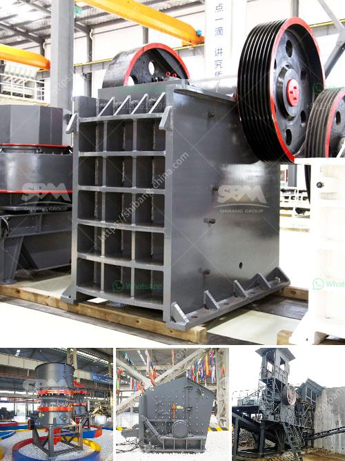

<h3>كسارة ومطحنة للذهب</h3>
تعتبر الكسارة والمطحنة للذهب جزءًا هامًا في صناعة التعدين حيث تستخدم لسحق وطحن الخامات الذهبية للاستفادة من الذهب. تهدف هذه المعدات إلى تحويل الصخور الكبيرة والصلبة إلى حجم أصغر لتسهيل عملية استخراج الذهب وفصله عن بقية المواد.

تتكون الكسارة من جزأين رئيسيين هما الفك الثابت والفك المتحرك. تقوم المطحنة، بتحطيم الصخور بتأثير الفكين على بعضهما البعض. يعمل الفك الثابت كنقطة تثبيت للصخور الكبيرة في حين يعمل الفك المتحرك على سحق الصخور بحركته الدورانية. 

من جهة أخرى، تستخدم المطاحن لطحن الخامات الذهبية المكسرة بعد عملية التكسير. تعمل المطاحن بدورها على سحق الخامات الذهبية المكسرة وتحويلها إلى مسحوق مناسب لفصل الذهب عن المواد الأخرى. تتمثل العملية في وجود الكرات المعدنية داخل الطاحونة تتحرك في دوران مستمر. وتعتمد سرعة الدوران على حجم الكرات المعدنية الموجودة داخل المطحنة والحجم الذي تحتاجه الخامات الذهبية المطحونة.

تعتبر الكسارة والمطحنة عمليتين متكاملتين في صناعة التعدين لاستخراج الذهب حيث تعود تلك العمليتين على تكسير الصخور الكبيرة وسحقها وتحويلها إلى أحجام أصغر مناسبة للمعالجة اللاحقة. ويعتبر الذهب الناتج من هذه العملية أحد المنتجات الرئيسية التي تدعم الاقتصاد بشكل كبير.

باختصار، تلعب الكسارة والمطحنة للذهب دورًا حاسمًا في التعدين حيث تتيح للشركات إمكانية استخراج واستفادة من الذهب الموجود في الصخور الكبيرة. وبفضل هذه العملية، يتم تحويل الخامات الذهبية إلى منتج قابل للفصل والاستخدام النهائي.

تنبع أهمية الكسارة والمطحنة للذهب في تحويل الصخور الكبيرة وصلابتها إلى أحجام أصغر تسهل عملية استخلاص الذهب. وبفضل هذه العملية، يسهم اكتشاف الذهب في زيادة الإنتاجية وتنمية الاقتصادات المستفيدة من صناعة التعدين.
<h3>Contact us</h3><ul><li><strong>Whatsapp:&nbsp;<a href="https://wa.me/8613661969651">+8613661969651</a></strong></li><li><a href="https://swt.shibang-china.com/?git&amp;zhl&amp;كسارة ومطحنة للذهب"><strong>Online Service(chat now)</strong></a></li></ul><h3>Related</h3><ul><li><a href='استثمار مصنع كسارة الحجر.md'>استثمار مصنع كسارة الحجر</a></li><li><a href='مطحنة الكرة للبيع في جنوب أفريقيا.md'>مطحنة الكرة للبيع في جنوب أفريقيا</a></li><li><a href='كيفية صنع مسحوق الجبس.md'>كيفية صنع مسحوق الجبس</a></li><li><a href='سير ناقل لرماد الفحم.md'>سير ناقل لرماد الفحم</a></li><li><a href='مغذي اهتزازي لخام السنتر.md'>مغذي اهتزازي لخام السنتر</a></li></ul>