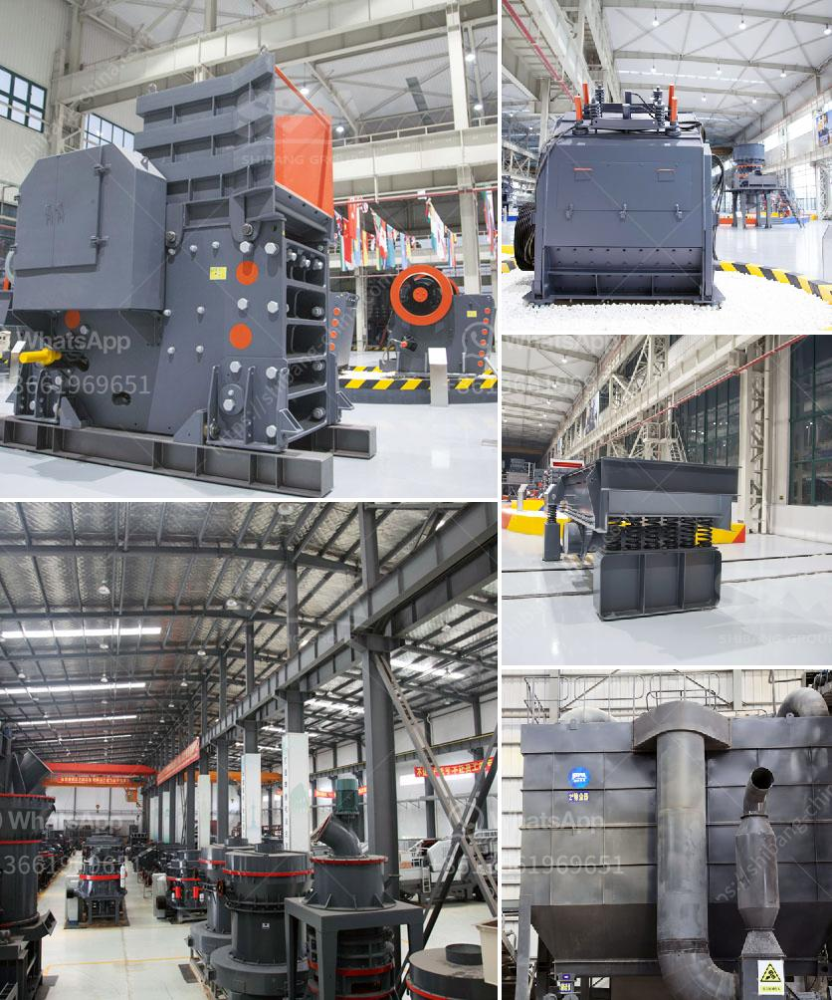

<h3>كفاءة الشاشة الاهتزازية</h3>
تُعتبر الشاشة الاهتزازية واحدة من التكنولوجيات المبتكرة والمتقدمة في عالم الهواتف الذكية. تتميز هذه الشاشات بقدرتها على توليد اهتزازات صغيرة وسريعة عند استلام إشعارات أو رسائل أو مكالمات هاتفية. وهي خاصية تجعل من عملية تلقي الإشعارات أكثر بساطة ويسراً لمستخدم الهاتف.

إحدى الفوائد الرئيسية للشاشة الاهتزازية هي قدرتها على إشعار المستخدمين بأي حدث هام مثل تلقي رسالة نصية أو مكالمة هاتفية في حالة عدم قدرتهم على سماع النغمة الصوتية أو لتجنب إلحاق الإزعاج بالآخرين في المكان العام. بفضل هذه التقنية، لا يضطر الناس إلى الاعتماد على النغمات الصوتية فقط، بل يمكنهم الاعتماد على الاهتزازات لتنبيههم للأحداث المهمة.

تُعد الشاشة الاهتزازية مفيدة أيضًا في التطبيقات الأخرى مثل الألعاب، حيث يمكن استخدامها للتفاعل مع اللاعبين من خلال خلق تأثيرات متنوعة وملموسة. قد يتلقى اللاعب مثلاً اهتزازًا عندما يتم تحقيق هدف معين أو تلقي ضربة منافس. وهذا يعزز تجربة اللعب ويعطي إحساساً واقعياً أكبر.

واحدة من الاستخدامات الأكثر شيوعًا للشاشة الاهتزازية هي في التطبيقات الصحية واللياقة البدنية. تستخدم بعض تطبيقات متتبعات اللياقة البدنية الاهتزازات لإبلاغ المستخدم عند تحقيق أهداف محددة مثل عدد الخطوات المستهدفة في اليوم. وبالتالي، تعمل الشاشة الاهتزازية كتذكير مرئي للمرتدي وتساعده في الوصول إلى أهدافه اليومية.

إضافةً إلى ذلك، فإن الشاشة الاهتزازية تُعد خيارًا ممتازًا للأشخاص الذين يعانون من إعاقة سمعية أو صعوبة في الاستماع الجيد. حيث يمكنها أن توفر طريقة بديلة لاستلام الإشعارات والتنبيهات لهؤلاء الأشخاص.

ومن الملحوظ أن الشاشات الاهتزازية تستهلك طاقة أقل بالمقارنة مع تشغيل الصوت على الهاتف. وهذا يساعد على تحسين عمر البطارية ويوفر فرصة لاستخدام أخرى من قبل المستخدم.

للخلاصة، فإن الشاشة الاهتزازية تعتبر تقنية مميزة وفعالة في عالم الهواتف الذكية. فهي توفر إشعارات رجّاجة ومرئية للمستخدمين، وتعزز تجربة اللعب، وتساعد على تحقيق الأهداف اليومية في التطبيقات الصحية واللياقة البدنية، وتقلل من استهلاك البطارية. بالتالي، يمكن القول إن الشاشة الاهتزازية قد حققت كفاءة ملحوظة في تحسين تجربة المستخدم في الهواتف الذكية.
<h3>Contact us</h3><ul><li><strong>Whatsapp:&nbsp;<a href="https://wa.me/8613661969651">+8613661969651</a></strong></li><li><a href="https://swt.shibang-china.com/?git&amp;zhl&amp;كفاءة الشاشة الاهتزازية"><strong>Online Service(chat now)</strong></a></li></ul><h3>Related</h3><ul><li><a href='دراسة جدوى لمصنع سحق الكروم الفير.md'>دراسة جدوى لمصنع سحق الكروم الفير</a></li><li><a href='تقرير مشروع وحدات كسارة الحجر.md'>تقرير مشروع وحدات كسارة الحجر</a></li><li><a href='مصنع معالجة مسحوق الجبس في الهند.md'>مصنع معالجة مسحوق الجبس في الهند</a></li><li><a href='حجر الكسارة للبيع.md'>حجر الكسارة للبيع</a></li><li><a href='معدات إعادة تدوير الجبس للبيع.md'>معدات إعادة تدوير الجبس للبيع</a></li></ul>