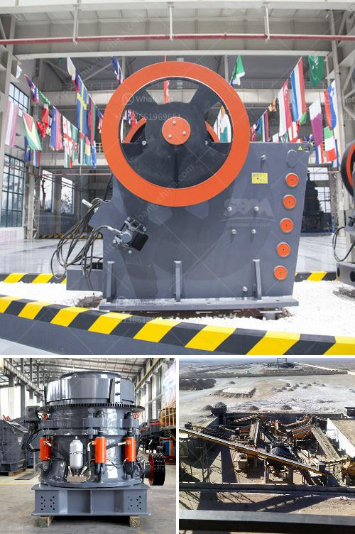

<h3>كل مصانع التكسير المحاجر</h3>
تعتبر مصانع التكسير في المحاجر من الصناعات الهامة والضرورية في العديد من الدول. فهذه المصانع تقوم بعملية تكسير الصخور والحجارة لاستخدامها في العديد من الأغراض. تحتوي هذه المصانع على معدات وآلات متطورة لتكسير المواد الصلبة إلى حجم وشكل محدد يمكن استخدامها في العديد من الصناعات المختلفة.

تستخدم مصانع التكسير في المحاجر في صناعة الإسمنت والخرسانة، حيث يتم استخدام تلك الحجارة المكسرة في إعداد الخلطات المستخدمة في عمليات البناء. فخلال عملية التكسير، يتم تحويل الحجارة الكبيرة إلى حجم يمكن معالجته وخلطه لإنتاج مواد بناء متينة وقوية.

تستخدم مصانع التكسير في المحاجر أيضًا في صناعة الطرق، حيث يتم استخدام المواد المكسرة لتمهيد الطرق وتعبيدها. فتلك الحجارة المكسرة تعتبر مادة أساسية في بناء الطرق السريعة والطرق الريفية، حيث يتم تعبيدها لإنشاء طبقة قوية ومتينة يمكن للسيارات المرور فوقها بأمان.

لا تقتصر استخدامات مصانع التكسير في المحاجر على صناعة الإسمنت والخرسانة والطرق فحسب، بل تستخدم أيضًا في صناعة الزجاج والسيراميك والألومنيوم. ففي هذه الصناعات، يتم استخدام المواد المكسرة لصنع الهياكل والأجزاء المتنوعة التي تستخدم في تجميع المنتج النهائي.

مصانع التكسير في المحاجر تعتبر من الصناعات البيئية، حيث تعمل على إعادة استخدام الصخور والحجارة وتقليل الضغط على الموارد الطبيعية. كما تسهم في تنظيف المحاجر وإزالة الحجارة الكبيرة التي تصعب الوصول إليها أو استخراجها بواسطة المعدات الأخرى.

ولكن يجب الانتباه إلى آثار نشاط مصانع التكسير في المحاجر على البيئة المحيطة. فعملية التكسير تولد غبارًا يمكن أن يؤثر على جودة الهواء في المنطقة، لذا يجب اتخاذ التدابير اللازمة لمنع انبعاث الغبار إلى الجو وتنظيف الهواء قبل إعادته للبيئة.

باختصار، تعتبر مصانع التكسير في المحاجر صناعة هامة يعتمد عليها العديد من القطاعات الاقتصادية. تلك الصناعة تساهم في إعادة استخدام المواد الصلبة وتقليل الضغط على الموارد الطبيعية. ولتحقيق التوازن بين التنمية الاقتصادية والحفاظ على البيئة، يجب تطبيق إجراءات واحتياطات مناسبة للحد من تأثير عملية التكسير على البيئة المحيطة.
<h3>Contact us</h3><ul><li><strong>Whatsapp:&nbsp;<a href="https://wa.me/8613661969651">+8613661969651</a></strong></li><li><a href="https://swt.shibang-china.com/?git&amp;zhl&amp;كل مصانع التكسير المحاجر"><strong>Online Service(chat now)</strong></a></li></ul><h3>Related</h3><ul><li><a href='كيفية إنشاء مصنع لتكسير الحجر.md'>كيفية إنشاء مصنع لتكسير الحجر</a></li><li><a href='تحليل التكلفة للكسارات.md'>تحليل التكلفة للكسارات</a></li><li><a href='خط إنتاج مطحنة عمودية LM.md'>خط إنتاج مطحنة عمودية LM</a></li><li><a href='تكلفة مصنع الأسمنت.md'>تكلفة مصنع الأسمنت</a></li><li><a href='آلة غربلة الرمل للبيع في الفلبين.md'>آلة غربلة الرمل للبيع في الفلبين</a></li></ul>