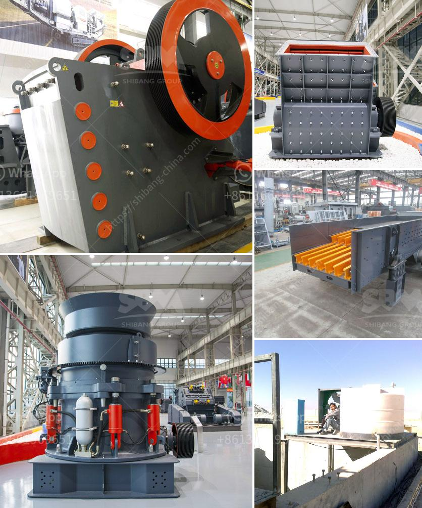

<h3>كل معدة لكل جهاز كسارة فك</h3>
جهاز كسارة الفك هو أحد الأدوات الرئيسية المستخدمة في صناعة التعدين ومجموعة متنوعة من المجالات الأخرى مثل صناعة البناء والمواد الأولية. ويتألف الجهاز من معدات متعددة ، وسنتحدث في هذه المقالة عن كل معدة لكل جهاز كسارة الفك ودورها.

أول معدة هي الفك الثابت: وهو جزء ثابت من الجهاز يعمل كقاعدة للفك المتحرك. وظيفته هي تثبيت الفك المتحرك وتوجيه حركته لمدة محددة. تكون مادة صنع الفك الثابت عادة مصنوعة من الصلب المقوى، حيث توفر متانة وقوة في الاستخدام اليومي للجهاز.

ثاني معدة هي الفك المتحرك: وهو جزء متحرك في الجهاز ويعمل على كسر وسحق المواد الخام. وظيفته الرئيسية هي الضغط على المواد الخام من خلال حركة الفك المتحرك نحو الفك الثابت. وتثبيت المواد الخام بسبب تناقص المساحة بين الفكين يفضي إلى تفتيت المواد إلى قطع صغيرة.

ثالث معدة هي الحوض الدوار: يوجد في الجزء السفلي من الجهاز ويعمل على دعم الجسم العلوي للكسارة الفكية وتوجيهه. بالإضافة إلى ذلك ، فهو يحتوي على محامل تدعم الفك الثابت والفك المتحرك ، وتعزيز استقرار الجهاز.

رابع معدة هي رمح الإرجاع: وهو محور يعمل على استعادة الفك المتحرك إلى وضعه الاستردادي بعد الكسر ، عن طريق ضبط قوة الربيع الموجود في الجزء العلوي من الجهاز. يضمن رمح الإرجاع عودة الفك المتحرك إلى وضعه الأصلي واستعداده للعمل القادم.

خامس معدة هي نظام التشغيل والتحكم: وهو الجهاز الذي يمكن من خلاله تشغيل وإيقاف الكسارة الفكية وضبط حجم الفك المتحرك. وهو عادة ما يكون عبارة عن لوحة تحكم تحتوي على أزرار للتحكم وشاشة لعرض مخرجات وحالة الجهاز.

في النهاية ، جهاز كسارة الفك يعتبر أداة أساسية في صناعة التعدين والبناء. تعتبر هذه المعدات جزءًا أساسيًا في عملية سحق وطحن المواد الخام ، مما يسمح بتحويلها إلى منتجات قابلة للاستخدام في الصناعات المختلفة.
<h3>Contact us</h3><ul><li><strong>Whatsapp:&nbsp;<a href="https://wa.me/8613661969651">+8613661969651</a></strong></li><li><a href="https://swt.shibang-china.com/?git&amp;zhl&amp;كل معدة لكل جهاز كسارة فك"><strong>Online Service(chat now)</strong></a></li></ul><h3>Related</h3><ul><li><a href='الحجم في مطاحن طحن الأسمنت.md'>الحجم في مطاحن طحن الأسمنت</a></li><li><a href='عملية تعدين الذهب.md'>عملية تعدين الذهب</a></li><li><a href='سحق الحجر الأسود تايلاند.md'>سحق الحجر الأسود تايلاند</a></li><li><a href='كيفية إنشاء شركة محجر.md'>كيفية إنشاء شركة محجر</a></li><li><a href='كسارات محمولة في السعودية.md'>كسارات محمولة في السعودية</a></li></ul>