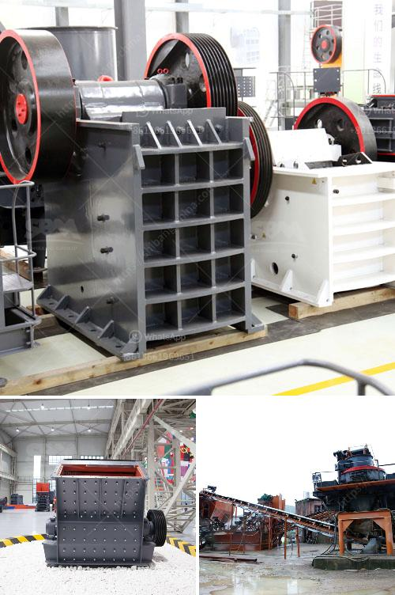

<h3>كم تكلف تراخيص التعدين على الذهب في نيجيريا</h3>
تعتبر صناعة التعدين على الذهب من أهم القطاعات الاقتصادية في نيجيريا، حيث يتم استخراج الذهب من المناجم وتصنيعه وبيعه للأسواق المحلية والعالمية. ومن أجل ممارسة هذا النشاط، يجب أن تحصل الشركات العاملة في قطاع التعدين على تراخيص من الحكومة.

تختلف تكلفة التراخيص المطلوبة للتعدين على الذهب في نيجيريا بناءً على عدة عوامل، بما في ذلك حجم العملية التعدينية وموقعها وتقنيات التعدين المستخدمة. عادةً ما تتطلب تراخيص التعدين دفع رسوم تسجيل ورسوم استخراج المعادن والتعدين ورسوم استخدام الموارد. قد يتم تقديم المبالغ المستحقة كرسوم سنوية أو شهرية للحكومة.

لا يوجد رسم ثابت محدد لتراخيص التعدين على الذهب في نيجيريا، ومع ذلك، فإن الرسوم والتكاليف قد تتراوح بين 200 و400 دولار أمريكي أو أكثر حسب متطلبات الحكومة وسياستها التنظيمية في الوقت الحالي. تحدد الحكومة النيجيرية هذه الرسوم لتحفيز الاستثمار وتعزيز قطاع التعدين في البلاد، وفي بعض الأحيان يمكن أن تكون الرسوم مخفضة للشركات النيجيرية المحلية.

ومن المهم ملاحظة أن تكلفة التراخيص ليست العنصر الوحيد الذي يؤثر على تكاليف التعدين على الذهب في نيجيريا. تشمل التكاليف الأخرى تكاليف الاستكشاف والتنقيب والتطوير المحتملة للعثور على مناجم الذهب، بالإضافة إلى تكاليف التشغيل والصيانة والأجور وتكاليف المعدات والمواد الأولية وتكاليف النقل والتصنيع المحتملة.

بشكل عام، فإن تكلفة التراخيص للتعدين على الذهب في نيجيريا تتراوح بين 200 و400 دولار أمريكي أو أكثر، ولكن يجب الأخذ في الاعتبار أن هناك تكاليف أخرى يجب أن تضاف إلى ذلك. ينبغي للشركات الراغبة في الاستثمار في هذا القطاع البحث والاستفسار عن الرسوم والتكاليف التنظيمية الحالية لدى الحكومة النيجيرية والتأكد من توافر الموارد المالية اللازمة قبل الشروع في عملية التعدين على الذهب في نيجيريا.
<h3>Contact us</h3><ul><li><strong>Whatsapp:&nbsp;<a href="https://wa.me/8613661969651">+8613661969651</a></strong></li><li><a href="https://swt.shibang-china.com/?git&amp;zhl&amp;كم تكلف تراخيص التعدين على الذهب في نيجيريا"><strong>Online Service(chat now)</strong></a></li></ul><h3>Related</h3><ul><li><a href='خط إنتاج طلاء الحجر.md'>خط إنتاج طلاء الحجر</a></li><li><a href='قائمة أسعار كسارة الحجر بسعة 300 طن في الساعة.md'>قائمة أسعار كسارة الحجر بسعة 300 طن في الساعة</a></li><li><a href='كسارات الصخور للبيع.md'>كسارات الصخور للبيع</a></li><li><a href='مطحنة أسطوانية ثنائية المرور.md'>مطحنة أسطوانية ثنائية المرور</a></li><li><a href='كيف يعمل مطحنة الطحن.md'>كيف يعمل مطحنة الطحن</a></li></ul>