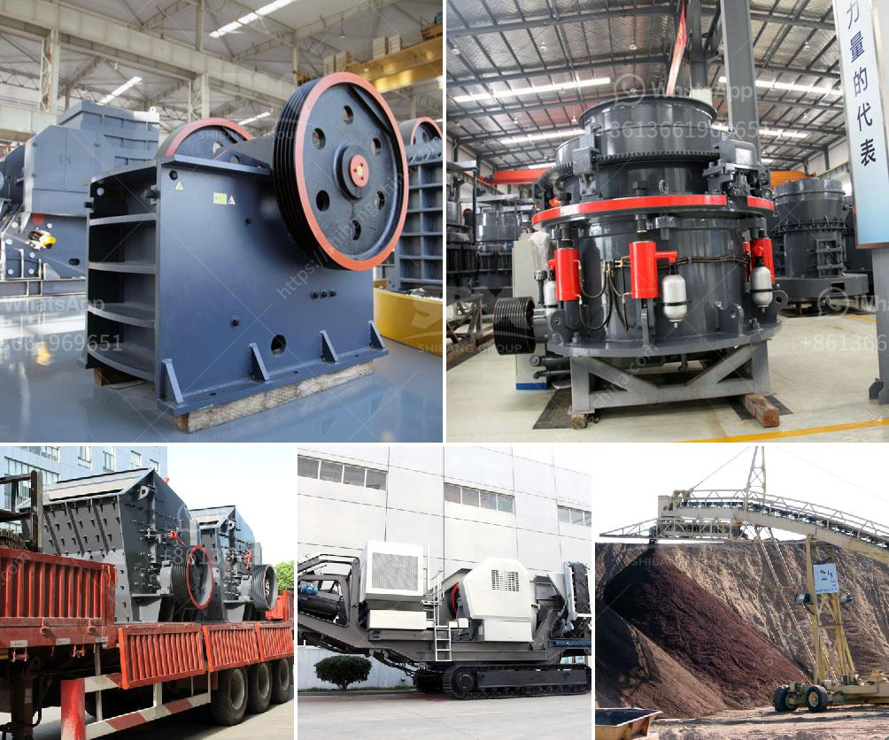

<h3>كم تكلف كسارات الصخور</h3>
تعتبر كسارات الصخور من الآلات الهامة في صناعة التعدين والبناء، حيث تستخدم لسحق الصخور الكبيرة وتحويلها إلى قطع صغيرة يمكن استخدامها في عدة مجالات. تختلف تكلفة كسارات الصخور حسب الحجم والمواصفات المطلوبة، والتكاليف العامة المرتبطة بالمشروع.

تتراوح تكلفة كسارة الصخور بين 200 إلى 400 ألف دولار، والتي تشمل العناصر التالية:

1- تكلفة الجهاز نفسه: يعتبر ثمن الكسارة نفسها من بين العوامل الرئيسية التي تؤثر في تكلفتها الإجمالية. يتوقف سعر الكسارة على الحجم والقدرات والمواصفات المطلوبة. كلما كانت المواصفات أقوى وأكبر، زاد السعر بالتالي.

2- تكاليف الشحن: معظم الكسارات تحتاج إلى شحن ونقل من مصنع الصنع إلى موقع الاستخدام، وتكلفة الشحن تكون عادةً محسوبة بحسب المسافة ونوع النقل المستخدم (شاحنات أو حاويات أو ناقلات خاصة).

3- تكاليف التركيب والتشغيل: تكلفة تركيب الكسارة تشمل تجهيز الموقع وإجراء العمليات اللازمة لتشغيل الكسارة بشكل صحيح. بالإضافة إلى ذلك، قد تتطلب الكسارة الصيانة المستمرة وتكلفة الأجزاء البديلة والمواد الاستهلاكية.

4- تكاليف الكهرباء والوقود: تحتاج الكسارات إلى كميات كبيرة من الكهرباء لتشغيلها، بالإضافة إلى استهلاك الوقود إذا كانت تعمل بواسطة محركات ديزل. يجب احتساب تكلفة الكهرباء والوقود عند تقدير التكلفة الشهرية أو السنوية لتشغيل الكسارة.

5- تكاليف العمالة والتأمين الصحي: قد تتطلب عمليات التركيب والتشغيل فرق عمل محترفة لضمان تشغيل الكسارة بكفاءة وسلامة. علاوة على ذلك، يجب توفير تأمين صحي للعمال وتوفير معدات السلامة اللازمة.

بالإضافة إلى ذلك، يجب أن يؤخذ في الاعتبار أيضًا تكلفة الصيانة والإصلاحات الدورية التي قد تكون مطلوبة لضمان أداء الكسارة بشكل جيد على المدى الطويل.

في النهاية، يجب على المستخدم مراعاة جميع هذه العوامل عند تقدير التكلفة الإجمالية لشراء كسارة الصخور. يوصى بالتشاور مع مختصين في الصناعة والموردين المعتمدين للحصول على تقدير دقيق وبالتالي تحقيق الأداء المثلى والعائد على الاستثمار المناسب.
<h3>Contact us</h3><ul><li><strong>Whatsapp:&nbsp;<a href="https://wa.me/8613661969651">+8613661969651</a></strong></li><li><a href="https://swt.shibang-china.com/?git&amp;zhl&amp;كم تكلف كسارات الصخور"><strong>Online Service(chat now)</strong></a></li></ul><h3>Related</h3><ul><li><a href='سعر مطاحن الكرة.md'>سعر مطاحن الكرة</a></li><li><a href='شركة تصنيع لوحات الجبس في سنغافورة.md'>شركة تصنيع لوحات الجبس في سنغافورة</a></li><li><a href='شراء وبيع حجر الكسارة في ماليزيا.md'>شراء وبيع حجر الكسارة في ماليزيا</a></li><li><a href='كسارة الحجر الدوارة.md'>كسارة الحجر الدوارة</a></li><li><a href='مصنع تكسير وطحن الكالسايت في أودايبور.md'>مصنع تكسير وطحن الكالسايت في أودايبور</a></li></ul>