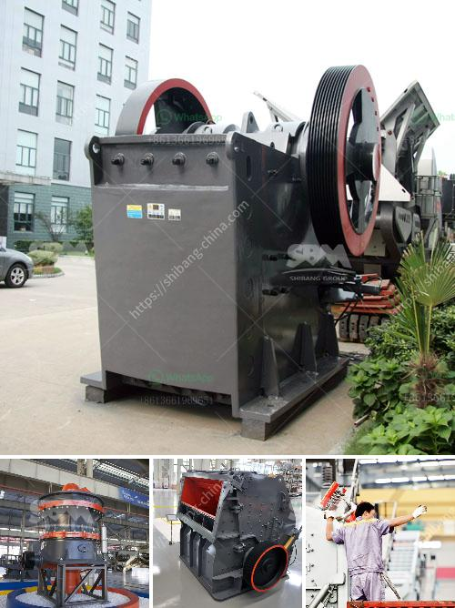

<h3>كم تكلف مصنع التكسير</h3>
يُعد مصنع التكسير أحد المصانع الهامة في قطاع الصناعة، حيث يقوم بتكسير المواد الخام لإنتاج منتجات ذات قيمة وفائدة عالية. يتلقى المصنع العديد من الطلبات والاحتياجات من شركات ومؤسسات مختلفة، ولا يمكن تحديد تكلفته الثابتة بشكل دقيق لأنها تختلف من مصنع إلى آخر في العديد من العوامل المختلفة مثل:

1- حجم المصنع: إذا كان المصنع يعمل في نطاق صغير أو كبير، ستختلف تكلفة بنائه وتجهيزه وتشغيله على نطاق واسع. وسيكون له تأثير كبير على تكاليف المواد الخام وعمالة الإنتاج.

2- نوعية المواد الخام: يمكن أن تختلف تكلفة المصنع تبعاً للمواد الخام التي سيتم تكسيرها، خاصة إذا كانت هذه المواد نوعية نادرة أو ذات قيمة عالية.

3- التكنولوجيا المستخدمة: يؤثر استخدام التكنولوجيا المتقدمة في التكسير على تكلفة المصنع، حيث تكون الأجهزة والمعدات الحديثة أغلى من تلك التي تستخدم تكنولوجيا قديمة.

4- تكاليف الطاقة: تعتبر تكاليف الطاقة من أهم العوامل في تكلفة المصنع، حيث يحتاج المصنع إلى استهلاك كميات كبيرة من الكهرباء والوقود لتشغيل المعدات والآلات الثقيلة.

5- التكاليف الإدارية: يتضمن ذلك تكلفة الإدارة والموظفين والتأمينات الاجتماعية والضرائب وغيرها من النفقات المرتبطة بإدارة المصنع.

بشكل عام، يمكن أن تتراوح تكلفة بناء وتشغيل مصنع التكسير بين 200،000 إلى 400،000 دولار أمريكي. ولكن هذه الأرقام تعتبر تقديرية وتختلف بشكل كبير من حالة إلى أخرى. يمكن للمستثمرين المحتملين استشارة متخصصين في التقديرات وإجراء تحليلات تكلفة مفصلة لحساب التكاليف المتوقعة قبل بدء بناء المصنع.

باختصار، يعد مصنع التكسير من الاستثمارات الضخمة والمجهود الكبير المطلوب لتشغيله، وتكلفته تعتمد على العديد من العوامل المختلفة مثل حجم المصنع، والمواد الخام والتكنولوجيا المستخدمة، وتكاليف الطاقة والتكاليف الإدارية.
<h3>Contact us</h3><ul><li><strong>Whatsapp:&nbsp;<a href="https://wa.me/8613661969651">+8613661969651</a></strong></li><li><a href="https://swt.shibang-china.com/?git&amp;zhl&amp;كم تكلف مصنع التكسير"><strong>Online Service(chat now)</strong></a></li></ul><h3>Related</h3><ul><li><a href='محطة كسارة في الفلبين.md'>محطة كسارة في الفلبين</a></li><li><a href='كسارة خرسانية صغيرة في المملكة المتحدة.md'>كسارة خرسانية صغيرة في المملكة المتحدة</a></li><li><a href='تركيبة مواد كسارة الفحم.md'>تركيبة مواد كسارة الفحم</a></li><li><a href='فرق بين مطحنة ريموند وضغط عالي.md'>فرق بين مطحنة ريموند وضغط عالي</a></li><li><a href='كيفية اختيار كسارة مخروطية.md'>كيفية اختيار كسارة مخروطية</a></li></ul>