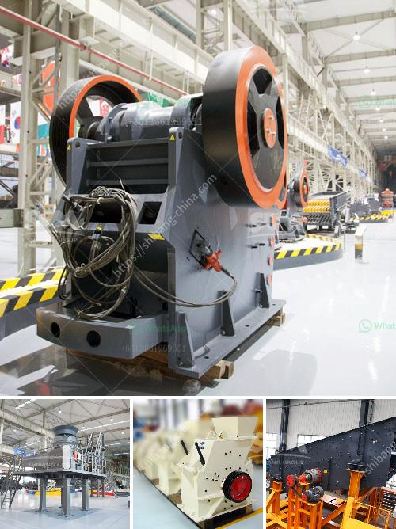

<h3>كم تكلفة آلة المحجر</h3>
آلة المحجر هي آلة تستخدم في صناعة التعدين لاستخراج المواد الخام من الأرض. وتعد آلة المحجر العامل الأساسي في عمليات التعدين، حيث تستخدم لاستخراج المواد الخام بكفاءة وفعالية.

تتفاوت تكلفة آلة المحجر بناءً على العديد من العوامل المختلفة. يشمل ذلك حجم آلة المحجر، والقدرة الانتاجية، والتقنيات المستخدمة فيها. بالإضافة إلى ذلك، يلعب عمر الآلة وجودة المواد المستخدمة في تصنيعها دورًا أيضًا في تحديد التكلفة النهائية.

يعتمد سعر آلة المحجر أيضًا على الشركة المصنعة والمديل. قد تختلف الأسعار بين الشركات المصنعة المختلفة اعتمادًا على سمعتها وتاريخها وموثوقيتها. بالإضافة إلى ذلك، يعتبر التكاليف المستمرة للصيانة والتشغيل أيضًا جزءًا من العوامل التي يجب مراعاتها عند حساب التكلفة الإجمالية لآلة المحجر.

بشكل عام، يمكن أن تتراوح تكلفة آلة المحجر بين عدة آلاف إلى الملايين من الدولارات. تعتمد هذه التكلفة على الاحتياجات الخاصة بكل مشروع والمواد المطلوبة لتنفيذه بنجاح. في بعض الحالات، يمكن إيجاد آلات المحجر المستعملة بسعر أقل من آلات المحجر الجديدة، وهذا يمكن أن يساعد في تقليل التكلفة النهائية.

من المهم أن يتم اعتبار آلة المحجر كاستثمار مهم لشركات التعدين. فعلى الرغم من تكلفتها العالية، إلا أن آلات المحجر قادرة على زيادة إنتاجية الشركات وتحسين كفاءتها بشكل عام. يجب أن تراعى الاحتياجات المحددة للشركة وأهدافها المحددة للتوصل إلى التكلفة المناسبة واختيار آلة المحجر الملائمة.

باختيار آلة المحجر المناسبة واستثمار الوقت والجهد في البحث عن العروض المناسبة واستشارة خبراء الصناعة، يمكن للشركات تحقيق الاستفادة الأمثل من آلات المحجر بأقل تكلفة ممكنة. وبالتالي، يمكن استخدام آلة المحجر كأداة فعالة لرفع الإنتاجية وتحقيق النجاح والنمو المستدام في صناعة التعدين.
<h3>Contact us</h3><ul><li><strong>Whatsapp:&nbsp;<a href="https://wa.me/8613661969651">+8613661969651</a></strong></li><li><a href="https://swt.shibang-china.com/?git&amp;zhl&amp;كم تكلفة آلة المحجر"><strong>Online Service(chat now)</strong></a></li></ul><h3>Related</h3><ul><li><a href='آلة الجبس في ألمانيا.md'>آلة الجبس في ألمانيا</a></li><li><a href='مصانع قديمة للبيع، استخدمت مطاحن الكرات.md'>مصانع قديمة للبيع، استخدمت مطاحن الكرات</a></li><li><a href='مطحنة طحن الحجر الصناعي.md'>مطحنة طحن الحجر الصناعي</a></li><li><a href='معدات فحص الصخور.md'>معدات فحص الصخور</a></li><li><a href='سعر طاحونة المطرقة.md'>سعر طاحونة المطرقة</a></li></ul>