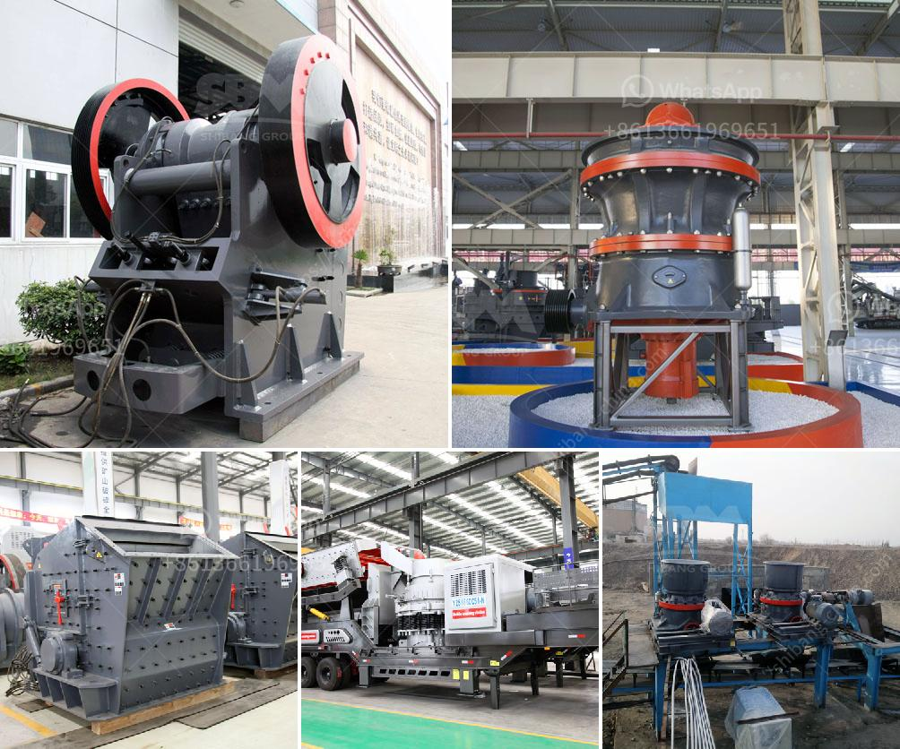

<h3>كم تكلفة بناء مصنع الأسمنت بسعة 100 طن</h3>
يعد بناء مصنع الأسمنت بسعة 100 طن من المشاريع الهامة في قطاع البناء والتشييد، حيث يلعب الأسمنت دورًا حيويًا في صناعة البناء والتعمير. يعمل المصنع بشكل عام على إنتاج الأسمنت البورتلاندي، وهو أحد أكثر أنواع الأسمنت شيوعًا واستخدامًا في العديد من المشاريع العمرانية والإنشائية.

من حيث التكلفة، تعتمد تكلفة بناء مصنع الأسمنت بسعة 100 طن على العديد من العوامل المختلفة، بما في ذلك موقع المصنع وتكلفة الأرض، تجهيز الموقع، تكلفة المباني والهياكل، آلات الإنتاج والتكنولوجيا المستخدمة، المعدات والماكينات والأدوات اللازمة، وعمالة الإنتاج.

قد يتراوح تكلفة بناء مصنع الأسمنت بسعة 100 طن بين 1000000 دولار إلى 5000000 دولار. قد تشمل هذه التكلفة تأجير الأرض وشراء المواد والتجهيزات اللازمة. بالإضافة إلى ذلك، قد يتم تكاليف أخرى مثل توظيف مهندسين وفنيين محترفين وتدريب العمال على كيفية التعامل مع المعدات والتقنيات المتوفرة.

إن مصنع الأسمنت يتطلب أيضاً تكلفة التشغيل اليومية للحفاظ على الإنتاجية وجودة المنتج. قد تشمل هذه التكاليف تكلفة الوقود والكهرباء وصيانة الماكينات والمعدات. يجب مراعاة جودة الأسمنت المنتج، حيث يتطلب ذلك اختبارات مستمرة ومراقبة الجودة لضمان استمرارية العملية الإنتاجية وتلبية معايير الجودة المطلوبة.

بالنظر إلى الجوانب المالية والإدارية، ينبغي توخي الحذر في التخطيط والاستثمار في مثل هذا المشروع. يجب القيام بدراسة جدوى متأنية لتحديد التكاليف بدقة وتقدير التكاليف الإضافية المحتملة. يجب أيضاً أن تستند هذه الدراسة على بيانات سوقية واضحة تشير إلى الطلب المحلي على الأسمنت وتوقع العائد المالي المتوقع على المدى القصير والطويل.

باختصار، تكلفة بناء مصنع الأسمنت بسعة 100 طن تتطلب استثماراً مالياً كبيراً، ومن المهم التخطيط وإجراء دراسة جدوى شاملة قبل الاقدام على هذا المشروع. على الرغم من التكلفة العالية، فإن مصانع الأسمنت تعتبر استثمارًا جيدًا لأنها تلبي الطلب المتزايد على البنية التحتية والمشاريع الإنشائية في العديد من البلدان.
<h3>Contact us</h3><ul><li><strong>Whatsapp:&nbsp;<a href="https://wa.me/8613661969651">+8613661969651</a></strong></li><li><a href="https://swt.shibang-china.com/?git&amp;zhl&amp;كم تكلفة بناء مصنع الأسمنت بسعة 100 طن"><strong>Online Service(chat now)</strong></a></li></ul><h3>Related</h3><ul><li><a href='سعر كسارة الحجر سعة طن في الساعة.md'>سعر كسارة الحجر سعة طن في الساعة</a></li><li><a href='مصانع مطاحن الأسمنت.md'>مصانع مطاحن الأسمنت</a></li><li><a href='مخطط لمطحنة المطرقة العمودية.md'>مخطط لمطحنة المطرقة العمودية</a></li><li><a href='معدات مطحنة الكرة.md'>معدات مطحنة الكرة</a></li><li><a href='مطحنة عمودية للأسمنت.md'>مطحنة عمودية للأسمنت</a></li></ul>