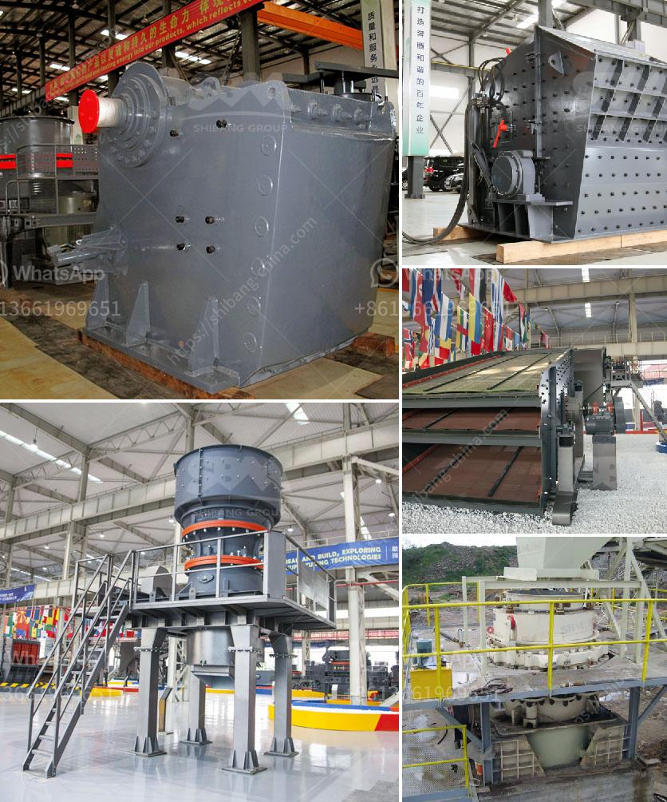

<h3>كم تكلفة كسارة الفك</h3>
يُعتبر تحطيم المواد الصلبة من أحد أهم المهام اللازمة في صناعة البناء والتشييد والتعدين، ولذلك فإن امتلاك كسارة فكية عالية الجودة وفعالة من حيث التكلفة يعتبر استثمارًا ذكيًا للشركات العاملة في هذه الصناعة. تعد كسارة الفك هي الخيار الأكثر شيوعًا لمعالجة المواد الصلبة، حيث تستخدم عادةً في تكسير الصخور الكبيرة إلى جزيئات صغيرة ومنفعة.

واحدة من العوامل الرئيسية التي تؤثر في تكلفة كسارة الفك هي جودتها ومواصفاتها التقنية. تعتمد جودة الكسارة على عدة عوامل، مثل قوة الضغط التي يمكنها تحملها، وسرعة الإنتاج، تجهيز الطاقة، وسهولة التشغيل. يوجد اختلاف ملحوظ في الأسعار بين الكسارات المتاحة في السوق، حيث تتأثر التكلفة بمستوى الجودة والتقنيات المستخدمة في تصنيعها.

بشكل عام، يمكن للشركات شراء كسارات فكية متوسطة الحجم بتكلفة تتراوح بين 10,000-50,000 دولار أمريكي. ومع ذلك، يجب أن يتم اختيار الكسارة المناسبة وفقًا للاحتياجات الفعلية. فعلى سبيل المثال، إذا كنت تعمل في صناعة التعدين وتحتاج إلى معدات بقدرة إنتاج عالية، قد تكون التكلفة أعلى وتتراوح بين 50,000-100,000 دولار أمريكي.

بالإضافة إلى ذلك، يجب أيضًا مراعاة التكاليف الإضافية التي تشمل التركيب والشحن وتكاليف الصيانة. كما يجب أيضًا مراعاة تكلفة قطع الغيار المحتملة وتكاليف الإصلاحات المستقبلية.

علاوة على ذلك، يجب أن يؤخذ في الاعتبار أن تكلفة الكسارة ليست المعيار الوحيد لاختيار الجهاز المناسب. يجب أيضًا مراعاة الموثوقية والعمر الافتراضي للكسارة والخدمات المقدمة من قبل الشركة المصنعة.

في النهاية، يعتبر امتلاك كسارة فكية فعالة من حيث التكلفة هو استثمار مهم للشركات في صناعة البناء والتعدين. يجب على الشركات اختيار الكسارات التي تتناسب مع احتياجاتها الفعلية والتي توفر أداءًا ممتازًا وجودة عالية بأفضل قيمة ممكنة.
<h3>Contact us</h3><ul><li><strong>Whatsapp:&nbsp;<a href="https://wa.me/8613661969651">+8613661969651</a></strong></li><li><a href="https://swt.shibang-china.com/?git&amp;zhl&amp;كم تكلفة كسارة الفك"><strong>Online Service(chat now)</strong></a></li></ul><h3>Related</h3><ul><li><a href='شركات سيور النقل في المكسيك.md'>شركات سيور النقل في المكسيك</a></li><li><a href='مورد قطع غيار الكسارة كينيا.md'>مورد قطع غيار الكسارة كينيا</a></li><li><a href='خطة عمل للرمال.md'>خطة عمل للرمال</a></li><li><a href='الفرق بين مطاحن الكرات ومطاحن الأنابيب.md'>الفرق بين مطاحن الكرات ومطاحن الأنابيب</a></li><li><a href='كسارات أسطوانية وشاشات محمولة مستعملة.md'>كسارات أسطوانية وشاشات محمولة مستعملة</a></li></ul>