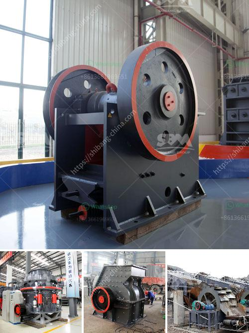

<h3>كم تكلفة مصنع الكرة؟</h3>
تكلفة إنشاء مصنع الكرة هي عامل رئيسي يؤثر على العملية الإنتاجية والاقتصادية للشركة. تختلف تكلفة إقامة المصنع حسب العديد من العوامل، بما في ذلك الحجم والموقع والتقنيات المستخدمة والموارد المتاحة.

أولاً وقبل كل شيء، يجب أن يتم تحديد حجم المصنع المطلوب وفقًا للسعة الإنتاجية المخططة وطلبات السوق. تعتمد تكاليف البناء والبنية التحتية على حجم المصنع، حيث تحتاج المصانع الكبيرة إلى مساحة أكبر ومبانٍ أكبر وتكلفتها أعلى من المصانع الصغيرة.

ثانياً، يعتبر الموقع من العوامل المهمة التي تؤثر في تكلفة المصنع. فإذا تم اختيار موقع ملائم بالقرب من المواد الخام والسوق المستهدفة، فيمكن تقليل تكاليف النقل والشحن وجعل عملية الإنتاج أكثر كفاءة. بالإضافة إلى ذلك، يجب مراعاة التكاليف البيئية والتصاريح والضوابط المحلية عند تحديد الموقع.

ثالثاً، تعتبر التقنيات المستخدمة في عملية الإنتاج عاملاً آخر يؤثر على تكلفة المصنع. لتجهيز المصنع، قد يلزم شراء معدات، مثل آلات الحقن وماكينات الطباعة والنقش وآلات التعبئة والتغليف والطلاء. تختلف تكلفة هذه الأجهزة حسب الحجم والمواصفات والجودة. بالإضافة إلى ذلك، يجب أيضًا النظر في تكاليف الصيانة وإصلاح المعدات.

أخيرا، تكاليف الموارد البشرية أمر مهم للغاية. يجب توظيف فريق مؤهل من العاملين لتشغيل المصنع وإدارته وصيانته. تكلفة توظيف وتدريب ودفع الرواتب للعمال والموظفين تشكل جزءًا هامًا من تكلفة المصنع.

باختصار، يمكن أن تتراوح تكلفة إنشاء وتشغيل مصنع الكرة بين 200 إلى 400 ألف دولار أمريكي، وذلك حسب العوامل المذكورة سابقاً. يجب دراسة كل عامل بدقة واختيار البدائل الأكثر فعالية من الناحية الاقتصادية لضمان تحقيق أعلى جودة ممكنة بأقل تكلفة ممكنة.
<h3>Contact us</h3><ul><li><strong>Whatsapp:&nbsp;<a href="https://wa.me/8613661969651">+8613661969651</a></strong></li><li><a href="https://swt.shibang-china.com/?git&amp;zhl&amp;كم تكلفة مصنع الكرة؟"><strong>Online Service(chat now)</strong></a></li></ul><h3>Related</h3><ul><li><a href='مصنع دوامة للبيع لخام الكروم.md'>مصنع دوامة للبيع لخام الكروم</a></li><li><a href='كسارات الأسمنت المستخدمة للبيع.md'>كسارات الأسمنت المستخدمة للبيع</a></li><li><a href='كسارات الحجر الرخيصة.md'>كسارات الحجر الرخيصة</a></li><li><a href='آلة مسحوق التلك.md'>آلة مسحوق التلك</a></li><li><a href='كسارة لسحق الكوارتز.md'>كسارة لسحق الكوارتز</a></li></ul>