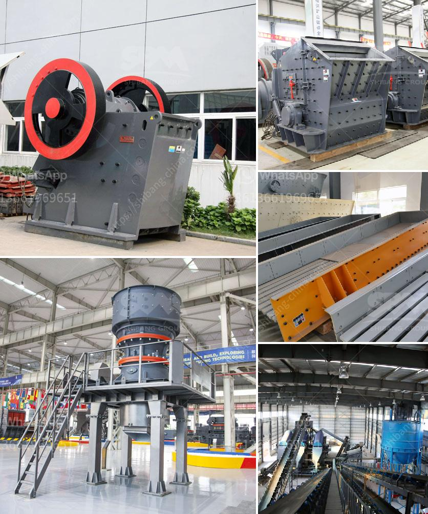

<h3>كم تكلفة مطحنة الكرة</h3>
تعتبر مطحنة الكرة واحدة من أهم الأدوات المستخدمة في صناعات التعدين والمعادن والبناء. تستخدم لطحن المواد الخام بواسطة كرات فولاذية تدور داخل الأسطوانة الأفقية. تعتبر هذه المطاحن ذات كفاءة عالية وتتميز بصيانة سهلة وتكاليف منخفضة، مما يجعلها شديدة الشعبية في العديد من الصناعات.

تتفاوت التكاليف المرتبطة بشراء وتشغيل مطحنة الكرة وفقًا لعدة عوامل. أولاً وقبل كل شيء، تختلف التكاليف حسب حجم وسعة المطحنة. فمطحنة الكرة الكبيرة بسعة إنتاجية أعلى ستكون أغلى من المطحنة الصغيرة بسعة إنتاجية أقل.

ثانيًا، تعتمد التكاليف أيضًا على نوع وجودة المطحنة. هناك العديد من الشركات المصنعة لمطاحن الكرة، ويمكن أن تتفاوت جودة المعدات وبالتالي تكلفتها. من الأفضل شراء مطاحن الكرة من الشركات المعروفة التي تضمن جودة وكفاءة المعدات.

ثالثًا، يؤثر الموقع الجغرافي وظروف النقل والشحن على تكلفة المطحنة. قد يتطلب شحن المطحنة عبر الحدود النقل الدولي ورسوم الاستيراد والتصدير. كما قد يتكبد المشتري تكاليف إضافية لنقل وتركيب المطحنة في موقع التشغيل.

بشكل عام، يتراوح سعر مطحنة الكرة بين 200 و 400 دولار أمريكي. ومع ذلك، يجب أن يتم الانتباه لأن أموال المشتريات لا تنتهي فقط عند شراء المطحنة، بل يجب أيضًا أخذ بعين الاعتبار تكاليف الصيانة وتكاليف التشغيل المستمرة. تشمل تكاليف التشغيل اليومية تكاليف الطاقة والمياه والمواد الاستهلاكية للمطحنة مثل الكرات الفولاذية.

في النهاية، يعتمد سعر وتكلفة مطحنة الكرة على عدة عوامل، بما في ذلك حجم وسعة المطحنة، نوع وجودة المعدات، الموقع الجغرافي وتكاليف الشحن والتركيب. ينصح بأن يعمل المشتري بالتعاون مع الموردين الموثوقين ويقيم التكاليف الكامنة لامتلاك وتشغيل مطحنة الكرة وفقًا للزمن والموارد المتاحة.
<h3>Contact us</h3><ul><li><strong>Whatsapp:&nbsp;<a href="https://wa.me/8613661969651">+8613661969651</a></strong></li><li><a href="https://swt.shibang-china.com/?git&amp;zhl&amp;كم تكلفة مطحنة الكرة"><strong>Online Service(chat now)</strong></a></li></ul><h3>Related</h3><ul><li><a href='معدات ترقية خام الحديد.md'>معدات ترقية خام الحديد</a></li><li><a href='وزير التعدين في غانا.md'>وزير التعدين في غانا</a></li><li><a href='مصنع كسارة الحجر 100 tph.md'>مصنع كسارة الحجر 100 tph</a></li><li><a href='كسارة متنقلة القطرة.md'>كسارة متنقلة القطرة</a></li><li><a href='كسارة الحجر الجيري مستعملة.md'>كسارة الحجر الجيري مستعملة</a></li></ul>