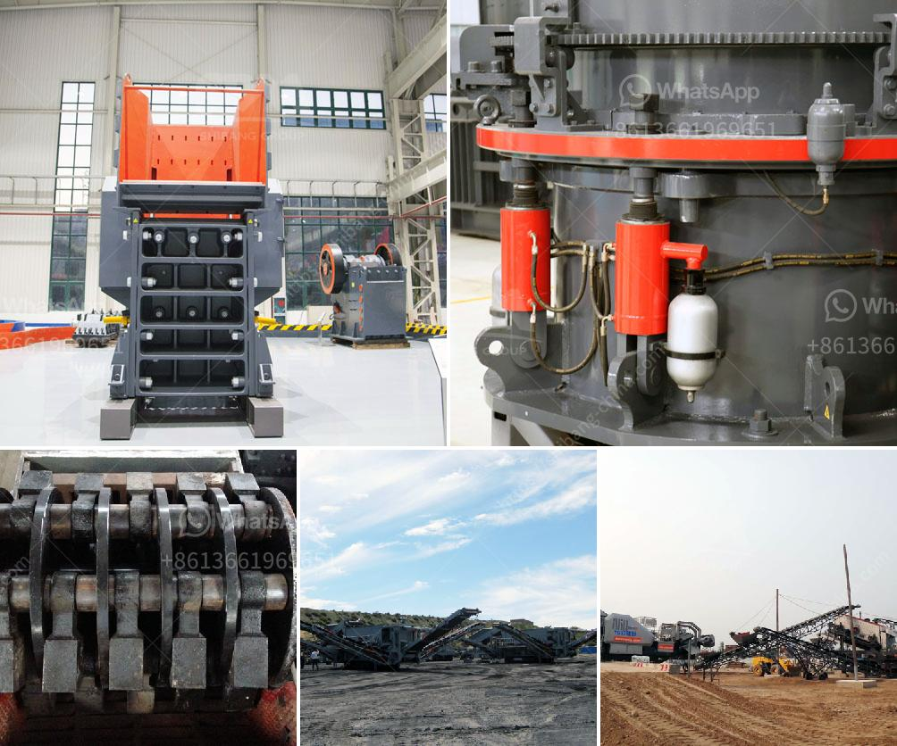

<h3>كم عدد شركات تصنيع كسارات الفك في الهند</h3>
تعتبر الهند واحدة من أكبر الدول في صناعة التصنيع في العالم، حيث توجد العديد من الشركات التي تصنّع كسارات الفك في الهند. تتنوّع هذه الشركات في حجمها وقدراتها وتوجد بعض الشركات الكبيرة التي تعد متخصصة في صناعة معدات التكسير والطحن، وهناك أيضًا بعض الشركات الصغيرة والمتوسطة الحجم التي تصنع كسارات الفك.

وفيما يلي سنستعرض عددًا من تلك الشركات التي تصنع كسارات الفك في الهند:

1. شركة ماهيندرا إنجنيرز (Mahindra Engineers): تعتبر شركة ماهيندرا إحدى الشركات الرائدة في مجال تصنيع معدات التكسير والغربلة في الهند. تقدم الشركة مجموعة متنوعة من كسارات الفك التي تلبي احتياجات العملاء المختلفة.

2. شركة تيريكس فينلايد (Terex Finlay): تُعد شركة تيريكس فينلايد شركة عالمية لتصنيع وتوريد معدات التكسير والغربلة. تقدم الشركة مجموعة واسعة من كسارات الفك بمختلف الأحجام والتصميمات لتتناسب مع مجالات التطبيق المختلفة.

3. شركة لاكشمي إنجنيرينغ وركس (Laxmi Engineers): تعتبر شركة لاكشمي إحدى الشركات الرائدة في مجال تصنيع معدات تكسير الصخور والمعادن في الهند. تقوم الشركة بتصنيع كسارات الفك التي تمتاز بالجودة العالية والأداء الموثوق به.

4. شركة بيكون إنترناشونال (Beacon International): توفر شركة بيكون إنترناشونال مجموعة واسعة من كسارات الفك الفعّالة والموثوقة والمناسبة لتكسير الصخور والمعادن المختلفة. تسعى الشركة لتلبية متطلبات العملاء وتقديم الحلول المبتكرة والفعّالة لتحسين عمليات التكسير.

هذه مجرد بعض الأمثلة للشركات التي تصنع كسارات الفك في الهند، ويمكن العثور على عدد أكبر من الشركات بالبحث والاستكشاف المزيد. تتمتع الهند بالتكنولوجيا المتقدمة وموارد بشرية ذو خبرة عالية في صناعة التصنيع، مما يجعلها وجهة مثالية للحصول على معدات التكسير عالية الجودة والتكنولوجيا المتطورة.
<h3>Contact us</h3><ul><li><strong>Whatsapp:&nbsp;<a href="https://wa.me/8613661969651">+8613661969651</a></strong></li><li><a href="https://swt.shibang-china.com/?git&amp;zhl&amp;كم عدد شركات تصنيع كسارات الفك في الهند"><strong>Online Service(chat now)</strong></a></li></ul><h3>Related</h3><ul><li><a href='مصنع غسل الحجارة الكوارتز.md'>مصنع غسل الحجارة الكوارتز</a></li><li><a href='سعر آلة تكسير الصخور.md'>سعر آلة تكسير الصخور</a></li><li><a href='سعر آلات كسارة المحجر.md'>سعر آلات كسارة المحجر</a></li><li><a href='سعر كسارة الأسطوانة.md'>سعر كسارة الأسطوانة</a></li><li><a href='آلة طحن لكربونات الكالسيوم من ألمانيا.md'>آلة طحن لكربونات الكالسيوم من ألمانيا</a></li></ul>