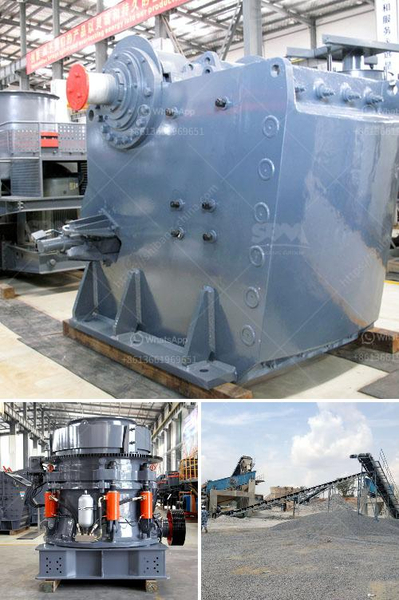

<h3>كم من الأرض مطلوبة لكسارة الحجر</h3>
تعتبر كسارات الحجر من المعدات الأساسية في صناعة البناء والإنشاءات، حيث يتم استخدامها لتكسير الصخور والحجارة لاستخراج الحجارة والحصى المطلوبة لإنتاج مواد البناء. ومن المعروف أن هذه الكسارات تحتاج إلى مساحة واسعة لتركيبها وتشغيلها بكفاءة وفاعلية.

تختلف مساحة الأرض المطلوبة لكسارة الحجر وفقًا لأحجام الكسارة ونوعها، بالإضافة إلى الاحتياجات الإضافية مثل ساحات التخزين والمناولة والمعدات الأخرى. ومن الصعب تحديد الحجم الدقيق المطلوب للكسارة، ولكن يمكن أن نقدره باتجاهات عامة.

عند تثبيت كسارة الحجر بحجم متوسط، قد يتطلب ذلك مساحة تتراوح بين 200-400 ألف متر مربع. هذه المساحة تشمل مواقع تخزين المواد الخام، ومناطق تفريغ الحجارة المكسورة، ومنصات العمل والممرات، ونظام التغذية والفرز، ومناطق العمال والإدارة، بالإضافة إلى البنية التحتية اللازمة مثل الطرق والجسور ومنظومة الصرف الصحي والتيار الكهربائي.

تحسب المساحة المطلوبة للكسارة بناءً على العديد من العوامل، بما في ذلك سعة الإنتاج المطلوبة، ونوع الحجر المطلوب تكسيره، وطريقة التشغيل التي يتم اتباعها، والضوابط البيئية المحلية والأنظمة. قد يتطلب أيضًا الاهتمام بتصميم متطلبات محددة مثل تجهيز مياه الشرب والمرافق الصحية للعمال.

تجدر الإشارة إلى أن هذه الأرقام مجرد تقديرات تقريبية وتختلف من موقع لآخر وفقًا للظروف المحلية والمتطلبات. قد يتم تخصيص مساحات أكبر أو أصغر حسب متطلبات الكسارة والمشروع الذي تخدمه.

وباختصار، تحتاج كسارة الحجر إلى مساحة واسعة تتراوح بين 200-400 ألف متر مربع تقريبًا، وتعتمد المساحة الدقيقة المطلوبة على عدة عوامل مثل السعة والطراز والتشغيل والظروف المحيطة. يجب الالتزام باللوائح والقوانين المحلية عند توسيع أو إنشاء كسارة حجر، والعمل على توفير الفضاء الكافي لتشغيلها بكفاءة ودون المساس بالبيئة المحلية والمجتمع.
<h3>Contact us</h3><ul><li><strong>Whatsapp:&nbsp;<a href="https://wa.me/8613661969651">+8613661969651</a></strong></li><li><a href="https://swt.shibang-china.com/?git&amp;zhl&amp;كم من الأرض مطلوبة لكسارة الحجر"><strong>Online Service(chat now)</strong></a></li></ul><h3>Related</h3><ul><li><a href='آلة كسارة صغيرة للبيع في زيمبابوي.md'>آلة كسارة صغيرة للبيع في زيمبابوي</a></li><li><a href='عملية تعدين الكوارتز في ولاية أندرا براديش.md'>عملية تعدين الكوارتز في ولاية أندرا براديش</a></li><li><a href='شركات سيور النقل في المكسيك.md'>شركات سيور النقل في المكسيك</a></li><li><a href='مطحنة طحن عمودية مستعملة بسعة 100 طن في الساعة.md'>مطحنة طحن عمودية مستعملة بسعة 100 طن في الساعة</a></li><li><a href='كسارة مخروطية للبيع في جنوب أفريقيا.md'>كسارة مخروطية للبيع في جنوب أفريقيا</a></li></ul>