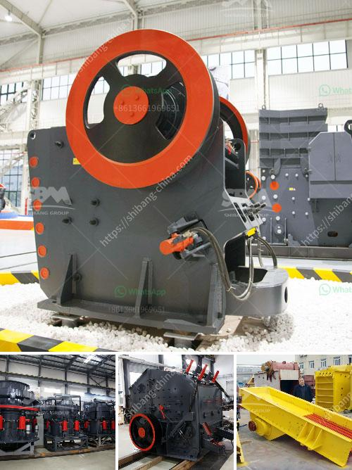

<h3>كم يكلف كسارة الحجر</h3>
تعد كسارة الحجر جهازًا يستخدم في صناعة البناء والتشييد لكسر وطحن الحجارة والصخور الكبيرة إلى حجم أصغر. تتوفر كسارات الحجر بأحجام وأنواع مختلفة تتنوع في تكلفتها وقدرتها على الإنتاج. سنناقش في هذه المقالة تكلفة كسارة الحجر في النطاق السعري 200-400.

تتأثر تكلفة كسارة الحجر بعدة عوامل. من بين هذه العوامل هي جودة المواد الأولية المستخدمة في الكسارة ، والمكونات المستخدمة في الآلة ، وسعة الإنتاج المقدمة من الكسارة ، وتكاليف الصيانة والتشغيل ، وتكاليف النقل والشحن ، وتكاليف التأمين ، وتكاليف التراخيص والضرائب ، وعمر الآلة.

في النطاق السعري 200-400 ، يمكن العثور على مجموعة متنوعة من كسارات الحجر. قد تشمل هذه الآلات كسارات الفك الأساسية والكسارات المخروطية وكسارات الصدم الأفقية. تعتبر كسارات الفك الأساسية واحدة من أنواع الكسارات الأكثر استخدامًا في صناعة البناء ، وتتراوح قدرتها عادةً من 50 إلى 200 طن في الساعة. ومن المعروف أن كسارة الفك الأساسية في هذا النطاق السعري تكون موفرة من حيث التكلفة وعمرها التشغيلي الطويل. قد تتطلب هذه الآلات صيانة منتظمة وتكاليف تشغيل منخفضة.

بالإضافة إلى ذلك ، يمكن أن تتكون تكلفة كسارة الحجر من تكاليف إضافية مثل شاشات الغربلة والسيور الناقلة والمحركات وأجهزة التحكم وغيرها من الملحقات. ومع ذلك ، قد تكون هذه التكاليف اختيارية وتختلف حسب متطلبات الإنتاج واحتياجات العميل.

باختصار ، لا يمكن تحديد السعر المحدد لكسارة الحجر في النطاق السعري 200-400 بدقة ، لأنه يتعلق بالعديد من العوامل المختلفة. ينصح بالتواصل مع الشركات المصنعة أو الموردين للحصول على تفاصيل أكثر تحديدًا وأسعار وعروض محددة. من المهم أيضًا معرفة المواصفات المطلوبة لآلة الكسارة واحتياجات الإنتاج لتحديد النموذج المناسب والتكلفة.
<h3>Contact us</h3><ul><li><strong>Whatsapp:&nbsp;<a href="https://wa.me/8613661969651">+8613661969651</a></strong></li><li><a href="https://swt.shibang-china.com/?git&amp;zhl&amp;كم يكلف كسارة الحجر"><strong>Online Service(chat now)</strong></a></li></ul><h3>Related</h3><ul><li><a href='سعر فحص الرمل بسعة كبيرة للبيع.md'>سعر فحص الرمل بسعة كبيرة للبيع</a></li><li><a href='آلة طحن الكالسايت للبيع.md'>آلة طحن الكالسايت للبيع</a></li><li><a href='تكلفة تشغيل الكسارة في لاس فيغاس.md'>تكلفة تشغيل الكسارة في لاس فيغاس</a></li><li><a href='جول محطم الحجر.md'>جول محطم الحجر</a></li><li><a href='معالجة الذهب في الفلبين.md'>معالجة الذهب في الفلبين</a></li></ul>