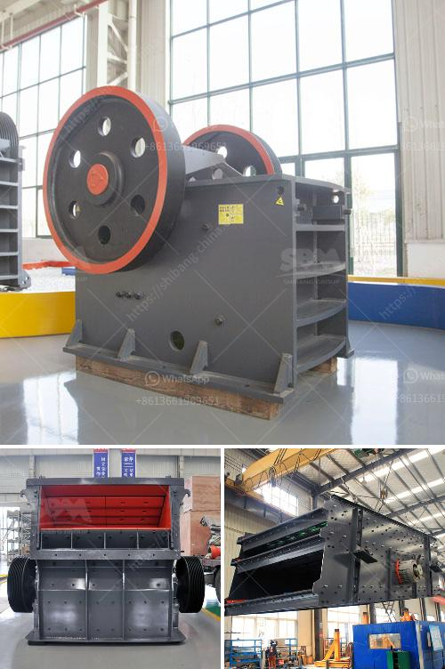

<h3>كيف يتم استخدام مسحوق الدولوميت في البناء</h3>
مسحوق الدولوميت هو مادة يتم الحصول عليها من الصخور الدولوميتية، وهي صخور تتكون أساسًا من الكربونات والمغنيسيوم والكالسيوم. وتُستخدم هذه المادة في البناء لعدة أسباب، منها خواصها الميكانيكية الجيدة ومقاومتها للتآكل وقدرتها على تحسين خصائص بعض المواد الأخرى المستخدمة في البناء.

أحد استخدامات مسحوق الدولوميت في البناء هو في صناعة الخرسانة. فعند إضافة الدولوميت إلى الخليط الخرساني، يؤدي ذلك إلى زيادة قوة الخرسانة ومقاومتها للتآكل. كما أنه يحسن توزيع الجسيمات في الخليط الخرساني، مما يؤدي إلى زيادة كثافتها ومرونتها. وبالتالي، يتم الحصول على خرسانة أكثر متانة وقوة، وتستخدم في الهياكل التي تحتاج إلى مقاومة عالية للضغط والتآكل، مثل الجسور والسدود.

كما يُستخدم مسحوق الدولوميت في صناعة الجص. فعند إضافة هذه المادة إلى مادة الجص، يتم تحسين خواصها الميكانيكية ومقاومتها للانكماش والتشقق. وذلك يتيح استخدام الجص في الجدران الداخلية والأسقف بشكل مستدام ودون تشوه. كما يتم تحسين مقاومة الجص للرطوبة، مما يجعله مناسبًا للاستخدام في الحمامات والمطابخ.

وفي صناعة الدهّانات، يستخدم مسحوق الدولوميت لتعزيز خواص الدهانات وتحسين مقاومتها للتآكل والتشقق. كما أنه يستخدم كمادة ملء لتسوية الشوائب والعيوب في الأسطح قبل طلاءها، مما يعطي نتائج أفضل وأكثر اتساقًا في التشطيب النهائي.

بالإضافة إلى ذلك، يُستخدم مسحوق الدولوميت في إنتاج البلاط والأرضيات. فعند خلطه مع مواد أخرى مثل السيراميك أو الحجر الصناعي، يتم تحسين خواصها الميكانيكية ومقاومتها للتآكل والصدمات. وبالتالي، يُمكننا الحصول على بلاط وأرضيات أكثر متانة وقوة، وتستخدم في المناطق ذات الاستخدام العالي، مثل المطارات والمحلات التجارية.

استخدام مسحوق الدولوميت في البناء يعتبر فعالًا ومجدًا لتحسين خواص ومقاومة المواد المستخدمة. فإضافة هذه المادة تعزز قوة المواد ومقاومتها للتآكل والتشقق، مما يضمن بناءًا أكثر استدامة ومتانة. وبالتالي، فإن استخدام مسحوق الدولوميت يُعد خيارًا مثلى للحصول على نتائج ذات جودة عالية في البناء.
<h3>Contact us</h3><ul><li><strong>Whatsapp:&nbsp;<a href="https://wa.me/8613661969651">+8613661969651</a></strong></li><li><a href="https://swt.shibang-china.com/?git&amp;zhl&amp;كيف يتم استخدام مسحوق الدولوميت في البناء"><strong>Online Service(chat now)</strong></a></li></ul><h3>Related</h3><ul><li><a href='كسارة المحجر للحجر.md'>كسارة المحجر للحجر</a></li><li><a href='كسارات حجر محمولة أوغندا للبيع.md'>كسارات حجر محمولة أوغندا للبيع</a></li><li><a href='مشكلة الناقل الفحم.md'>مشكلة الناقل الفحم</a></li><li><a href='معدات معالجة الحجر الكاملة محطم 100 طن.md'>معدات معالجة الحجر الكاملة محطم 100 طن</a></li><li><a href='مواصفات معدات مصنع طحن الحجر.md'>مواصفات معدات مصنع طحن الحجر</a></li></ul>