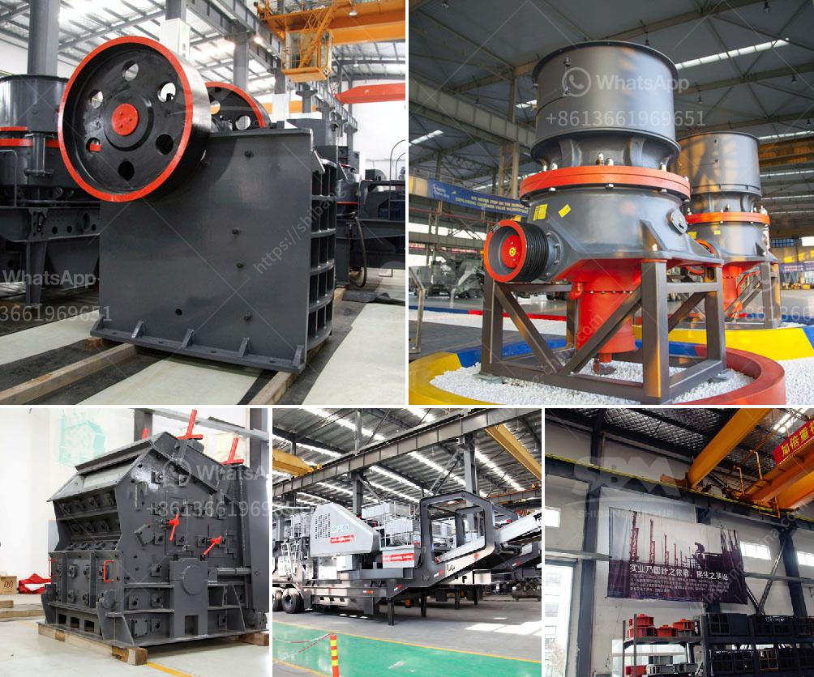

<h3>كيف يعمل مطحنة الطحن</h3>
مطحنة الطحن هي جهاز يستخدم لطحن الحبوب والأعشاب والتوابل والقهوة وغيرها من المواد الغذائية. يعتبر الطحن عملية أساسية في تحضير الأطعمة، حيث يتم تفتيت المواد الصلبة إلى جزيئات أصغر، مما يسهل عملية الهضم ويساهم في تحرير المكونات الغذائية القيمة.

تتكون مطحنة الطحن من عدة أجزاء رئيسية. الجزء الأول هو الوعاء أو الجرعة الذي يحتوي على المادة التي سيتم طحنها. يتم وضع هذه المادة في الوعاء وإغلاقه بواسطة غطاء محكم لضمان عدم تسرب المواد أثناء الطحن.

يحتوي الوعاء على سطح داخلي متين ومثالي للطحن. إذا كانت الحبوب مرطبة، قد يتم إضافة بعض الحبيبات القاسية مثل الكورنميل لمنع التلصيق وتشكيل الكتل. يتم ربط الغطاء بإحكام لتفادي الحوادث ولاستدامة الأداء العالي للمطحنة.

الجزء الثاني في المطحنة هو المحرك الكهربائي، الذي يعمل على تشغيل القرص الدوار السنبكي أو برواندر الطحن. يقوم القرص بتحويل الحبيبات إلى مسحوق أو قوام غرامة بسرعة عالية. يتم التحكم في سرعة القرص من خلال أزرار أو ترس على المطحنة، حيث يمكن ضبط درجة الطحن وفقًا لاحتياجات المستخدم.

يتم توجيه الحبوب أو المواد الأخرى من الجرعة إلى الجزء العلوي من المطحنة عن طريق فتحة متحركة. بعض المطاحن قد تحتوي على غربال لفصل الحبيبات الدقيقة عن الكبيرة، مما يسمح بالتحكم في حجم الطحين أو المسحوق.

بعض أنواع المطاحن الحديثة تحتوي على ميزات إضافية مثل التحكم الآلي، حيث يمكن ضبط الوقت ومستوى الطحن تلقائيًا. قد تحتوي أيضًا على شاشات رقمية لعرض معلومات مثل السرعة والزمن المتبقي. هذه الميزات تسهل عملية الطحن وتعزز الدقة.

في الختام، تعد مطحنة الطحن أداة هامة لإعداد الطعام في المنازل والمخابز والمطاعم. تتوفر أنواع مختلفة من المطاحن لتلبية الاحتياجات المختلفة، سواء للطحن الخشن أو الدقيق. تبقى مطاحن الطحن الحديثة تطورًا مستمرًا لتوفير أداء أفضل وأدق في عملية الطحن.
<h3>Contact us</h3><ul><li><strong>Whatsapp:&nbsp;<a href="https://wa.me/8613661969651">+8613661969651</a></strong></li><li><a href="https://swt.shibang-china.com/?git&amp;zhl&amp;كيف يعمل مطحنة الطحن"><strong>Online Service(chat now)</strong></a></li></ul><h3>Related</h3><ul><li><a href='مصنع معالجة خام الكروم في الصين.md'>مصنع معالجة خام الكروم في الصين</a></li><li><a href='معدات معالجة مسحوق الجرافيت.md'>معدات معالجة مسحوق الجرافيت</a></li><li><a href='معدات معالجة خام الذهب المستخدمة للبيع.md'>معدات معالجة خام الذهب المستخدمة للبيع</a></li><li><a href='سعر مطحنة الكرة في باكستان.md'>سعر مطحنة الكرة في باكستان</a></li><li><a href='محطة سحق ثابتة بسعة 200 طن في الساعة.md'>محطة سحق ثابتة بسعة 200 طن في الساعة</a></li></ul>