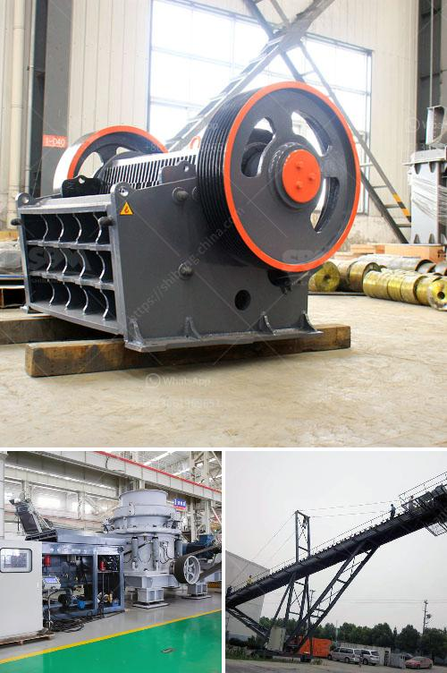

<h3>كيف يعمل مطحنة الهامر</h3>
مطحنة الهامر عبارة عن آلة تستخدم لطحن المواد الصلبة إلى قطع صغيرة أو مسحوق. تعمل هذه المطاحن على طريقة ضربات الهامرات العمودية، حيث يتم استخدام شفرات مثبتة على ذراع دوارة تدور بسرعة عالية داخل غرفة الطحن.

تتكون مطاحن الهامر من العديد من الأجزاء المهمة. الجزء الرئيسي هو الوعاء الذي يحتوي على المادة المراد طحنها. ويمتاز هذا الوعاء بتصميمٍ مقاوم للاهتراء والتآكل. يتم تحميل المادة في الوعاء ويتم طحنها عن طريق الهامرات عند تشغيل المطحنة.

ثم يوجد هناك موتور يدفع رمح الذي يحمل الشفرات الدوارة. يعمل الموتور على تشغيل الشفرات بسرعة عالية تصل إلى الآلاف من اللفات في الدقيقة. وهذه الشفرات الدوارة تصطدم بالمواد الموجودة في الوعاء، مما يسبب طحنها وتفتيتها. تعتمد سرعة الدوران والشكل وعدد الشفرات على نوعية المادة المراد طحنها والمطلوبة منتج النهائي.

تتميز مطاحن الهامر بقدرتها على طحن مجموعة متنوعة من المواد مثل الحبوب، والأعشاب، والتوابل، والبلاستيك، والعديد من المواد الأخرى. تم تصميم هذه المطاحن لتكون قوية ومتينة وقادرة على التعامل مع مواد صلبة من جميع الأحجام والأشكال. تستخدم في العديد من الصناعات مثل الأغذية، والمنسوجات، والكيماويات، والمعادن.

من المهم أخذ العديد من الاحتياطات الأمنية عند استخدام مطحنة الهامر. يجب توفير جهاز حماية للعاملين لمنع وصول اليدين إلى منطقة الطحن. بالإضافة إلى ذلك، يجب تنظيف الآلة بعناية بعد كل استخدام لإزالة الرواسب والمواد العالقة.

لخلاصة القول، مطحنة الهامر هي آلة فعالة وموثوقة تعمل على طحن المواد الصلبة إلى جزيئات أصغر للحصول على منتج نهائي مطلوب. تستخدم في العديد من الصناعات وتتطلب احتياطات أمنية للاستخدام السليم.
<h3>Contact us</h3><ul><li><strong>Whatsapp:&nbsp;<a href="https://wa.me/8613661969651">+8613661969651</a></strong></li><li><a href="https://swt.shibang-china.com/?git&amp;zhl&amp;كيف يعمل مطحنة الهامر"><strong>Online Service(chat now)</strong></a></li></ul><h3>Related</h3><ul><li><a href='مطاحن طحن أتا.md'>مطاحن طحن أتا</a></li><li><a href='كسارة الحجر ديربان.md'>كسارة الحجر ديربان</a></li><li><a href='مطحنة طحن عمودية.md'>مطحنة طحن عمودية</a></li><li><a href='تعدين البازلت.md'>تعدين البازلت</a></li><li><a href='كسارة الحجر بوزولانا 100 طن في الساعة.md'>كسارة الحجر بوزولانا 100 طن في الساعة</a></li></ul>