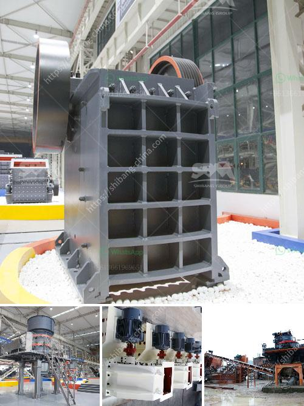

<h3>كيفية إعداد خطة عمل لمصنع الكسارات</h3>
إعداد خطة عمل لمصنع الكسارات يعتبر أمرًا حاسمًا لضمان نجاح المشروع وتحقيق الأهداف المرجوة. فيما يلي سنقدم نظرة عامة على كيفية إعداد خطة عمل لمصنع الكسارات:

تبدأ خطة العمل بتحديد الهدف الرئيسي للمصنع، والذي يعتبر القاعدة الأساسية لبقية الخطة. يجب أن يكون الهدف محددًا وواقعيًا وقابلًا للقياس، كمثال: "تصبح الشركة الرائدة في صناعة الكسارات في المنطقة خلال خمس سنوات".

يتضمن تحليل السوق دراسة العوامل المؤثرة على صناعة الكسارات، مثل الطلب والعرض والمنافسة. يُقدم في هذا القسم تقدير لحجم السوق والفرص والتحديات المحتملة.

بناءً على التحليل السابق، يتعين تحديد قائمة بالمنتجات والخدمات التي ستقدمها المصنع، بالإضافة إلى التركيز على الفوائد التنافسية التي ستقدمها المنتجات والخدمات هذه.

تشمل هذه الخطوة تقدير القدرة الإنتاجية المطلوبة وتحديد العمليات والمعدات المطلوبة لتلبية الطلب. يجب أيضًا النظر في الاحتياجات البشرية والمهارات المطلوبة لتشغيل المصنع.

يجب وضع استراتيجية تسويق ومبيعات قوية للتعريف بالمنتجات والخدمات وجذب العملاء المحتملين. يمكن استخدام أدوات الترويج التقليدية والتسويق الرقمي لتحقيق ذلك.

يجب تحديد تكاليف إنشاء وتشغيل المصنع، بما في ذلك تحديد التمويل المطلوب. يعتبر تخطيط الميزانية وتقدير التكاليف المستقبلية جانبًا حاسمًا لنجاح المشروع.

بعد وضع الخطة، يجب تنفيذها على الواقع. يجب على الفريق القيادي تعيين وإشراف على تنفيذ الخطة، ومتابعة تقدم المشروع والتحكم فيه على مدار الزمن.

يجب تقييم أداء المصنع بشكل منتظم ومقارنته بالأهداف المرجوة. يساعد هذا في تحديد النقاط القوية والضعف وتحديد الفرص للتحسين المستمر.

في النهاية، إعداد خطة عمل جيدة لمصنع الكسارات يعزز فرصة النجاح في السوق. يجب أن يتم مراجعة الخطة بانتظام وتعديلها وفقًا للتغيرات التي قد تحدث في سوق الكسارات وبناءً على النتائج المستمرة.
<h3>Contact us</h3><ul><li><strong>Whatsapp:&nbsp;<a href="https://wa.me/8613661969651">+8613661969651</a></strong></li><li><a href="https://swt.shibang-china.com/?git&amp;zhl&amp;كيفية إعداد خطة عمل لمصنع الكسارات"><strong>Online Service(chat now)</strong></a></li></ul><h3>Related</h3><ul><li><a href='كسارة صخرية للبيع.md'>كسارة صخرية للبيع</a></li><li><a href='مصنع كسارة الفك.md'>مصنع كسارة الفك</a></li><li><a href='سعر آلة طاحونة الهامر.md'>سعر آلة طاحونة الهامر</a></li><li><a href='علامات مصنع كسارة المحجر مطحنة الكرة.md'>علامات مصنع كسارة المحجر مطحنة الكرة</a></li><li><a href='آلات مصنع الحصى الكوارتز.md'>آلات مصنع الحصى الكوارتز</a></li></ul>