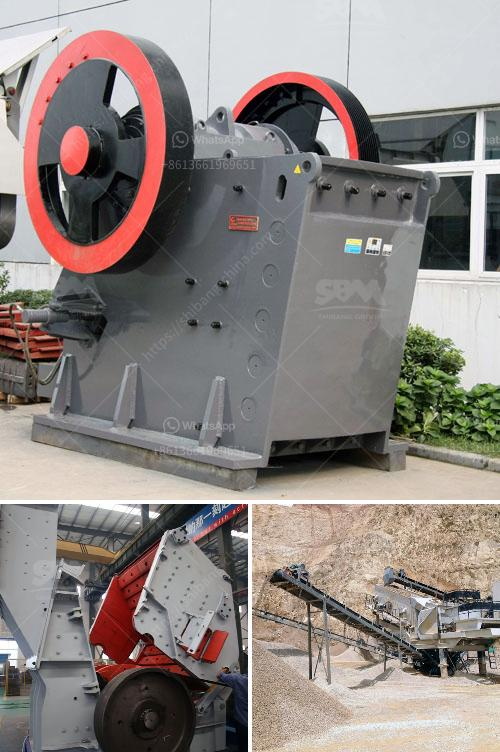

<h3>كيفية إعداد شركة محجر حجر</h3>
إن إعداد شركة محجر حجر يتطلب عدة خطوات ومجهودات لضمان نجاح العمل وتحقيق الأرباح المرجوة. في هذه المقالة، سنناقش بعض الخطوات الرئيسية التي يجب اتخاذها لإنشاء شركة محجر حجر.

أولاً وقبل كل شيء، يجب إجراء دراسة جدوى شاملة للتحقق من جدوى المشروع. يجب أن تشمل هذه الدراسة تقييم موقع المحجر وتقدير كمية ونوعية الحجر المتاح فيه. يلزم أيضًا دراسة السوق المحلية لتحديد الطلب على منتجات الحجر ومعرفة المنافسة المحتملة. إن استنادك إلى دراسة جدوى دقيقة سيساعدك على تحديد النقاط القوية والضعف وتطوير استراتيجيات ناجحة.

بعد ذلك، يجب عليك الحصول على التراخيص والتصاريح اللازمة لتشغيل المحجر. يتضمن ذلك الحصول على تصاريح بناء ورخصة بيئية ورخصة استخراج المواد الصخرية من المحجر. ينبغي أن تواصل التعاون مع الجهات المعنية المحلية والاطلاع على القوانين واللوائح المتعلقة بالعمل في صناعة الحجر.

من الضروري أيضًا تأمين معدات وأدوات العمل اللازمة لاستخراج ومعالجة الحجر. يجب أن تعتمد على المعدات المناسبة لاحتياجاتك الخاصة، مثل الكسارات والشاحنات والحفارات. قد تحتاج أيضًا إلى عمال مهرة وذوي خبرة في هذا المجال للقيام بالعمليات اللازمة.

بعد تجهيز المحجر بالمعدات اللازمة، يجب العمل على تسويق منتجاتك بفعالية. يُنصح بالبدء بإنشاء شبكة عملاء محتملة بالتعاون مع مقاولي البناء والمطورين العقاريين وصانعي الأثاث وغيرهم من الأشخاص الذين يحتاجون إلى المحجر لمشروعاتهم. يمكنك أيضًا الاستفادة من الوسائل التسويقية الحديثة مثل وسائل التواصل الاجتماعي والمواقع الإلكترونية لتعزيز علامتك التجارية وزيادة الوعي بمنتجات الحجر التي تقدمها.

الجوانب المالية أيضًا لا يجب تجاهلها. يجب عليك إعداد خطة تمويل مناسبة لتغطية تكاليف إنشاء المحجر وتشغيله. قد تحتاج إلى التعاون مع البنوك المحلية أوالجهات التمويلية الأخرى للحصول على التمويل اللازم. يجب أيضًا وضع خطط لإدارة العائد المالي ومراقبة التكاليف بشكل دائم.

الاستمرار في تطوير أعمالك وتحسين الجودة وتوسيع الشبكة العملاء هو أمر حاسم لضمان استمرار نجاح شركتك. يجب أن تعمل بانتظام على تقييم الأداء وتحليل البيانات واستخلاص التعلمات القيمة لتحسين أداء عملك وتوجيه استراتيجياتك المستقبلية.

إعداد شركة محجر حجر يتطلب التخطيط الجيد والتحضير المبكر. عند اتباع الخطوات المذكورة أعلاه، يمكنك أن تصبح رائدًا ناجحًا في صناعة الحجر وتحقيق النجاح المالي الذي تطمح إليه.
<h3>Contact us</h3><ul><li><strong>Whatsapp:&nbsp;<a href="https://wa.me/8613661969651">+8613661969651</a></strong></li><li><a href="https://swt.shibang-china.com/?git&amp;zhl&amp;كيفية إعداد شركة محجر حجر"><strong>Online Service(chat now)</strong></a></li></ul><h3>Related</h3><ul><li><a href='مورد مصنع التكسير والفرز في الصين.md'>مورد مصنع التكسير والفرز في الصين</a></li><li><a href='تكلفة أعمال المحجر في الهند.md'>تكلفة أعمال المحجر في الهند</a></li><li><a href='سعر كسارة الأسطوانة.md'>سعر كسارة الأسطوانة</a></li><li><a href='حسابات في مطحنة الأسطوانة العمودية.md'>حسابات في مطحنة الأسطوانة العمودية</a></li><li><a href='منتجات آلات الكتل الطينية.md'>منتجات آلات الكتل الطينية</a></li></ul>