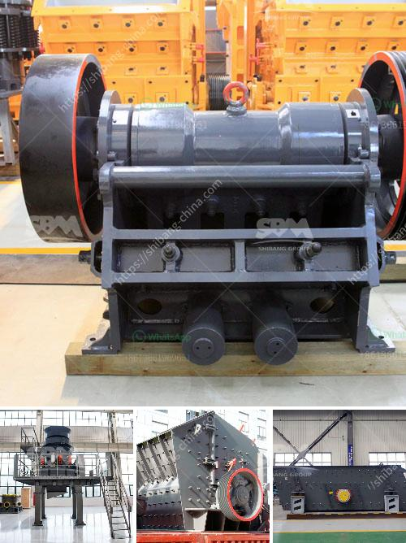

<h3>كيفية إعداد كسارة</h3>
تحظى كسارة باهتمام كبير في صناعة التعدين والبناء، حيث تستخدم لتفتيت وتكسير المواد الصلبة مثل الصخور والخامات. يهدف استخدام الكسارة إلى تحجيم المواد الخام إلى أحجام أصغر، مما يتيح لها أن تصبح مناسبة للاستخدام في العمليات الصناعية الأخرى.

إعداد الكسارة يتطلب بعض الخطوات والإجراءات الأساسية لضمان أدائها بشكل فعال وسلس. هنا سنلقي نظرة على كيفية إعداد الكسارة:

1- دراسة المواد الخام: ينبغي تحديد نوع وصلابة المواد الخام قبل استخدام الكسارة. هذا يساعد في اختيار النوع المناسب من الكسارة وتحديد التكوينات اللازمة لتشغيلها بشكل مثالي.

2- اختيار النوع المناسب من الكسارة: هناك عدة أنواع من الكسارات المتاحة مثل الكسارات الفكية والصدمية والمخروطية. يجب اختيار النوع الأنسب بناءً على نوعية المواد الخام والحجم المطلوب للمواد النهائية.

3- تحديد الطاقة والسعة الإنتاجية: يجب تحديد الطاقة والسعة الإنتاجية المطلوبة للكسارة بناءً على حجم الإنتاج المرجو والمتطلبات العملية الخاصة بالمشروع.

4- إعداد منطقة العمل والمعدات المساندة: يجب إعداد منطقة العمل المناسبة وتأمين المعدات المساندة مثل السيور الناقلة والغرابيل الاهتزازية وأجهزة التحكم والقدرات الهيدروليكية.

5- التجهيزات الكهربائية والتحكم: يجب تأمين التجهيزات الكهربائية اللازمة والتحكم الآلي للكسارة بشكل صحيح وفعال. ينبغي أن تتوافق مواصفات الغلاف الكهربائي والأسلاك والتوصيلات مع المعايير الصناعية السليمة.

6- التدريب والصيانة: يجب تدريب العاملين على تشغيل وصيانة الكسارة بشكل صحيح. وينبغي تحديد خطة صيانة دورية للحفاظ على أداء الكسارة بشكل مستدام.

في النهاية، من المهم الاهتمام بإعداد الكسارة بشكل صحيح لضمان أداءها الفعال وسلامتها. التحضير والتوافق مع المعايير الصناعية يساهمان في ضمان حسن تشغيل الكسارة وزيادة كفاءتها، مما يؤدي في النهاية إلى تعزيز الإنتاجية وتحقيق أقصى استفادة من هذه التقنية الحديثة في العمليات الصناعية.
<h3>Contact us</h3><ul><li><strong>Whatsapp:&nbsp;<a href="https://wa.me/8613661969651">+8613661969651</a></strong></li><li><a href="https://swt.shibang-china.com/?git&amp;zhl&amp;كيفية إعداد كسارة"><strong>Online Service(chat now)</strong></a></li></ul><h3>Related</h3><ul><li><a href='مطحنة السيليكا المطحونة للبيع.md'>مطحنة السيليكا المطحونة للبيع</a></li><li><a href='معدات التعويم للتعدين للبيع في جنوب أفريقيا.md'>معدات التعويم للتعدين للبيع في جنوب أفريقيا</a></li><li><a href='معدات معالجة خام الذهب المستخدمة للبيع.md'>معدات معالجة خام الذهب المستخدمة للبيع</a></li><li><a href='بناء شاشات اهتزاز.md'>بناء شاشات اهتزاز</a></li><li><a href='مصنع كسارة في الهند.md'>مصنع كسارة في الهند</a></li></ul>