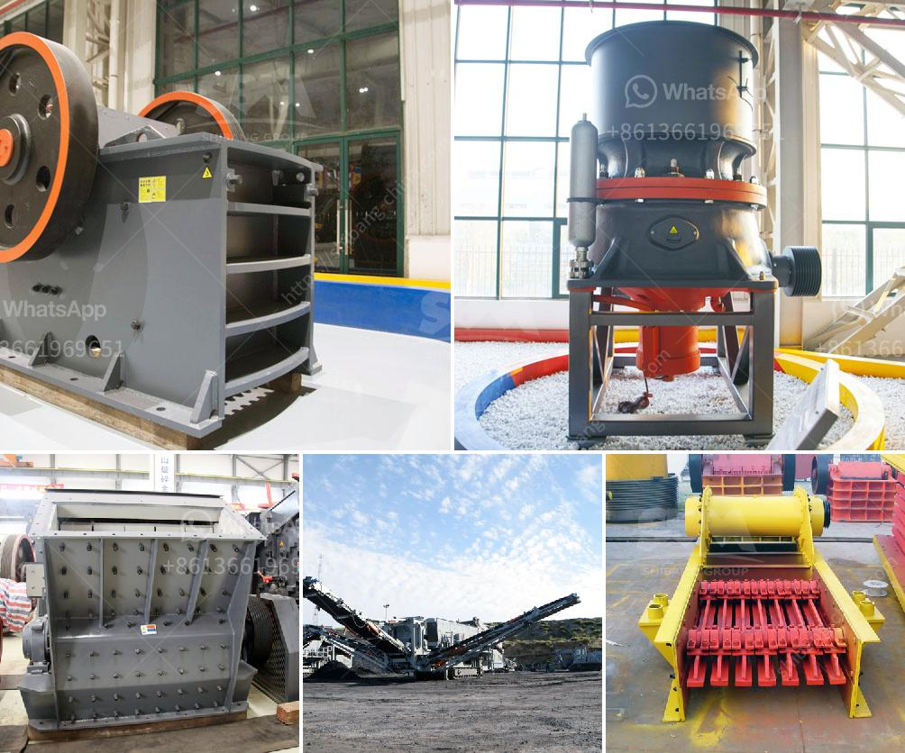

<h3>كيفية إنشاء شركة محجر</h3>
إنشاء شركة محجر يمكن أن يكون استثمارًا ناجحًا ومربحًا. هنا هي بعض الخطوات الأساسية لإنشاء شركة محجر:

1- البحث عن الموقع المناسب: يجب أولاً أن تحدد الموقع الذي ستقوم فيه ببناء المحجر. يجب أن يكون الموقع قريبًا من مصادر المواد الخام والسوق المستهدفة للمنتجات المحجرة. قم بتقييم التربة والتضاريس في المنطقة واحرص على الحصول على التراخيص اللازمة للبناء.

2- تجهيز المعدات: احصل على المعدات اللازمة لأعمال التعدين والاستخراج. هذه المعدات يمكن أن تشمل الحفارات والجرافات والشاحنات والكسارات والآلات الأخرى ذات الصلة. قم بالبحث والاستشارة لاختيار المعدات المناسبة والعمل على الحصول عليها.

3- تأسيس الشركة وترتيب الأوراق القانونية: يجب أن يتم إنشاء الشركة بشكل قانوني وتسجيلها في الجهات المعنية. قم بتجهيز الأوراق القانونية لتأسيس الشركة مثل العقود والوثائق الضريبية وغيرها من المتطلبات النظامية.

4- التسويق وتطوير العملاء: ابحث عن الفرص التجارية والعملاء المحتملين لمنتجاتك. قم بتطوير استراتيجية تسويقية فعالة تركز على المزايا التنافسية التي يوفرها محجرك للعملاء. استخدم وسائل التواصل الاجتماعي والإعلانات التقليدية للترويج لمنتجاتك وجذب العملاء الجدد.

5- إدارة العمليات والأنشطة: قم بتنظيم وإدارة العمليات والأنشطة في المحجر بشكل فعال. ضع خطط لسحب وتخزين المواد الخام وعمليات تصنيع المنتجات والتوصيل. تأكد من اتباع معايير الجودة والسلامة في جميع الأنشطة.

6- إدارة الموارد البشرية: قم بتوظيف وتدريب فريق عمل مؤهل لإدارة المحجر. يجب أن يكون لديك فريق محترف ومتفاني للقيام بالأعمال في المحجر والحفاظ على سلامة الموظفين والمعدات.

7- متابعة الأداء وتحسينه: قم بتتبع أداء الشركة وتحسينه باستمرار من خلال تحليل البيانات وتقييم العمليات. استمع لردود الفعل من العملاء وحاول التكيف مع تطلعاتهم وتحسين المنتجات والخدمات.

بالاعتماد على هذه الخطوات الأساسية، يمكنك بدء إنشاء شركة محجر ناجحة وتحقيق النجاح والربح في هذه الصناعة التنقيبية.
<h3>Contact us</h3><ul><li><strong>Whatsapp:&nbsp;<a href="https://wa.me/8613661969651">+8613661969651</a></strong></li><li><a href="https://swt.shibang-china.com/?git&amp;zhl&amp;كيفية إنشاء شركة محجر"><strong>Online Service(chat now)</strong></a></li></ul><h3>Related</h3><ul><li><a href='معدات محجر الحجر الجيري.md'>معدات محجر الحجر الجيري</a></li><li><a href='شركة معدات تعدين الذهب في اليابان.md'>شركة معدات تعدين الذهب في اليابان</a></li><li><a href='كسارات محمولة في محجر جنوب أفريقيا.md'>كسارات محمولة في محجر جنوب أفريقيا</a></li><li><a href='مطاحن الكرة في إندونيسيا.md'>مطاحن الكرة في إندونيسيا</a></li><li><a href='كسارة الفك الصينية PE 150 250 في الفلبين.md'>كسارة الفك الصينية PE 150 250 في الفلبين</a></li></ul>