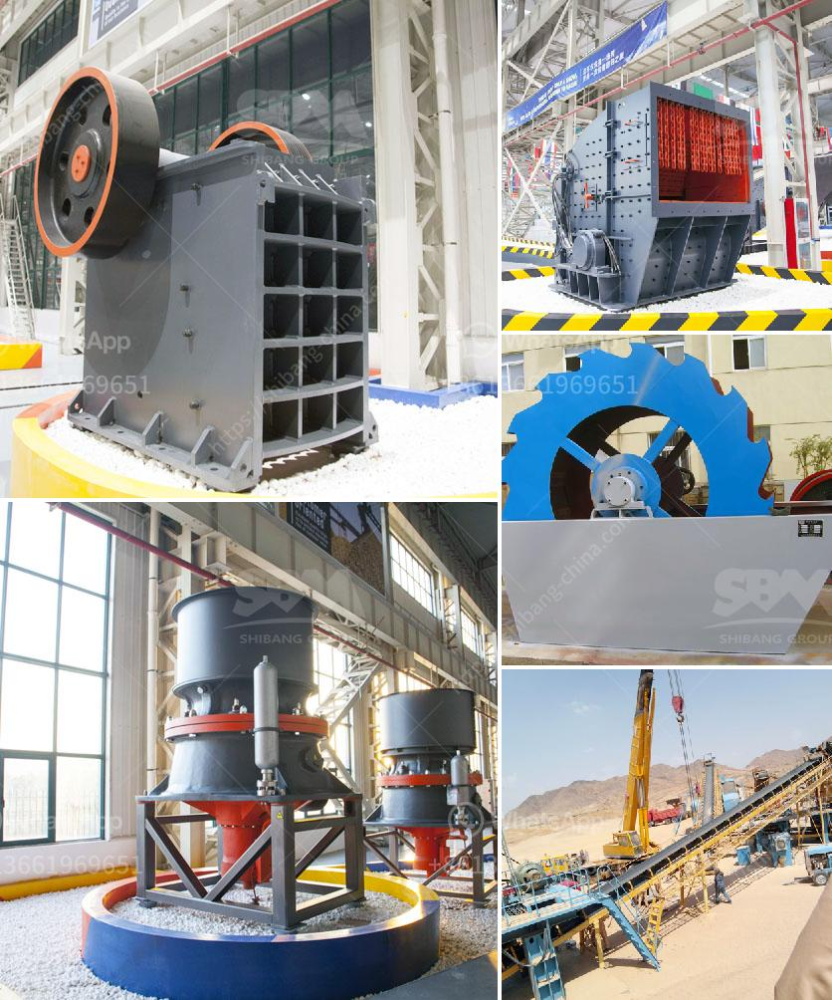

<h3>كيفية إنشاء مصنع لتكسير الحجر</h3>
تكسير الحجر هو عملية تستخدم لتحويل الصخور الكبيرة إلى قطع صغيرة من الحصى أو الحجارة المسحوقة التي يمكن استخدامها في مجموعة متنوعة من التطبيقات الصناعية والإنشائية. وإنشاء مصنع لتكسير الحجر هو عملية معقدة ومتعددة الخطوات تتطلب التخطيط الدقيق والموارد المالية والفنية اللازمة لبناء المصنع وتشغيله بكفاءة. في هذه المقالة، سنستعرض بعض الخطوات الأساسية التي يجب اتباعها لإنشاء مصنع لتكسير الحجر.

الخطوة الأولى في إنشاء مصنع تكسير الحجر هي اختيار الموقع المناسب. يجب أن يكون الموقع قريبًا من مناجم الحجر ووسائل النقل، لتقليل التكاليف اللوجستية. يجب أيضًا دراسة البيئة المحيطة بالموقع لضمان عدم وجود مشاكل بيئية أو تأثيرات سلبية على المجتمع المحلي.

بعد ذلك، يجب تقدير حاجة المصنع للطاقة والمعدات. يمكن أن تشمل المعدات الأساسية في مصنع تكسير الحجر كسارات الفك، الكسارات المخروطية، وغرابيل الاهتزاز. يجب اختيار المعدات المناسبة بناءً على حجم الحجارة المستهدف تكسيرها وإمكانية إنتاج الأحجام المطلوبة من المنتج النهائي.

بعد ذلك، يجب أخذ في الاعتبار التصاميم الهندسية للمصنع. يتضمن ذلك تصميم المباني والهياكل التي ستستخدم في المصنع، بالإضافة إلى تخطيط المعدات وخطوط الإنتاج. يجب أن تلتزم هذه التصاميم بالمواصفات الصناعية القياسية وتفي بمعايير السلامة والصحة المهنية.

وبعد ذلك، يجب توفير الموارد المادية والمالية اللازمة لبناء المصنع. يشمل ذلك شراء المعدات والمعدات اللازمة وتوظيف العمال الماهرين وشراء المواد الأولية. يجب أن يتم تخطيط الميزانية بعناية لضمان تغطية جميع التكاليف المتوقعة والبقاء داخل حدود الإنفاق المحددة.

وأخيرًا، بعد الانتهاء من بناء المصنع وتجهيزه بالمعدات اللازمة، يجب تجريب عملية التكسير وضبط الإعدادات حتى تحقق أفضل أداء. يجب أيضًا تدريب العمال على استخدام المعدات بشكل صحيح والامتثال لإجراءات السلامة.

لا شك أن إنشاء مصنع لتكسير الحجر يتطلب تخطيطًا دقيقًا وتعاونًا مستمرًا بين الخبراء والعاملين. يجب الالتزام بأعلى المعايير الصناعية والبيئية لضمان إنتاجية المصنع ومساهمته في التنمية المستدامة.
<h3>Contact us</h3><ul><li><strong>Whatsapp:&nbsp;<a href="https://wa.me/8613661969651">+8613661969651</a></strong></li><li><a href="https://swt.shibang-china.com/?git&amp;zhl&amp;كيفية إنشاء مصنع لتكسير الحجر"><strong>Online Service(chat now)</strong></a></li></ul><h3>Related</h3><ul><li><a href='مطحنة عمودية معلومات أيرلندا.md'>مطحنة عمودية معلومات أيرلندا</a></li><li><a href='مبيعات آلة التكسير المحمولة في جنوب أفريقيا.md'>مبيعات آلة التكسير المحمولة في جنوب أفريقيا</a></li><li><a href='مطحنة البنتونيت المستعملة من اليد الثانية.md'>مطحنة البنتونيت المستعملة من اليد الثانية</a></li><li><a href='تقرير مشروع مصنع كسارة الحجر.md'>تقرير مشروع مصنع كسارة الحجر</a></li><li><a href='مطحنة طحن ريموند في أوروبا.md'>مطحنة طحن ريموند في أوروبا</a></li></ul>