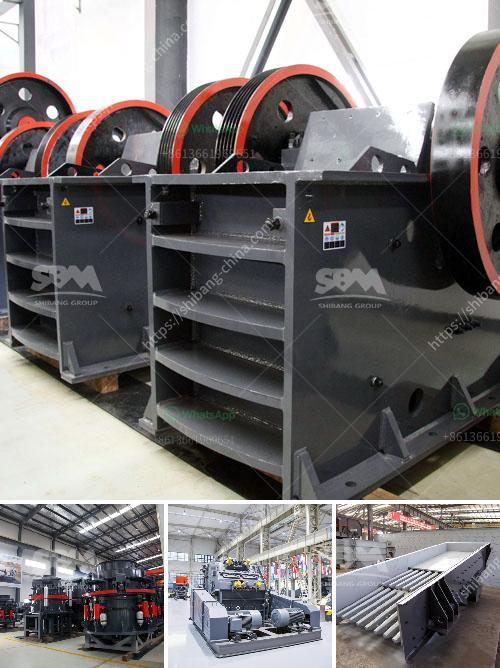

<h3>كيفية اختيار كسارة مخروطية</h3>
تعتبر الكسارات المخروطية أدوات هامة في صناعة التعدين والبناء، حيث تستخدم لتكسير المواد الصلبة إلى حجم صغير ومتساوٍ. ولكن لاختيار الكسارة المخروطية المناسبة، يجب أن يتم اعتبار العديد من العوامل التي ستضمن أداءً فعالًا واقتصاديًا للعملية.

أولاً، يجب أن يتم تحديد نطاق الإنتاج المطلوب من الكسارة بشكل دقيق. إذا كان المشروع الذي تعمل عليه يتطلب إنتاجية عالية، فيجب اختيار كسارة مخروطية كبيرة الحجم تستوعب كمية كبيرة من المواد. أما إذا كانت الإنتاجية أقل، فسيكون من المناسب اختيار كسارة أصغر حجمًا وأكثر مرونة.

ثانيًا، يجب مراعاة صلابة المواد التي ستتم معالجتها. إذا كانت المواد صلبة جدًا، فيجب اختيار كسارة مخروطية مصنوعة من مواد قوية تستطيع تحمل الظروف القاسية ومقاومة التآكل. بالإضافة إلى ذلك، السرعة والقوة التي يتم استخدامها في تكسير المواد يجب أن تكون متناسبة مع الصلابة لضمان كفاءة العملية.

ثالثًا، يجب النظر في حجم التغذية والمخرجات المطلوبة. إذا كان هناك اختلاف كبير في أحجام المواد المطلوبة، فيجب اختيار كسارة مخروطية قابلة للتعديل وتتميز بمرونة في التكيف مع متطلبات الإنتاج المختلفة. بالإضافة إلى ذلك، يتوجب أيضًا النظر في متطلبات السعة التشغيلية للكسارة وسرعة الإنتاج المطلوبة.

أخيرًا، يجب أيضًا مراعاة خصائص تصميم الكسارة. الجانب التقني للكسارة يجب أن يكون ملائمًا لظروف العمل المحددة، مثل التهوية والتبريد وتغيير الأسطوانة بسهولة. كما يجب أن تكون الصيانة والإصلاحات المطلوبة متاحة ومناسبة لتقليل الأعطال وتحسين كفاءة العمل.

باختصار، لاختيار كسارة مخروطية مناسبة، يجب مراعاة الاحتياجات الإنتاجية وصلابة المواد والحجم المطلوب ومتطلبات التصميم. من خلال التوافق بين هذه العوامل، يمكن الوصول إلى الكسارة المناسبة التي ستضمن أداءًا فعالًا واقتصاديًا للعملية.
<h3>Contact us</h3><ul><li><strong>Whatsapp:&nbsp;<a href="https://wa.me/8613661969651">+8613661969651</a></strong></li><li><a href="https://swt.shibang-china.com/?git&amp;zhl&amp;كيفية اختيار كسارة مخروطية"><strong>Online Service(chat now)</strong></a></li></ul><h3>Related</h3><ul><li><a href='شركة تصنيع معدات التعدين في الصين.md'>شركة تصنيع معدات التعدين في الصين</a></li><li><a href='كسارة للذهب.md'>كسارة للذهب</a></li><li><a href='معالجة تكسير الكاولين في الهند.md'>معالجة تكسير الكاولين في الهند</a></li><li><a href='مصانع التكسير الكاملة في جيرميستون.md'>مصانع التكسير الكاملة في جيرميستون</a></li><li><a href='شركة تصنيع كرات الكرة في مومباي.md'>شركة تصنيع كرات الكرة في مومباي</a></li></ul>