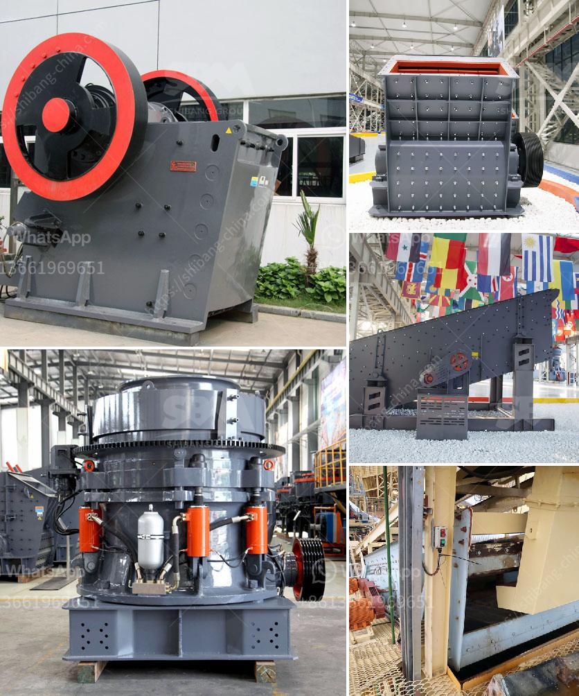

<h3>كيفية بدء عمل في مجال صناعة الكتل الخرسانية</h3>
صناعة الكتل الخرسانية تعتبر من الصناعات المهمة والمربحة في العديد من الدول. تتمثل فكرة هذه الصناعة في إنتاج الكتل الخرسانية المستخدمة في البناء وذلك بإدخال الخرسانة في قوالب خاصة وتركها حتى تتجمد وتتصلب. إذا كنت ترغب في بدء عملك الخاص في صناعة الكتل الخرسانية، فيما يلي بعض الخطوات الأساسية للبدء:

1. دراسة السوق: يجب أن تقوم بإجراء دراسة أولية للسوق المحلي لتحديد الطلب على الكتل الخرسانية ولمعرفة المنافسة والأسعار الحالية في السوق.

2. الحصول على المعدات والمواد اللازمة: ستحتاج إلى شراء معدات صناعة الكتل الخرسانية مثل قوالب، ومكبس هيدروليكي، ومصافي، ومنتجات أخرى ذات الصلة. كما يجب عليك شراء مواد البناء الأساسية مثل الخرسانة والرمل والأسمنت والماء.

3. الموقع والمساحة: يجب أن تحدد المكان المناسب لمصنع الكتل الخرسانية. يجب أن يكون لديك مساحة كافية لتخزين المعدات والمواد وإنتاج الكتل الخرسانية بكفاءة.

4. الترخيص والتصاريح: قد تحتاج إلى الحصول على تراخيص وتصاريح من الجهات المختصة في مجال الصناعة والبناء قبل بدء عملك. يمكن أن تتضمن هذه التصاريح أشياء مثل رخصة العمل وتصاريح البناء والصحة والسلامة.

5. التسويق والترويج: عندما تكون مستعدًا لإنتاج الكتل الخرسانية، يجب أن تركز على الترويج لعملك وتسويقه بشكل جيد. يمكنك استخدام وسائل التواصل الاجتماعي، وإنشاء موقع إلكتروني، والإعلان في الصحف المحلية، والمشاركة في المعارض والمؤتمرات المهنية لزيادة التوعية وجذب العملاء المحتملين.

6. التحسين المستمر: لتحقيق النجاح في صناعة الكتل الخرسانية، يجب أن تعمل على تحسين أداء عملك باستمرار. يمكنك تحسين جودة المنتجات الخاصة بك، وزيادة كفاءة الإنتاج، وتطوير علاقات مع العملاء لضمان الرضا التام عن منتجك.

عند اتباع هذه الخطوات الأساسية، يمكن أن تبدأ عملك في صناعة الكتل الخرسانية بنجاح. يجب أن تتذكر أنه من المهم أن تكون موجودًا في السوق لتوفير منتجات ذات جودة عالية وبأسعار تنافسية لتلبية احتياجات العملاء.
<h3>Contact us</h3><ul><li><strong>Whatsapp:&nbsp;<a href="https://wa.me/8613661969651">+8613661969651</a></strong></li><li><a href="https://swt.shibang-china.com/?git&amp;zhl&amp;كيفية بدء عمل في مجال صناعة الكتل الخرسانية"><strong>Online Service(chat now)</strong></a></li></ul><h3>Related</h3><ul><li><a href='تقرير جدوى مصنع الأسمنت.md'>تقرير جدوى مصنع الأسمنت</a></li><li><a href='كسارة فك محمولة في المملكة العربية السعودية.md'>كسارة فك محمولة في المملكة العربية السعودية</a></li><li><a href='محجر مستعمل بشكل معقول في نيجيريا.md'>محجر مستعمل بشكل معقول في نيجيريا</a></li><li><a href='تجهيز الذهب بالزئبق الفضي في جنوب أفريقيا.md'>تجهيز الذهب بالزئبق الفضي في جنوب أفريقيا</a></li><li><a href='شركة تصنيع آلات الكسارة في زامبيا.md'>شركة تصنيع آلات الكسارة في زامبيا</a></li></ul>