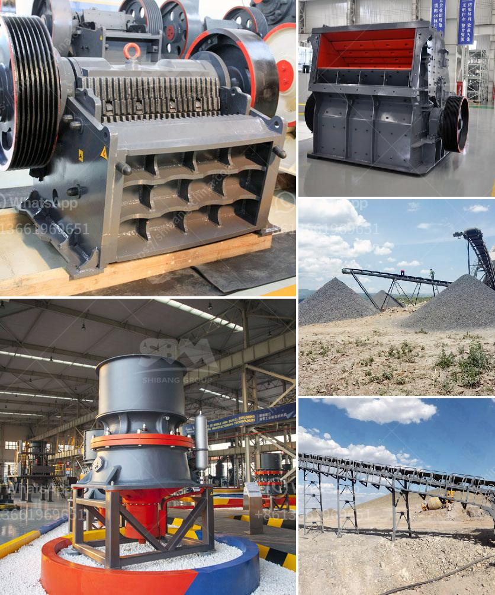

<h3>كيفية بدء مشروع كسارة الحجر</h3>
تعتبر كسارة الحجر من المشاريع التجارية المربحة في صناعة البناء والتشييد. يعود ذلك إلى الطلب المستمر على الحجارة والمواد الخام لاستخدامها في بناء المباني والطرق والجسور وغيرها. إذا كنت ترغب في الدخول في هذا القطاع، فإليك كيفية بدء مشروع كسارة الحجر.

قبل البدء في المشروع، يجب عليك القيام بالدراسات اللازمة لفهم سوق الحجارة المحلي واحتياجاته. ينبغي عليك أن تعرف الكمية المطلوبة من الحجارة، وأنواع الحجارة التي تتطلبها السوق، ومنافسيك المحتملين. كما يجب عليك أيضًا التحقق من المتطلبات القانونية والبيئية لتشغيل كسارة الحجر في منطقتك.

يجب عليك اختيار موقع مناسب لبناء الكسارة. يجب أن يكون لديك مساحة كافية لتخزين الحجارة، ووجود طرق وصول جيدة لنقل الحجارة والمعدات، ووجود مصدر مياه قريب لاستخدامه في عملية الغسيل والتبريد.

كسارة الحجر تعتبر عملية صناعية تحتاج إلى التراخيص والتصاريح المناسبة من الجهات المعنية. قم بالتواصل مع السلطات المحلية والبيئية لتحديد المتطلبات والإجراءات اللازمة للحصول على التراخيص.

قبل أن تبدأ في تشغيل الكسارة، يجب عليك اقتناء المعدات اللازمة. هذه المعدات تشمل الكسارات الأساسية، والغرابيل، والناقلات، ومنظومة التغذية، ومعدات الفحص والفرز. يمكنك شراء هذه المعدات جديدة أو مستعملة، ويجب عليك التأكد من أنها تلبي المعايير الفنية والأمنية.

في عملية تشغيل الكسارة، ستحتاج إلى فريق عمل مدرب ومؤهل للتعامل مع المعدات وتشغيل العمليات. تأكد من توظيف مهندسين وفنيين ذوي الخبرة في هذا المجال وتدريبهم على العمليات الآمنة والفحص اللازم للحجارة.

بمجرد أن تكون الكسارة جاهزة للعمل، عليك بدء الترويج لمنتجاتك والتسويق لخدماتك. قم بإنشاء علاقات تجارية مع المقاولين المحليين والشركات البنائية لتوفير مورد موثوق للحجارة. علاوة على ذلك، يمكنك توسيع نطاق عملك بالتوجه إلى البلدان المجاورة أو تصدير منتجاتك إلى مناطق أخرى.

باختصار، مشروع كسارة الحجر هو استثمار قابل للنجاح إذا تم التخطيط والتنفيذ بطريقة صحيحة. يجب أن تكون لديك دراسة قوية للسوق والتوقعات والمتطلبات. ناهيك عن أهمية الالتزام بالقوانين والتراخيص اللازمة. قد يستغرق الأمر بعض الوقت والجهد، ولكن بالتأكيد ستحقق نجاحًا ماليًا وتجاريًا يستحق.
<h3>Contact us</h3><ul><li><strong>Whatsapp:&nbsp;<a href="https://wa.me/8613661969651">+8613661969651</a></strong></li><li><a href="https://swt.shibang-china.com/?git&amp;zhl&amp;كيفية بدء مشروع كسارة الحجر"><strong>Online Service(chat now)</strong></a></li></ul><h3>Related</h3><ul><li><a href='مصنع تكسير حجر الجرانيت في كينيا.md'>مصنع تكسير حجر الجرانيت في كينيا</a></li><li><a href='آلة سحق البلاد.md'>آلة سحق البلاد</a></li><li><a href='كسارة تأثير VSI لأحجام الركام.md'>كسارة تأثير VSI لأحجام الركام</a></li><li><a href='مصنع تكسير الحجر الكلي في الصين.md'>مصنع تكسير الحجر الكلي في الصين</a></li><li><a href='مصنع المعادن سحق خام البوكسيت.md'>مصنع المعادن سحق خام البوكسيت</a></li></ul>