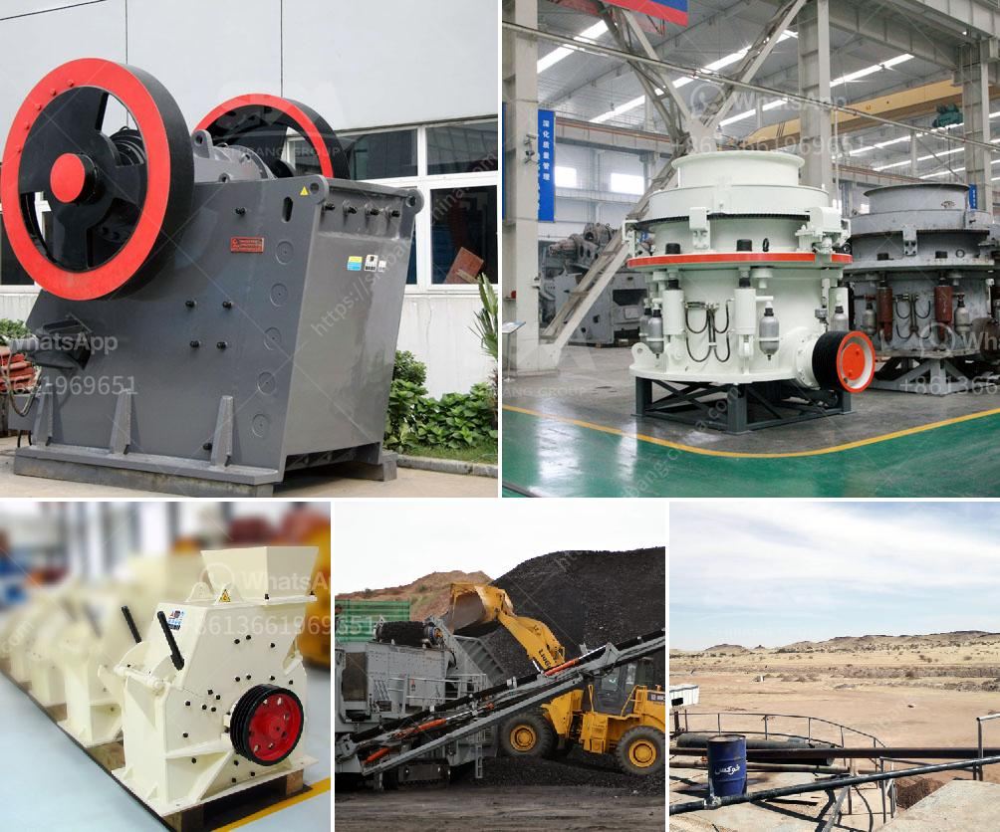

<h3>كيفية بناء مصنع استفادة من المنغنيز</h3>
يعد المنغنيز عنصرًا هامًا في صناعة الفولاذ والحديد، ويستخدم أيضًا في صناعة البطاريات والأسمدة والعديد من التطبيقات الصناعية الأخرى. بالنظر إلى أهمية هذا العنصر، يمكن أن تكون فكرة بناء مصنع استفادة من المنغنيز فرصة مربحة ومثيرة للاهتمام. في هذه المقالة، سنستعرض الخطوات الأساسية لبناء مصنع استغلال المنغنيز.

1. استكشاف المناجم: يكون التوجه الأول لبناء مصنع استفادة من المنغنيز هو البحث عن مناجم المنغنيز المتوفرة. يجب تحديد المنطقة التي تحتوي على كميات مناسبة من المنغنيز، وتحديد تكلفة استخراجه وقوة الإنتاج المتوقعة.

2. الترخيص والتصاريح: بناء مصنع استفادة من المنغنيز يتطلب الحصول على ترخيص وتصاريح من السلطات المحلية والجهات الحكومية المعنية. يجب الالتزام بمعايير السلامة والصحة المهنية وحماية البيئة لضمان عملية تشغيل آمنة ومستدامة.

3. تجهيز المنجم: بعد الحصول على التصاريح اللازمة، يجب تجهيز المنجم لبدء عملية استخراج المنغنيز. يشمل ذلك تنظيف الموقع وتأسيس البنية التحتية اللازمة مثل الطرق والمناور والمستودعات.

4. استخراج المنغنيز: تشمل عملية استخراج المنغنيز إزالة الطبقات العلوية من التربة والتحجير للحصول على الصخور التي تحتوي على المنغنيز. يجب استخدام المعدات والأدوات المحددة الخاصة بهذه العملية مثل الحفارات والشاحنات والكسارات.

5. التجهيز الأولي: يتم تجهيز الصخور المحجرة في المنجم لفصل المواد غير المرغوب فيها مثل الرواسب الطينية والأحجار الغير مرغوب فيها. يتم غالبًا تحويل الصخور إلى حجم أصغر بواسطة الكسارات والمطاحن.

6. عملية الاستفادة: هنا تتم عملية استفادة المنغنيز من الصخور المحجرة وتحولها إلى منتج نهائي. تشمل هذه العملية عمليات مثل الفصل المغناطيسي والطحن والترشيح والتركيز.

7. التصنيع والتغليف: بعد استخلاص المنغنيز بنجاح، يجب إجراء عمليات التصنيع اللازمة لتحويله إلى المنتج النهائي المطلوب مثل قضبان الحديد أو أقراص البطارية. بعد ذلك، يتم تغليف المنتج النهائي وتجهيزه للتوزيع والتسويق.

بناء مصنع استفادة من المنغنيز يتطلب التخطيط الجيد والعمل الجاد. يجب أن يتم تنفيذ العمليات اللازمة بشكل صحيح وتكون عملية الإنتاج مراقبة بشكل دقيق لضمان جودة المنتج النهائي وتحقيق الربح المرجو. يجب الالتزام بالمعايير الصناعية والبيئية لحماية العمال والبيئة المحيطة. باستخدام التكنولوجيا المتقدمة والمهارات الفنية المناسبة، يمكن تحقيق نجاح مصنع استفادة من المنغنيز والاستفادة القصوى من مورد هذا العنصر الهام.
<h3>Contact us</h3><ul><li><strong>Whatsapp:&nbsp;<a href="https://wa.me/8613661969651">+8613661969651</a></strong></li><li><a href="https://swt.shibang-china.com/?git&amp;zhl&amp;كيفية بناء مصنع استفادة من المنغنيز"><strong>Online Service(chat now)</strong></a></li></ul><h3>Related</h3><ul><li><a href='تكلفة تقديرية لمصنع التعدين.md'>تكلفة تقديرية لمصنع التعدين</a></li><li><a href='معدات تحميل وسائط مطحنة الكرة.md'>معدات تحميل وسائط مطحنة الكرة</a></li><li><a href='كسارة مخروطية بسعة 100 طن في الساعة.md'>كسارة مخروطية بسعة 100 طن في الساعة</a></li><li><a href='مصنع سحق الحجر في ألمانيا.md'>مصنع سحق الحجر في ألمانيا</a></li><li><a href='آلة سحق الحديد.md'>آلة سحق الحديد</a></li></ul>