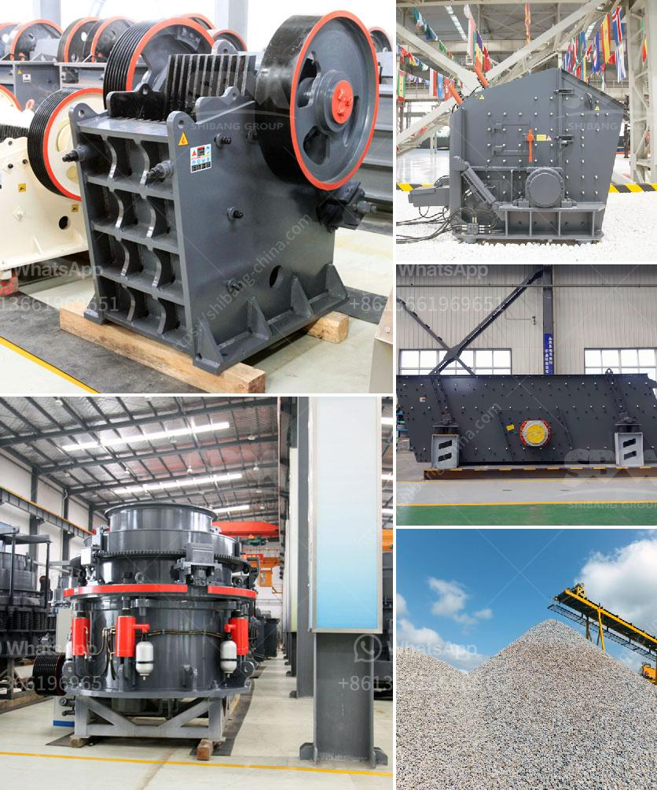

<h3>كيفية تحديد سعة سير الناقل</h3>
يعتبر تحديد سعة سير الناقل أمرًا هامًا لأي منظومة نقل، سواء كانت تُستخدم لنقل البضائع أو الأفراد. تُعَدّ سعة سير الناقل مقياسًا للقدرة الإجمالية للناقل على نقل الحمولة في فترة زمنية محددة، وتحديد هذه السعة يساعد على تحديد عدد وتوزيع الناقلات في المنظومة.

هناك عدة طرق يمكن استخدامها لتحديد سعة سير الناقل، ومن ضمنها:

1. الاعتماد على السعة النظرية: يتم حساب سعة سير الناقل استنادًا إلى القوة الدافعة للناقل وسرعته القصوى. وتُحسب السعة النظرية بمعرفة متوسط الحمولة التي يمكن للناقل حملها على سبيل المثال في اليوم الواحد أو الساعة الواحدة، ثم يتم تحويلها للوحدة المطلوبة.

2. التحقيق والدراسة الميدانية: يمكن تحديد سعة سير الناقل من خلال دراسات الميدان والتحقيقات التي تتطلب القيام برصد وتحليل عمليات النقل الحالية. تساعد هذه التحقيقات في تحديد فترات الذروة وفترات الخمود وتحديد الأحمال المتوقعة.

3. الاستعانة بنماذج النقل: تُستخدم النماذج الرياضية المتعلقة بالنقل لتحديد سعة سير الناقل. يقوم هذا النوع من النماذج بمحاكاة السلوك المرتقب للمنظومة بناءً على البيانات السابقة والظروف المستقبلية المتوقعة، وبناءً على ذلك يتم تحديد السعة المثلى.

من المهم أن يتم التركيز على عدة عوامل أساسية في تحديد سعة سير الناقل ومنها:

1. تحليل حجم الحمولة المتوقعة: يجب دراسة حجم الحمولة المتوقعة للناقل، بما في ذلك القدرة القصوى والحد الأدنى لكل رحلة وفترة زمنية.

2. تحليل تركيبة الحمولة: يجب مراعاة نوعية الحمولة المنقولة، وحجمها، والمساحة التي تحتاجها، والوزن الإجمالي للشحنة.

3. تحديد متوسط السرعة المطلوبة: يتوجب تحديد المتوسط المطلوب لسرعة الناقل لتحقيق السعة المستهدفة.

4. دراسة ظروف الطرق والمتغيرات الخارجية: يتعين دراسة الطرق المستخدمة ومعرفة الظروف المحتملة والتحديات الواجهة في مجال النقل، مثل الازدحامات المرورية والأحوال الجوية.

في الختام، تحديد سعة سير الناقل هو عملية معقدة نسبيًا وتعتمد على مجموعة من العوامل المتفاوتة. يتطلب ذلك دراسة دقيقة للتحليلات المالية والحجمية والزمنية للناقل، وينصح بالاستعانة بخبراء في مجال النقل واستخدام التكنولوجيا المتطورة والنماذج الرياضية لتحقيق تقدير دقيق لسعة سير الناقل.
<h3>Contact us</h3><ul><li><strong>Whatsapp:&nbsp;<a href="https://wa.me/8613661969651">+8613661969651</a></strong></li><li><a href="https://swt.shibang-china.com/?git&amp;zhl&amp;كيفية تحديد سعة سير الناقل"><strong>Online Service(chat now)</strong></a></li></ul><h3>Related</h3><ul><li><a href='طاحونة رايموند للفحم.md'>طاحونة رايموند للفحم</a></li><li><a href='آلة الجبس في ألمانيا.md'>آلة الجبس في ألمانيا</a></li><li><a href='إنتاج الركام.md'>إنتاج الركام</a></li><li><a href='آلة حزمة مطحنة الكرة.md'>آلة حزمة مطحنة الكرة</a></li><li><a href='تدفق معالجة البنتونيت.md'>تدفق معالجة البنتونيت</a></li></ul>