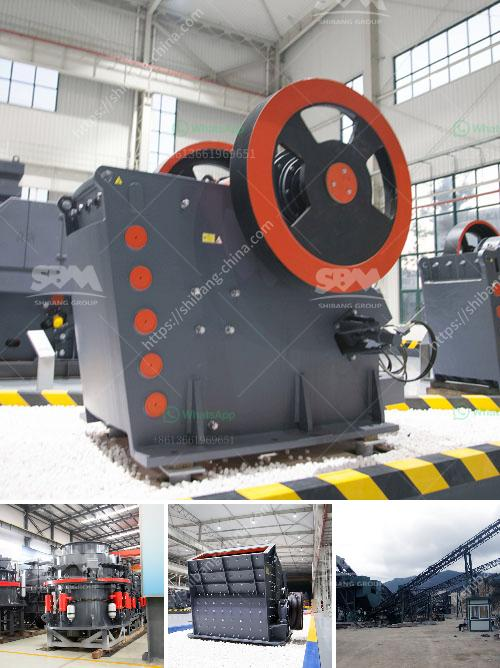

<h3>كيفية تصحيح كسارة مخروطية</h3>
تصحيح الكسارة المخروطية: توجد العديد من العوامل التي يجب دراستها وتصحيحها عند استخدام كسارة مخروطية. وعندما يتم اكتشاف خلل في الكسارة المخروطية، يجب اتباع بعض الإجراءات اللازمة لإصلاحها وضمان عودتها للعمل بالشكل الصحيح. في هذه المقالة، سنتعرف على بعض الخطوات التي يجب اتخاذها لتصحيح كسارة مخروطية.

أولاً وقبل كل شيء، يجب مراجعة دليل المالك الخاص بالكسارة للحصول على المعلومات اللازمة. قد يحتوي هذا الدليل على معلومات عن عملية التصحيح والإصلاح وغيرها من النصائح المفيدة التي يجب اتباعها.

ثانياً، قد يكون هناك مشكلة في وحدة التشغيل. لذلك، يجب التأكد من أن الكسارة تعمل بمعدات تشغيل سليمة. يجب فحص الأسلاك والموصلات والأجهزة الأخرى للتأكد من أنها سليمة ولا توجد بها أي قطع أو تلف.

ثالثاً، قد يكون هناك خلل في الأسطوانة الكسارة. من المهم فحص الأسطوانة للتأكد من أنها لا تتعرض لأي تلف. إذا وجد أي تلف، يجب استبدال الأسطوانة بواحدة جديدة.

رابعاً، المحامل الدوارة قد تكون أيضا مصدرًا للمشاكل. يجب فحص المحامل والتحقق من أنها لا تحتاج إلى أي تشحيم أو استبدال. يمكن استشارة فني المعدات للحصول على المشورة الصحيحة في هذا الصدد.

خامساً وأخيراً، قد يكون هناك خللاً في الأجزاء الداخلية للكسارة. يجب فحص الأجزاء الداخلية مثل الغلاف والعمود الرئيسي والغطاء الداخلي للتأكد من أنها لا تحتاج إلى أي تعديلات أو إصلاحات.

باختصار، تصحيح الكسارة المخروطية يشمل عدة خطوات وإجراءات لضمان أداء صحيح وموثوق بها. يجب البدء بالتحقق من الدليل المالك ومراجعة المعلومات الموجودة فيه، ثم فحص وحدة التشغيل، وفحص الأسطوانة والمحامل الدوارة والأجزاء الداخلية. إذا كانت هناك أي مشاكل، يجب إجراء التعديلات والصيانة اللازمة.
<h3>Contact us</h3><ul><li><strong>Whatsapp:&nbsp;<a href="https://wa.me/8613661969651">+8613661969651</a></strong></li><li><a href="https://swt.shibang-china.com/?git&amp;zhl&amp;كيفية تصحيح كسارة مخروطية"><strong>Online Service(chat now)</strong></a></li></ul><h3>Related</h3><ul><li><a href='معدات فحص الصخور.md'>معدات فحص الصخور</a></li><li><a href='آلة طحن السليكات في الهند.md'>آلة طحن السليكات في الهند</a></li><li><a href='كسارات الحجر المستعملة في كوريا الجنوبية.md'>كسارات الحجر المستعملة في كوريا الجنوبية</a></li><li><a href='سعر كسارة الحجر في باكستان.md'>سعر كسارة الحجر في باكستان</a></li><li><a href='معدات معالجة الجبس والكالسينيشن.md'>معدات معالجة الجبس والكالسينيشن</a></li></ul>