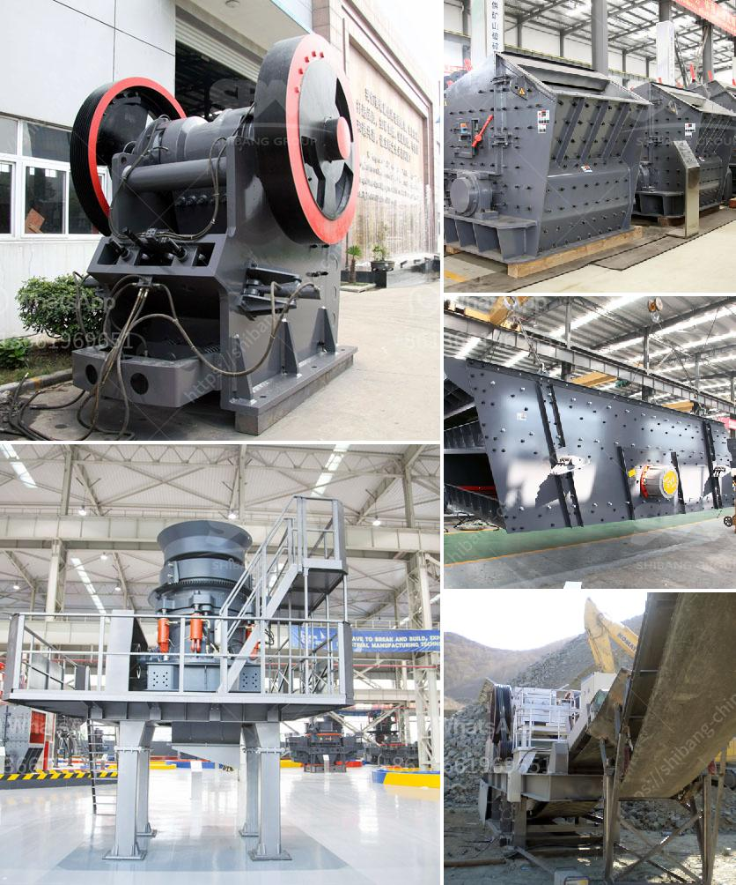

<h3>كيفية تصميم كسارة الحجر</h3>
تصميم كسارة الحجر هو عملية معقدة تتطلب فهما عميقا للعديد من العوامل التصميمية والهندسية. يهدف تصميم الكسارة إلى إعطاء وظيفة فعالة وفعالة من حيث التكلفة لتكسير الحجارة إلى أحجام صغيرة تصلح للاستخدام في البناء أو صناعة الركام.

أولاً وقبل كل شيء ، يحتاج المصمم إلى فهم متطلبات المستخدم والاحتياجات الخاصة به. يجب معرفة نوع الحجر الذي ستتم معالجته وأي خصائص ميكانيكية تحتاج إلى الانتباه إليها. يمكن أن يكون لدى الحجارة طبيعة هشة أو مقاومة عالية للضغط ، وبناءً على ذلك ستختلف خصائص التصميم التي يجب تضمينها في الكسارة.

العوامل الأساسية التي يجب مراعاتها في تصميم الكسارة تشمل:

1- سرعة الكسارة: يجب أن تكون سرعة الكسارة مناسبة لتكسير الحجارة بدون تسبب في تشتت فرط أو خلل في الأحجار.

2- الفتحة العرضية للفك: تعتبر فتحة الفك المناسبة جزءًا هامًا في تصميم الكسارة. يجب أن يكون هناك توازن جيد بين فتحة الفك وقدرة الإنتاج المطلوبة.

3- المطارق والدروع: يجب تصميم المطارق والدروع ليكون لديها قوة وصلابة كافية لتحمل تأثير الحجارة الكبيرة والمقاومة العالية.

4- نظام الغربلة: يجب أن يكون لدى الكسارة نظام غربلة لفصل الحجارة المكسورة إلى أحجام مختلفة وفقًا لاحتياجات المستخدم.

5- محرك الكسارة: يجب أن يكون لدى الكسارة محرك قوي بما يكفي لتحمل عملية التكسير ، بالإضافة إلى نظام تشغيل فعال للغاية للحفاظ على استقرار أداء الكسارة.

بصفة عامة ، يجب أن تستند عملية التصميم إلى الدراسات الفنية المتعمقة والتحليلات الهندسية لضمان تصميم كسارة فعالة وأمنة للعمل في ظل أقسى الظروف. يجب أيضًا توخي الحذر والالتزام بالمعايير الصناعية والتشريعات المحلية ذات الصلة لضمان تصميم آمن وفعال.
<h3>Contact us</h3><ul><li><strong>Whatsapp:&nbsp;<a href="https://wa.me/8613661969651">+8613661969651</a></strong></li><li><a href="https://swt.shibang-china.com/?git&amp;zhl&amp;كيفية تصميم كسارة الحجر"><strong>Online Service(chat now)</strong></a></li></ul><h3>Related</h3><ul><li><a href='كسارات رئيسية للبيع على Alibaba.md'>كسارات رئيسية للبيع على Alibaba</a></li><li><a href='استيراد كسارة الفك الصين في باكستان.md'>استيراد كسارة الفك الصين في باكستان</a></li><li><a href='مصنع معالجة رمل الحديد للبيع في باكستان.md'>مصنع معالجة رمل الحديد للبيع في باكستان</a></li><li><a href='مصنع تكسير في ماليزيا.md'>مصنع تكسير في ماليزيا</a></li><li><a href='مصنع تكسير الصدم.md'>مصنع تكسير الصدم</a></li></ul>