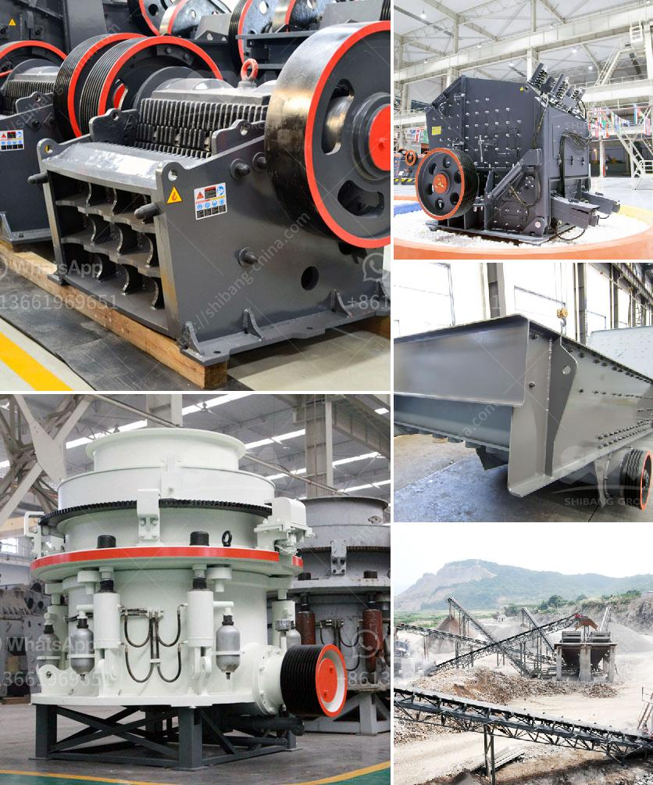

<h3>كيفية جعل مسحوق الحجر الجيري</h3>
يعد مسحوق الحجر الجيري من المواد الهامة في العديد من الصناعات، بما في ذلك صناعة الأسمنت والأسمدة الزراعية والزجاج والصابون والدهانات. ولذا، من المهم معرفة كيفية صنع مسحوق الحجر الجيري بطريقة فعالة وسهلة. في هذه المقالة، سوف نشرح الخطوات الأساسية لصنع مسحوق الحجر الجيري.

الخطوة الأولى هي جمع الحجر الجيري من المحجر. يتم استخراج الحجر الجيري من المحاجر عن طريق استخدام المعدات الثقيلة والآليات المتخصصة. يجب التأكد من جودة الحجر الجيري المستخدم، حيث يجب أن يكون خاليًا من الشوائب والشوائب الأخرى.

بعد جمع الحجر الجيري، يتم وضعه في كسارة الصخور حيث يتم طحنه إلى أجزاء صغيرة. وجود مسحوق الحجر الجيري يسهل دمجه في المواد الأخرى، كما أنه يساعد على تقليل الحجم والوزن الكلي للحجر الجيري.

ثم يتم نقل مسحوق الحجر الجيري إلى مطحنة الكرات حيث يتم طحنه بشكل أكثر دقة. يعمل الكرات في المطحنة على طحن مسحوق الحجر الجيري إلى حبيبات دقيقة ورقيقة. يتم التحكم في حجم الحبيبات عن طريق تعديل إعدادات المطحنة وسرعة الدوران.

عندما يكون المسحوق الجيري في حجم الجسيمات المطلوب، يتم نقله إلى مجفف حيث يتم إزالة الرطوبة الزائدة. إزالة الرطوبة مهمة للحصول على مسحوق الحجر الجيري ذو جودة عالية واستخدامه في الصناعات المختلفة.

بعد جفاف المسحوق الجيري، يتم تعبئته في أكياس أو حاويات للتخزين أو النقل. يتم التأكد من أن العبوات محكمة الغلق لمنع تلوث المسحوق الجيري والحفاظ على جودته.

في النهاية، يمكننا القول أن صناعة مسحوق الحجر الجيري هي عملية معقدة ولكنها ضرورية للعديد من الصناعات. يتطلب صنعه جمع الحجر الجيري، طحنه، تجفيفه، وتعبئته بعناية. إن مسحوق الحجر الجيري الناتج مهم في تحسين العديد من المنتجات والصناعات المختلفة، ولذا فإن معرفة كيفية جعله يعتبر معرفة قيمة.
<h3>Contact us</h3><ul><li><strong>Whatsapp:&nbsp;<a href="https://wa.me/8613661969651">+8613661969651</a></strong></li><li><a href="https://swt.shibang-china.com/?git&amp;zhl&amp;كيفية جعل مسحوق الحجر الجيري"><strong>Online Service(chat now)</strong></a></li></ul><h3>Related</h3><ul><li><a href='كسارة حجر لصنع رمل البناء.md'>كسارة حجر لصنع رمل البناء</a></li><li><a href='مطاحن الكرة في زابوبان.md'>مطاحن الكرة في زابوبان</a></li><li><a href='آلة صنع مسحوق الرخام.md'>آلة صنع مسحوق الرخام</a></li><li><a href='مشروع محجر للبيع في نيجيريا.md'>مشروع محجر للبيع في نيجيريا</a></li><li><a href='آلة طحن الجير.md'>آلة طحن الجير</a></li></ul>