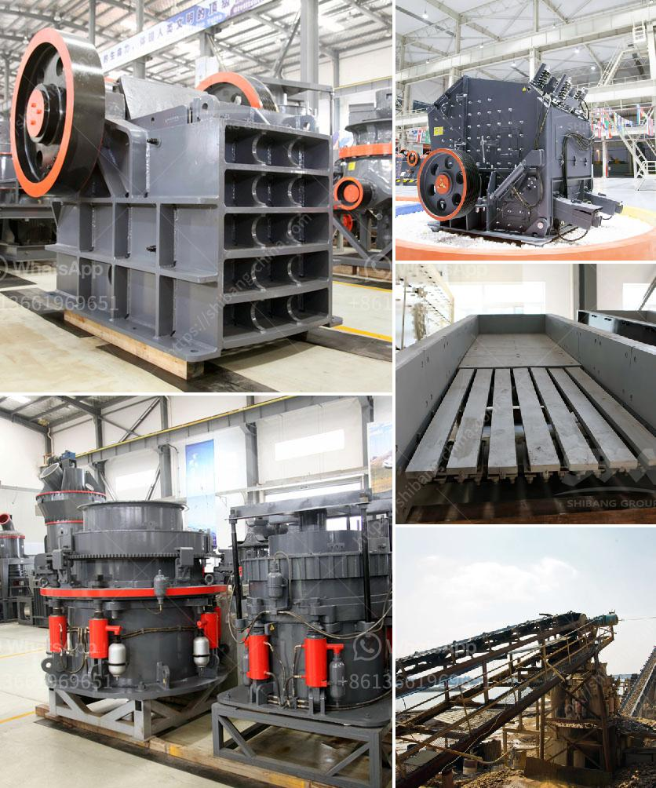

<h3>كيفية حساب تكلفة الطحن</h3>
إن حساب تكلفة الطحن هو عملية حاسمة لأي شركة صناعية تعتمد على عمليات الطحن في إنتاجها. تأخذ تلك التكاليف في الاعتبار جميع جوانب العملية بدءًا من تكلفة المعدات والمواد الخام وحتى تكاليف العمالة والطاقة. فيما يلي سنلقي نظرة عامة على كيفية حساب تكاليف الطحن بشكل فعال.

أولاً، يجب النظر في تكلفة المعدات. تشمل هذه التكاليف شراء أو استئجار الماكينات والمعدات المستخدمة في عمليات الطحن. يجب مراعاة عوامل مثل تكاليف الصيانة وتحديث المعدات للحفاظ على أدائها الجيد وتجنب توقف الإنتاج.

ثانياً، تكلفة المواد الخام. يجب أخذ في الاعتبار قيمة المواد الخام المستخدمة في عمليات الطحن، بما في ذلك سعر الشراء وتكاليف النقل والتخزين. يجب أن تكون هذه التكاليف مناسبة لضمان تحقيق أعلى جودة للمنتج النهائي وتحقيق الربح المرجو.

ثالثاً، تكلفة العمالة. تشمل هذه النفقات أجور الموظفين المشتركين في عمليات الطحن. يتم تحديد تلك التكاليف بناءً على عدد الساعات المدفوعة ومهارات الموظفين المشاركين. يجب الاستفادة من كفاءة العمالة وضمان توفر فريق عمل مدرب ومؤهل للتعامل مع المهام المطلوبة.

رابعاً، تكلفة الطاقة. يعتبر استهلاك الطاقة لعمليات الطحن عنصرًا أساسيًا في تقدير التكاليف. يجب معرفة استهلاك الطاقة اللازمة لتشغيل المعدات وتحويل المواد الخام إلى المنتج النهائي.

أخيرًا، يجب أن نضع في الاعتبار عوامل أخرى مثل تكاليف الصيانة المستمرة والتأمين والضرائب والإجراءات القانونية والتنظيمية المتعلقة بعمليات الطحن. يجب مراعاة هذه العوامل لتقدير التكلفة الإجمالية بشكل دقيق.

باختصار، حساب تكلفة الطحن يتطلب النظر في جوانب متعددة للعملية بدءًا من تكلفة المعدات والمواد الخام وحتى تكاليف العمالة والطاقة والعوامل الأخرى. يجب على الشركات أن تكون حذرة ومنهجية في تحليل هذه العوامل للحفاظ على تشغيلها بكفاءة وتنافسية وتحقيق الأرباح المرجوة.
<h3>Contact us</h3><ul><li><strong>Whatsapp:&nbsp;<a href="https://wa.me/8613661969651">+8613661969651</a></strong></li><li><a href="https://swt.shibang-china.com/?git&amp;zhl&amp;كيفية حساب تكلفة الطحن"><strong>Online Service(chat now)</strong></a></li></ul><h3>Related</h3><ul><li><a href='معدات كسارة الحجر.md'>معدات كسارة الحجر</a></li><li><a href='شركة تبيع كسارة الحجر في كينيا.md'>شركة تبيع كسارة الحجر في كينيا</a></li><li><a href='قائمة أسعار مصنع التكسير.md'>قائمة أسعار مصنع التكسير</a></li><li><a href='كسارات الحطام للبيع.md'>كسارات الحطام للبيع</a></li><li><a href='آلات وتجهيزات تسمين الجير.md'>آلات وتجهيزات تسمين الجير</a></li></ul>