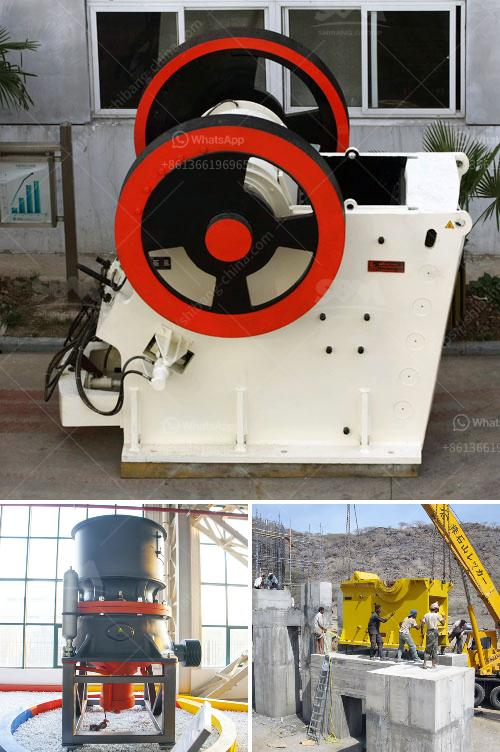

<h3>كيفية حساب كفاءة الكسارة</h3>
تعتبر الكسارات معدات مهمة في صناعة التعدين والبناء، حيث تعمل على سحق المواد الخام وتحويلها إلى قطع صغيرة قابلة للتعامل في المراحل اللاحقة من عملية الإنتاج. ولضمان أداء فعال للكسارة، يجب حساب كفاءتها، ويتم ذلك بإجراء بعض الحسابات والقياسات الميكانيكية. سنوضح في هذه المقالة كيفية حساب كفاءة الكسارة.

أولاً، يتم قياس حجم الكسرة الناتجة من الكسارة بعد عملية السحق. يتم ذلك باستخدام شبكة تحلل تحجيمية تحتوي على مجموعة من الفتحات بأحجام مختلفة. يتم تمرير المواد الناتجة عن الكسارة من خلال هذه الشبكة وتقاس الكمية التي تمر من خلال كل فتحة.

ثانياً، يتم حساب النسبة المئوية للمواد الممررة من خلال الشبكة من الكلية التي تمر عبر الكسارة. يتم ذلك بقسمة الكمية التي تمر من خلال الشبكة على إجمالي الكمية المغذاة إلى الكسارة، ثم ضرب النتيجة في 100. هذه النسبة هي مؤشر على كفاءة الكسارة في سحق المواد وتحويلها إلى حجم أصغر.

ثالثاً، يتم حساب كفاءة الحجر في الكسارة بإجراء حساب آخر. يتم ذلك بقسمة الحجم المتوسط ​​للكسرة الناتجة من الكسارة على الحجم المتوسط ​​للكسرات البادئة التي تم إدخالها إلى الكسارة. يتطلب هذا الحساب قياسات أدق عبر عينات متعددة وتحليلها للحصول على الحجم المتوسط ​​للكسرة الناتجة والبادئة.

تجمع هذه القياسات والحسابات جميعها سويًا لتحديد كفاءة الكسارة. يمكن أن تتراوح كفاءة الكسارة بين 0 و 100٪ ، حيث تكون النسبة العليا تعني كفاءة أكبر. وعندما تحسب وتقيم الكفاءة بانتظام، يمكن اتخاذ إجراءات تصحيحية إذا لزم الأمر لتحسين كفاءة الكسارة وزيادة أدائها.

في النهاية، يمكن القول أن حساب كفاءة الكسارة يلعب دورًا حاسمًا في تتبع أداء الكسارة وتحسين عمليتها. وباستخدام التقنيات المناسبة وقياسات الحجم والكمية بدقة، يمكن للمشغلين أن يتأكدوا من أن الكسارة تعمل بكفاءة عالية وتحقق النتائج المرجوة في عملية السحق.
<h3>Contact us</h3><ul><li><strong>Whatsapp:&nbsp;<a href="https://wa.me/8613661969651">+8613661969651</a></strong></li><li><a href="https://swt.shibang-china.com/?git&amp;zhl&amp;كيفية حساب كفاءة الكسارة"><strong>Online Service(chat now)</strong></a></li></ul><h3>Related</h3><ul><li><a href='آلة معالجة الرماد الطائر.md'>آلة معالجة الرماد الطائر</a></li><li><a href='كسارة خام الحديد في المكسيك.md'>كسارة خام الحديد في المكسيك</a></li><li><a href='مكونات مطحنة الأسطوانة.md'>مكونات مطحنة الأسطوانة</a></li><li><a href='سعر مصنع كسارة الحجر في الهند.md'>سعر مصنع كسارة الحجر في الهند</a></li><li><a href='آلة غسيل الذهب.md'>آلة غسيل الذهب</a></li></ul>