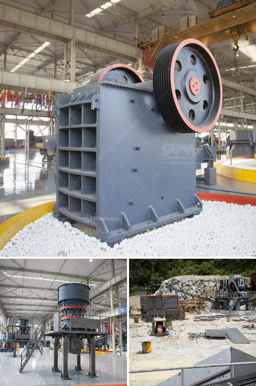

<h3>كيفية سحق خام الذهب في ماين كرافت</h3>
عملية سحق خام الذهب في لعبة ماين كرافت هي إحدى الخطوات الأساسية لاستخراج الذهب واستخدامه في صنع الأدوات أو البناء وفي هذه المقالة سنتناول كيفية القيام بها.

أولاً، يجب أن تجمع كمية كافية من خام الذهب. يمكنك العثور على خام الذهب عند التنقيب في الكهوف أو الجبال. قم بجمع الخام باستخدام أدوات التنقيب مثل الفأس أو المعول.

بمجرد أن تجمع كمية كافية من خام الذهب، اذهب إلى الطاولة الصناعية (Crafting Table) وحوّل 4 قطع من خام الذهب إلى 4 قطع من النقاط الصلبة للذهب (Gold Ingots) باستخدام المينائيا (Furnace). يمكنك استخدام النقاط الصلبة لبناء الأدوات والبناء وصنع المزيد من المواد.

والآن إذا كنت ترغب في سحق خام الذهب لاستخدامه في تلوين الزجاج أو إنشاء سلك فايرو، يمكنك استخدام الكسارة (Crushing Table) لتحويل النقاط الصلبة للذهب إلى الغبار. اصنع الكسارة باستخدام الخشب والحجر، ثم وضع النقاط الصلبة للذهب في فتحة الكسارة. بعد ذلك، ستقوم الكسارة بسحق النقاط الصلبة للذهب وتحويلها إلى غبار الذهب (Gold Dust).

استخدم غبار الذهب في تلوين الزجاج عن طريق وضعه في واجهة الصنع في الطاولة الصناعية مع الزجاج. يمكنك أيضًا استخدام الغبار في صنع سلك فايرو عن طريق وضعه بجانب قضيب حديد في واجهة الصنع.

بهذا الشكل يمكنك سحق خام الذهب في ماين كرافت. استخدم الذهب في بناء القواطع والتروس والساعات ومجموعة واسعة من الأدوات والمواد الأخرى. استمتع بتجربة صنع واستخدام الذهب في اللعبة واستكشاف ما يمكنك صنعه وبنائه باستخدام هذا المعدن النفيس.
<h3>Contact us</h3><ul><li><strong>Whatsapp:&nbsp;<a href="https://wa.me/8613661969651">+8613661969651</a></strong></li><li><a href="https://swt.shibang-china.com/?git&amp;zhl&amp;كيفية سحق خام الذهب في ماين كرافت"><strong>Online Service(chat now)</strong></a></li></ul><h3>Related</h3><ul><li><a href='طاحونة مسحوق ناعمة جدا.md'>طاحونة مسحوق ناعمة جدا</a></li><li><a href='سعر مطحنة الكرة.md'>سعر مطحنة الكرة</a></li><li><a href='مطحنة الكرة لمسحوق الألمنيوم.md'>مطحنة الكرة لمسحوق الألمنيوم</a></li><li><a href='كسارة الصخور للبيع في الفلبين.md'>كسارة الصخور للبيع في الفلبين</a></li><li><a href='آلة معالجة الذهب في الصين.md'>آلة معالجة الذهب في الصين</a></li></ul>