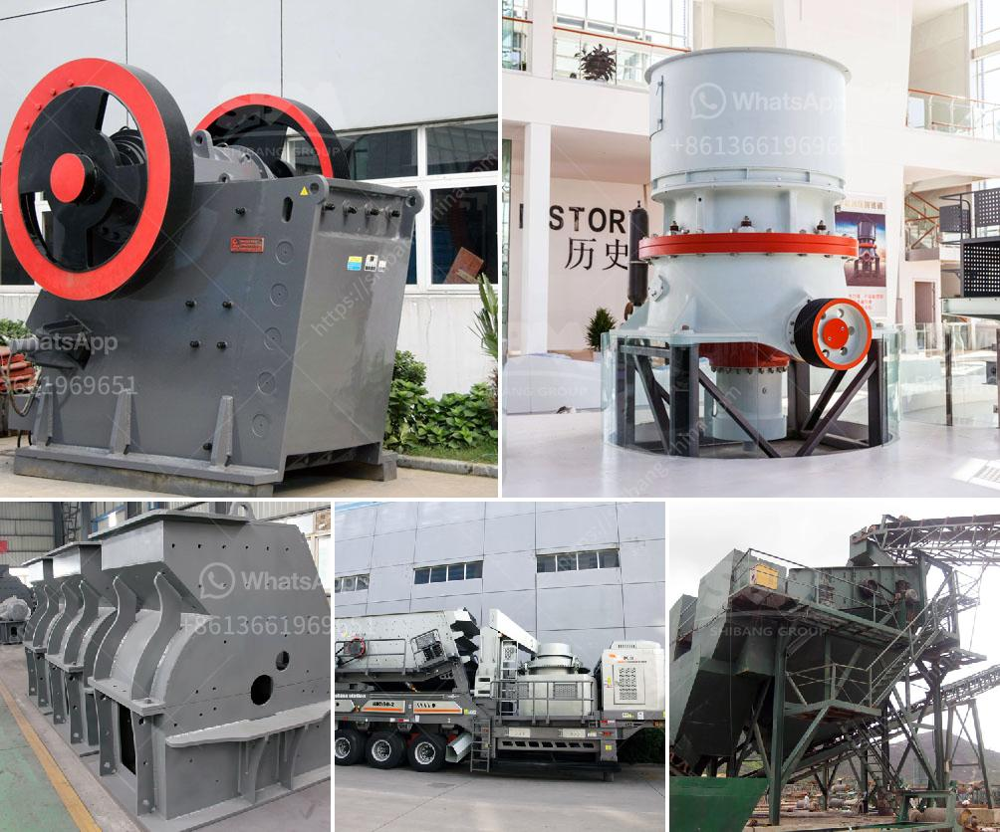

<h3>كيفية صنع آلة كسارة خام الحديد</h3>
لا يمكننا تقديم معلومات محددة عن كيفية صنع آلة كسارة خام الحديد في 200-400 كلمة، وذلك بسبب التعقيد والتنوع الكبير في تصميمات الآلات المستخدمة في صناعة التعدين واستخراج الخامات.

آلة كسارة خام الحديد هي آلة تستخدم لكسر الصخور والمعادن الصلبة لاستخراج الخامات منها. تتكون الكسارة عادةً من وحدة تكسير رئيسية تتضمن حجرة الكسارة والفك الصلب. يقوم الفك الصلب بالضغط على الصخرة وكسرها.

تختلف تصميمات الكسارات حسب حالة ونوع الخام المراد كسره. قد تشمل الآلات المستخدمة لتكسير خام الحديد الكسارة الفكية، الكسارة التصادمية، الكسارة المخروطية والكسارة الدوارة. تمتاز كل منها بمزايا مختلفة في عملية التكسير، مثل سرعة التكسير وحجم المخرجات.

بشكل عام، تتضمن عملية تصنيع آلة كسارة خام الحديد الخطوات التالية:

1. تحديد المتطلبات والمواصفات المطلوبة للآلة النهائية، مثل سعة التكسير والأبعاد الفنية.

2. تصميم مخطط الآلة واختيار المكونات المناسبة مثل الأسطوانات الهيدروليكية والمحركات الكهربائية والشاشات وأنظمة التحكم.

3. جمع المكونات والمواد اللازمة وتجهيزها للتجميع والتركيب.

5. اختبار وتشغيل الآلة للتأكد من أدائها الصحيح وفقًا للمواصفات المحددة.

6. ضمان صيانة وصيانة آلة الكسارة بشكل منتظم لضمان الحفاظ على أدائها الأمثل.

برغم التحديات الهندسية في تصميم وتصنيع الكسارات، إلا أنه يمكن العثور على العديد من الشركات المتخصصة في تصنيع الكسارات والتي تقدم الحلول المخصصة حسب احتياجات العملاء.

في النهاية، يجب على الأشخاص المهتمين ببناء آلة كسارة خام الحديد الحصول على المشورة المهنية من المهندسين والخبراء في مجال التعدين، وتنظيم الموارد المناسبة لضمان تصنيع وتثبيت آلة فعالة تلبي احتياجاتهم.
<h3>Contact us</h3><ul><li><strong>Whatsapp:&nbsp;<a href="https://wa.me/8613661969651">+8613661969651</a></strong></li><li><a href="https://swt.shibang-china.com/?git&amp;zhl&amp;كيفية صنع آلة كسارة خام الحديد"><strong>Online Service(chat now)</strong></a></li></ul><h3>Related</h3><ul><li><a href='استثمار مصنع كسارة الحجر.md'>استثمار مصنع كسارة الحجر</a></li><li><a href='معدات صنع مسحوق كربونات الكالسيوم في ألمانيا.md'>معدات صنع مسحوق كربونات الكالسيوم في ألمانيا</a></li><li><a href='مصنعون لمطحنة الهامر في بيرو.md'>مصنعون لمطحنة الهامر في بيرو</a></li><li><a href='كسارة عمودية.md'>كسارة عمودية</a></li><li><a href='سعر كسارة الحجر المحمولة في.md'>سعر كسارة الحجر المحمولة في</a></li></ul>