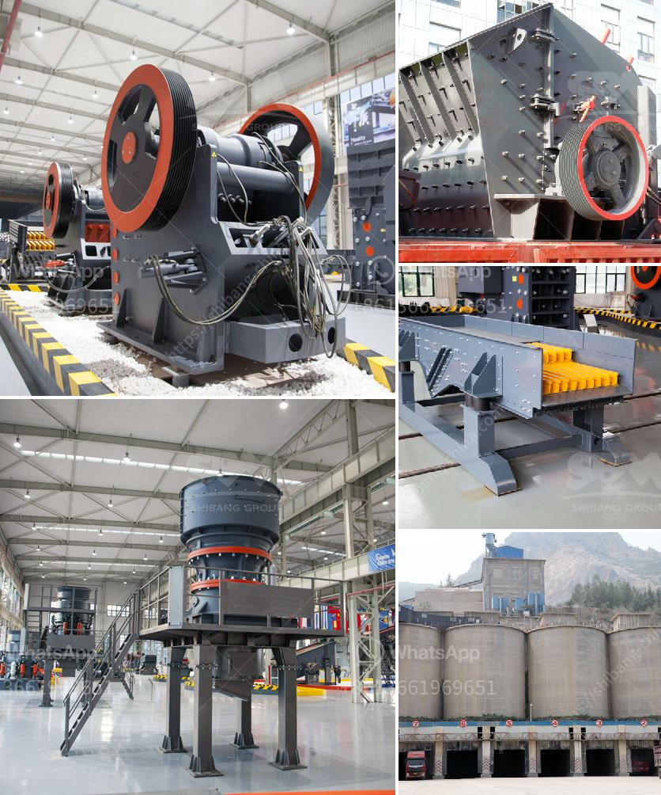

<h3>كيفية صنع كسارة فك صغيرة لنفسك</h3>
صنع كسارة فك صغيرة لنفسك يمكن أن يكون مشروعًا ممتعًا ومغامرة يمكن أن تحققها باتباع الخطوات الصحيحة. في هذه المقالة ، سنتحدث عن كيفية صنع كسارة فك صغيرة لك.

أولاً وقبل كل شيء ، ينبغي عليك التفكير في تصميم الكسارة. يمكنك استخدام برامج النمذجة ثلاثية الأبعاد لتصميم جزء الكسارة وتحديد المواد المستخدمة فيها. عند تحديد المواد ، يمكنك استخدام الفولاذ أو الألمنيوم الخفيف للواجهة الخارجية ، والحديد أو الصلب لهيكل الكسارة الداخلي.

بعد الانتهاء من تصميم الكسارة ، يجب اقتناء المواد اللازمة لبناءها. ستحتاج إلى قطع معدنية ، براغي ، لوح خشبية وأدوات يدوية مثل مفك براغي ومثاقب لطحن الأجزاء.

الخطوة الثالثة هي بدء تجميع الكسارة. يتطلب ذلك متابعة تصميمك وتجميع الأجزاء معًا وربطها بواسطة البراغي. يجب أخذ الاحتياطات اللازمة أثناء التجميع للتأكد من ثبات الأجزاء وسهولة استخدامها.

بعد الانتهاء من تجميع الكسارة ، يجب تجربتها واختبارها. يمكنك وضع بعض الحجارة الصغيرة في الكسارة والضغط على العتلة لرؤية كيفية عمل الفك. إذا لم تكن الكسارة تعمل بالشكل الصحيح ، قم بإجراء التعديلات اللازمة حتى يعمل بشكل سليم.

أخيرًا ، بعد التأكد من أن الكسارة تعمل بشكل صحيح ، يمكنك استخدامها لكسر الحجارة أو الصخور الصغيرة في المشاريع اليومية. يمكن استخدام الكسارة الصغيرة في المنزل لسحق الحجارة الصغيرة للاستخدام في الطرق أو الحدائق.

في النهاية ، صنع كسارة فك صغيرة هو مشروع يمكن تحقيقه باتباع الخطوات الصحيحة. يجب أن تستخدم المواد المناسبة والأدوات المناسبة وأن تتخذ الاحتياطات الإضافية لتجميع الكسارة. عندما تتمكن من استخدام كسارتك الخاصة ، ستكون فخورًا بالمهارات الحرفية الخاصة بك وقدرتك على صنع الأشياء الخاصة بك.
<h3>Contact us</h3><ul><li><strong>Whatsapp:&nbsp;<a href="https://wa.me/8613661969651">+8613661969651</a></strong></li><li><a href="https://swt.shibang-china.com/?git&amp;zhl&amp;كيفية صنع كسارة فك صغيرة لنفسك"><strong>Online Service(chat now)</strong></a></li></ul><h3>Related</h3><ul><li><a href='شاشة محمولة وكسارة.md'>شاشة محمولة وكسارة</a></li><li><a href='كسارات حجر مستعملة للبيع.md'>كسارات حجر مستعملة للبيع</a></li><li><a href='شراء كسارة حجر في الإمارات.md'>شراء كسارة حجر في الإمارات</a></li><li><a href='سعر كسارة الفك PE 400.md'>سعر كسارة الفك PE 400</a></li><li><a href='شركة تصنيع لوحات الجبس في سنغافورة.md'>شركة تصنيع لوحات الجبس في سنغافورة</a></li></ul>