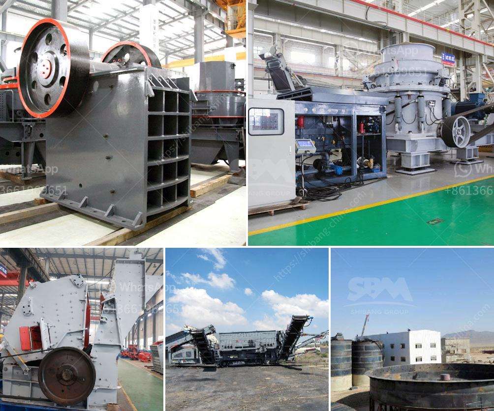

<h3>كيفية صنع كسارة كرات</h3>
تعد الكرات كأحد الألعاب الشائعة والمحببة للكثيرين. فهي توفر لنا فرصة للتسلية والمتعة والتحدي، سواء كنا نلعبها في الملاعب أو في الحدائق العامة. وإذا كنت أحد محبي لعبة الكرة، فربما تود تجربة بعض الأشياء الجديدة المتعلقة بهذه اللعبة. ومن هنا تأتي فكرة صنع كسارة كرات بنفسك.

إن صنع كسارة كرات هو عملية مثيرة وممتعة، حيث يمكنك تصميم وبناء الكسارة الخاصة بك بسهولة وأدوات بسيطة. وفي هذه المقالة سأشرح لك كيفية صنع كسارة كرات تسمح لك باللعب والتسلية والتحدي.

1. علبة من الورق المقوى: اختر علبة من الورق المقوى بحجم متوسط ​​وسماكة تكفي لتحمل قوة تأثير الكرة.

2. ماسك للعينين: يمكن استخدام ما تريده لوضعه كماسك للعينين، مثل أغطية العين البلاستيكية أو قطعة من القماش المطاطية.

3. مواد لتجميع الكسارة: تحتاج إلى شريط لاصق قوي مثل السيلوفان أو الديكيور لتثبيت الماسك على العلبة.

1. قم بقياس وتحديد الحجم المطلوب للعلبة. يجب أن يكون طولها وعرضها وارتفاعها قادرين على احتواء الكرة بسهولة.

2. قم بقص وتجهيز العلبة من جميع الجوانب، باستثناء أحد الجوانب حيث ستوضع فيها الماسك.

3. ارسم مربعًا صغيرًا على الجانب الذي تم تركه فارغًا. يجب أن يتناسب حجم هذا المربع مع حجم الماسك الذي ستستخدمه. قم بقص هذا المربع بحذر باستخدام مقص.

4. قم بتثبيت الماسك على المكان المقصوص في الخطوة السابقة باستخدام الشريط اللاصق، لكي يغطي عينيك ويحميهما من الإصابة.

5. اختبر الكسارة النهائية بوضع الكرة داخل العلبة وتأكد من أنها تسقط عند ضربها بالكسارة.

تذكر أن هذه الكسارة المصنوعة بطرق بسيطة ليست مثالية للعب المحترف. إنما هي للتسلية والتحدي اللذين يمكنهما تقديمهما لك ولأصدقائك في الوقت الذي تمضيه في الحديقة أو في الملعب.

باستخدام هذه الطريقة البسيطة والمتاحة للجميع، يمكنك صنع كسارة كرات بنفسك. ابدأ بالمواد المذكورة أعلاه واستكشف إمكانيات الإضافات والتعديلات التي يمكنك القيام بها لاحقًا.
<h3>Contact us</h3><ul><li><strong>Whatsapp:&nbsp;<a href="https://wa.me/8613661969651">+8613661969651</a></strong></li><li><a href="https://swt.shibang-china.com/?git&amp;zhl&amp;كيفية صنع كسارة كرات"><strong>Online Service(chat now)</strong></a></li></ul><h3>Related</h3><ul><li><a href='محطات تكسير الطاقة.md'>محطات تكسير الطاقة</a></li><li><a href='ما هو مطحنة الكرة.md'>ما هو مطحنة الكرة</a></li><li><a href='قائمة أسعار كسارة الحجر بسعة 300 طن في الساعة.md'>قائمة أسعار كسارة الحجر بسعة 300 طن في الساعة</a></li><li><a href='معدات معالجة الجبس والكالسينيشن.md'>معدات معالجة الجبس والكالسينيشن</a></li><li><a href='آلة مطحنة المطارق.md'>آلة مطحنة المطارق</a></li></ul>