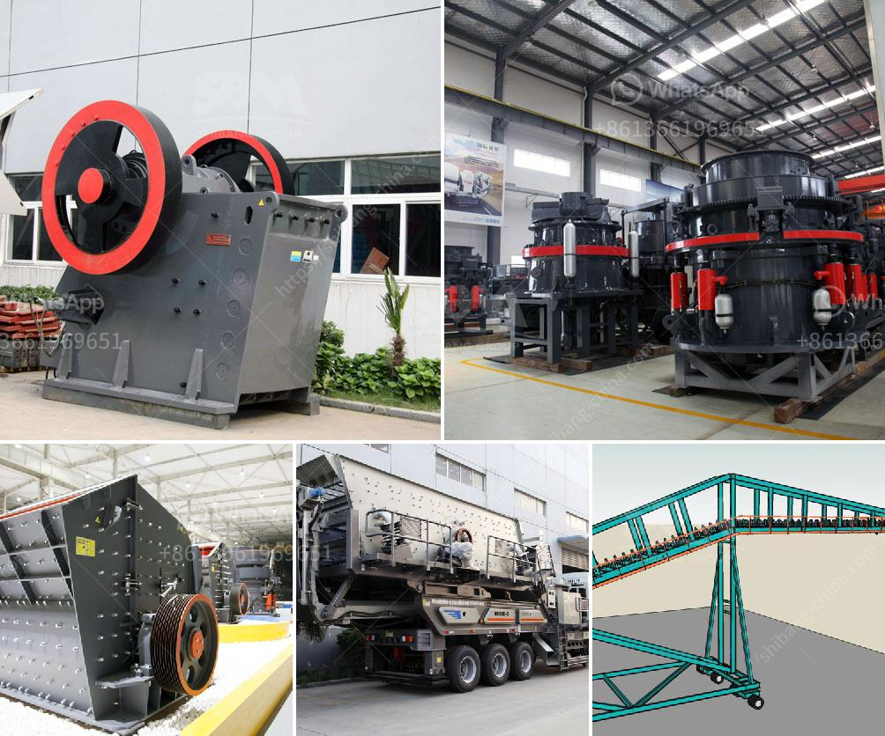

<h3>كيفية صنع مسحوق التلك الصناعي</h3>
مسحوق التلك الصناعي هو منتج يستخدم في مجموعة واسعة من التطبيقات، بدءًا من صناعة الأدوات التجميلية والمستحضرات الصيدلانية حتى تصنيع المواد البلاستيكية والألياف. يعتبر التلك مادة طبيعية تم استخدامها لقرون عديدة لخصائصها العديدة والفريدة. ولصناعة مسحوق التلك الصناعي، يتم اتباع عدة خطوات:

يتم استخراج التلك من مناجم التلك التي تحتوي على ترسبات ضخمة من هذه المادة. يتم حفر الأخاديد العميقة في الأرض وتكوين القناة المائلة لسحب التلك إلى السطح. بعد ذلك، يتم تفتيت كتل التلك الكبيرة إلى جزيئات أصغر باستخدام الكسارات والمطارق العملاقة.

بعد استخراج التلك وتفتيته، يجب إزالة الشوائب بعناية. يتم ذلك من خلال عملية تسمى عملية الفصل، حيث يتم تمرير المواد عبر مجموعة من الأجهزة المختلفة مثل المنخل والمصفاة لفصل الشوائب عن التلك النقي.

بعد تنقية المادة، يتم طحنها إلى صورة مسحوق ناعم باستخدام آلات الطحن. يتم تفتيت جزيئات التلك الكبيرة إلى جزيئات أصغر تتراوح بين حوالي 1 إلى 50 ميكرومترًا. ثم يتم تحبيب المسحوق لتكوين تجانس وأكثر استدامة في حجم الجسيمات.

بعد طحن وتحبيب المسحوق، يجب تعبئته وتغليفه بشكل مناسب. عادةً ما يتم تعبئة مسحوق التلك في أكياس بلاستيكية أو عبوات بلاستيكية أخرى قابلة للغلق بإحكام. يتم تزويد هذه الأكياس أو العبوات بتسميات تحمل معلومات المنتج وتعليمات الاستخدام.

في النهاية، يجب أن نذكر أن صناعة مسحوق التلك الصناعي هي عملية متعددة التخصصات تستدعي الاحتراف والخبرة. يلزم اتباع معايير جودة صارمة ومراقبة الجودة المستمرة لضمان أداء المنتج وسلامة المستخدمين. تطبيق هذه الخطوات بشكل صحيح ومنتظم هو ما يؤدي إلى منتج نهائي ذو جودة عالية من مسحوق التلك الصناعي.
<h3>Contact us</h3><ul><li><strong>Whatsapp:&nbsp;<a href="https://wa.me/8613661969651">+8613661969651</a></strong></li><li><a href="https://swt.shibang-china.com/?git&amp;zhl&amp;كيفية صنع مسحوق التلك الصناعي"><strong>Online Service(chat now)</strong></a></li></ul><h3>Related</h3><ul><li><a href='خدمات مصنع معالجة التعدين المحمول.md'>خدمات مصنع معالجة التعدين المحمول</a></li><li><a href='استئجار سير ناقل.md'>استئجار سير ناقل</a></li><li><a href='مصنع سحق الحجر الجيري.md'>مصنع سحق الحجر الجيري</a></li><li><a href='تكلفة كسارة الحجر.md'>تكلفة كسارة الحجر</a></li><li><a href='أنظمة ناقلات الحصى للمسافة.md'>أنظمة ناقلات الحصى للمسافة</a></li></ul>