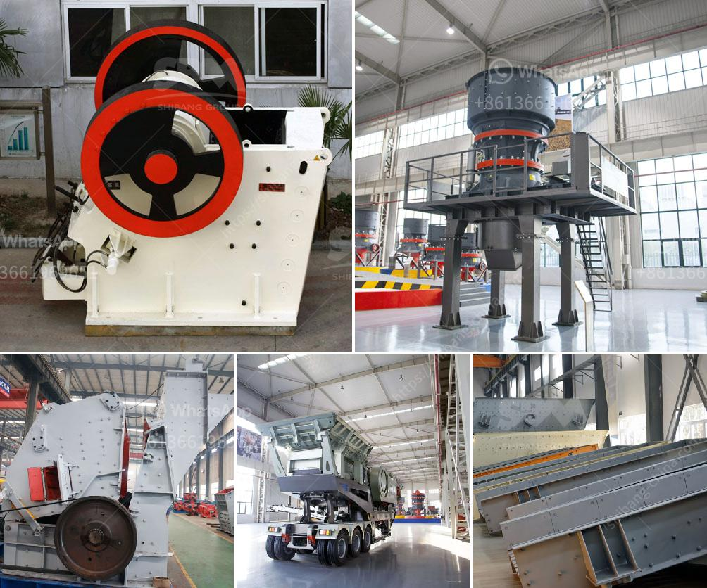

<h3>كيفية صنع مسحوق التلك</h3>
مسحوق التلك هو مادة رقيقة وناعمة يتم استخدامها في العديد من المنتجات المختلفة، مثل مستحضرات التجميل والعناية الشخصية ومساحيق الأطفال. ويتم صنع مسحوق التلك عن طريق طحن صخور التلك الطبيعية إلى حبيبات صغيرة جداً حتى يصبح لديها مظهر البودرة. يمكن صنع مسحوق التلك بسهولة في المنزل باستخدام الخطوات التالية.

أولاً، قبل أن نبدأ في صنع مسحوق التلك، يجب علينا جمع المواد والأدوات اللازمة. سنحتاج إلى صخور التلك الطبيعية، وهي موجودة عادةً في المناطق الجبلية أو يمكن شراؤها من متاجر الصخور. بالإضافة إلى ذلك، ستحتاج أيضًا إلى مطحنة صغيرة، يمكن شراؤها من محلات المستلزمات المنزلية، وغربال صغير لفصل الجزيئات الصغيرة عن الأكبر.

بعد جمع المكونات والأدوات اللازمة، يمكننا الآن البدء في صنع مسحوق التلك. أولاً، يجب طحن صخور التلك الطبيعية في المطحنة الصغيرة. يجب أن تكون صخور التلك جافة تمامًا قبل طحنها للحصول على أفضل النتائج. يتم طحن الصخور باستمرار حتى تتحول إلى مسحوق ناعم.

بمجرد الانتهاء من طحن صخور التلك، نستخدم الغربال الصغير لفحص المسحوق وفصل الجزيئات المتناهية الصغر عن الأكبر. لاحظ أنه يمكن التخلص من الجزيئات الأكبر واستخدام الجزيئات الناعمة فقط، حيث إنها تعطي المسحوق ملمسًا أنعم وأكثر صفاءً.

بعد فصل الجزيئات الصغيرة، بإمكانك تخزين مسحوق التلك في عبوة صغيرة ونظيفة للاستخدام المستقبلي.

وفي النهاية، يُشدد على ضرورة اتباع إجراءات السلامة عند صنع مسحوق التلك. يجب عليك ارتداء قناع وواقي عينين لتجنب استنشاق الغبار الناتج عن عملية الطحن، وتجنب الحركات السريعة والعنيفة التي قد تؤدي إلى تناثر المسحوق في الهواء.

بهذه الطريقة البسيطة، يمكنك صنع مسحوق التلك في المنزل. تذكر أنه يفضل قراءة تعليمات الاستخدام والسلامة المتعلقة بالمسحوق المخصص للاستخدام الشخصي قبل استخدامه.
<h3>Contact us</h3><ul><li><strong>Whatsapp:&nbsp;<a href="https://wa.me/8613661969651">+8613661969651</a></strong></li><li><a href="https://swt.shibang-china.com/?git&amp;zhl&amp;كيفية صنع مسحوق التلك"><strong>Online Service(chat now)</strong></a></li></ul><h3>Related</h3><ul><li><a href='معدات تأثير المحجر.md'>معدات تأثير المحجر</a></li><li><a href='آلة تكسير وطحن مناجم الذهب.md'>آلة تكسير وطحن مناجم الذهب</a></li><li><a href='كسارة في أنتيوكيا، كولومبيا.md'>كسارة في أنتيوكيا، كولومبيا</a></li><li><a href='صورة خط إنتاج الكلنكر الاسمنتي.md'>صورة خط إنتاج الكلنكر الاسمنتي</a></li><li><a href='مطاحن الأسطوانة العليا للبيع.md'>مطاحن الأسطوانة العليا للبيع</a></li></ul>