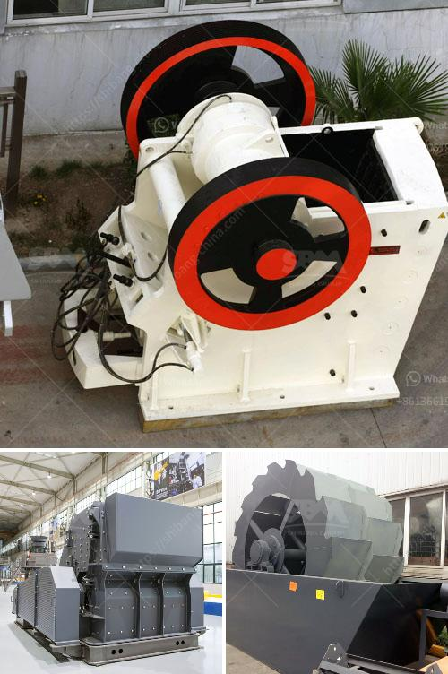

<h3>كيفية صنع مسحوق الجبس</h3>
صنع مسحوق الجبس هو عملية تتطلب مزيجًا من المهارة والمعرفة. يتم استخدام مسحوق الجبس في العديد من التطبيقات مثل البناء والديكور الداخلي وتصنيع الأثاث. فيما يلي خطوات عامة توضح كيفية صنع مسحوق الجبس.

أولاً وقبل كل شيء ، يتم استخراج الجبس من مناجمه. يتم تكسير الصخور وتنقيتها من الأوساخ والشوائب للحصول على الجبس النقي. تكون هذه العملية مشابهة لعملية استخراج أي مادة خام أخرى.

بعد استخراج الجبس ، يتم طحنه إلى حجم جسيمات صغيرة باستخدام مطاحن خاصة لتكوين مسحوق الجبس. يمكن استخدام مطاحن مختلفة مثل مطحنة الكرة أو مطحنة الضغط العالي حسب الاحتياجات.

تستخدم المعدات المختلفة لخلط مسحوق الجبس بالماء لتشكيل عجينة. يتم ضخ الماء تدريجياً حتى يتم الحصول على تركيبة متجانسة مع عدم وجود تكتلات أو فقاعات هواء.

بعد عملية الخلط ، يحتاج مزيج الجبس والماء إلى التجفيف. يمكن ذلك بطرق مختلفة ، بما في ذلك التجفيف الهوائي أو استخدام الأفران الخاصة. يتم التحكم في درجة حرارة الأفران وسرعة تدفق الهواء للتأكد من تجفيف مسحوق الجبس بشكل صحيح وفقًا للمواصفات.

بعد التجفيف ، يتم تبريد مسحوق الجبس وطحنه مرة أخرى. هذه الخطوة تقلل من حجم الجسيمات للحصول على مسحوق الجبس النهائي المطلوب. يمكن استخدام مطاحن خاصة تسمى مطاحن الإدارة لتلبية هذا الغرض.

أخيرًا ، يتم تعبئة مسحوق الجبس في حاويات مناسبة للتخزين والتوزيع. تكون هذه الحاويات عادة محكمة الغلق لضمان أن مسحوق الجبس لا يتعرض للتلوث.

هذه هي عملية عامة لصنع مسحوق الجبس. يجب ملاحظة أن هناك طرقًا أخرى لصنع مسحوق الجبس التي يمكن تعديلها وفقًا للمواصفات والاحتياجات المحددة. تحتاج هذه العملية إلى مراقبة دقيقة للحصول على جودة مسحوق الجبس العالية وضمان توافقه مع المعايير المطلوبة.
<h3>Contact us</h3><ul><li><strong>Whatsapp:&nbsp;<a href="https://wa.me/8613661969651">+8613661969651</a></strong></li><li><a href="https://swt.shibang-china.com/?git&amp;zhl&amp;كيفية صنع مسحوق الجبس"><strong>Online Service(chat now)</strong></a></li></ul><h3>Related</h3><ul><li><a href='سعر آلة كسارة الفك.md'>سعر آلة كسارة الفك</a></li><li><a href='مطحنة الأسطوانة العمودية للإسمنت.md'>مطحنة الأسطوانة العمودية للإسمنت</a></li><li><a href='تقرير الجدوى لاستفادة من خام النحاس.md'>تقرير الجدوى لاستفادة من خام النحاس</a></li><li><a href='ضبط حجم الفك كسارة الإغلاق.md'>ضبط حجم الفك كسارة الإغلاق</a></li><li><a href='كسارات الحطام للبيع.md'>كسارات الحطام للبيع</a></li></ul>