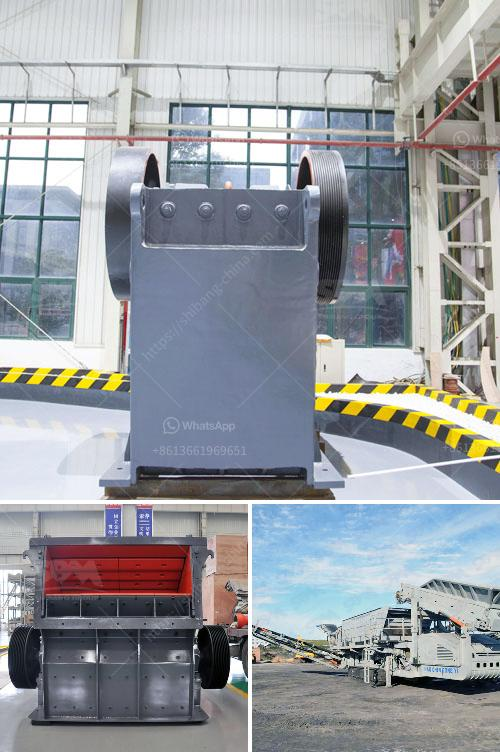

<h3>كيفية صنع مسحوق الطين الأحمر للغراز</h3>
يعد الطين الأحمر مادة طبيعية تستخدم في العديد من التطبيقات الحرفية، بما في ذلك صنع الفخار والغراز الفنية. يتراوح لون الطين الأحمر بين الأحمر الفاتح والأحمر الداكن، وهو مادة طبيعية غنية بالمعادن والعناصر النزرة التي تمنحه خصائصه المميزة. إذا كنت ترغب في صنع مسحوق الطين الأحمر للغراز الفنية، فإليك بعض الإرشادات التي يمكن أن تساعدك في ذلك:

أولاً، احصل على مصدر جيد للطين الأحمر. يمكنك شراء الطين الأحمر المجهز مسبقًا من محلات التوريد الفنية أو الإنترنت، أو يمكنك أيضًا الحصول على الطين الأحمر من المناطق الطبيعية التي يُعرف فيها وجوده. قم بتجفيف الطين الأحمر الذي حصلت عليه بشكل جيد قبل تحويله إلى مسحوق.

بما أن صنع مسحوق الطين الأحمر يتطلب مهارة وأدوات معينة، فننصحك بارتداء قفازات وواقي للعينين للحماية من الغبار وتطاير الجسيمات الدقيقة أثناء التحضير. قم بنشر الطين الأحمر المجفف على سطح مستوٍ وغير قابل للانزلاق.

استخدم آلة طحن لتحويل الطين الأحمر المجفف إلى مسحوق. قم بطحن الطين ببطء وتدريجياً للحصول على مسحوق ناعم وخالي من التجاعيد. تأكد من أن المسحوق ليس لديه أي تكتلات أو قطع كبيرة.

بعد طحن الطين الأحمر، قم بفرز المسحوق لإزالة أي شوائب أو جسيمات غير مرغوب فيها. يُمكنك استخدام غربال ناعم أو قماش ناعم لتصفية المسحوق وتجنب وجود قطع كبيرة.

يمكنك الأن استخدام مسحوق الطين الأحمر في صنع الغراز الفنية. قم بخلط المسحوق مع الماء بشكل تدريجي لخلق مزيج لزج وسميك. من المهم ضبط تركيبة المزيج بالتجربة والخطأ حتى تحصل على اللزوجة التي تناسب احتياجاتك.

بعد إعداد الغراز بمساعدة مسحوق الطين الأحمر، يمكنك استخدامها لتزيين الأواني الفخارية أو صنع القطع الفنية الأخرى. يُمكنك استخدام الفرن لتجفيف الغراز وجعلها صلبة ودائمة.

في الختام، صنع مسحوق الطين الأحمر للغراز هو أمر ممتع وإبداعي يمكنك القيام به في المنزل. تذكر أن الطين الأحمر له خواص فريدة ومميزة، ويمكنك تكييف تركيبة المسحوق بحسب احتياجاتك وتفضيلاتك الشخصية. استمتع بالتجربة واستكشف الإبداع!
<h3>Contact us</h3><ul><li><strong>Whatsapp:&nbsp;<a href="https://wa.me/8613661969651">+8613661969651</a></strong></li><li><a href="https://swt.shibang-china.com/?git&amp;zhl&amp;كيفية صنع مسحوق الطين الأحمر للغراز"><strong>Online Service(chat now)</strong></a></li></ul><h3>Related</h3><ul><li><a href='مصنع غسيل الذهب المستخدمة.md'>مصنع غسيل الذهب المستخدمة</a></li><li><a href='أنواع كسارة الحصى.md'>أنواع كسارة الحصى</a></li><li><a href='اشتقاق السرعة الحرجة في مطحنة كرات PDF.md'>اشتقاق السرعة الحرجة في مطحنة كرات PDF</a></li><li><a href='اليابان لمصنع تكسير متنقل.md'>اليابان لمصنع تكسير متنقل</a></li><li><a href='مطحنة للحجر الجيري في إيطاليا.md'>مطحنة للحجر الجيري في إيطاليا</a></li></ul>