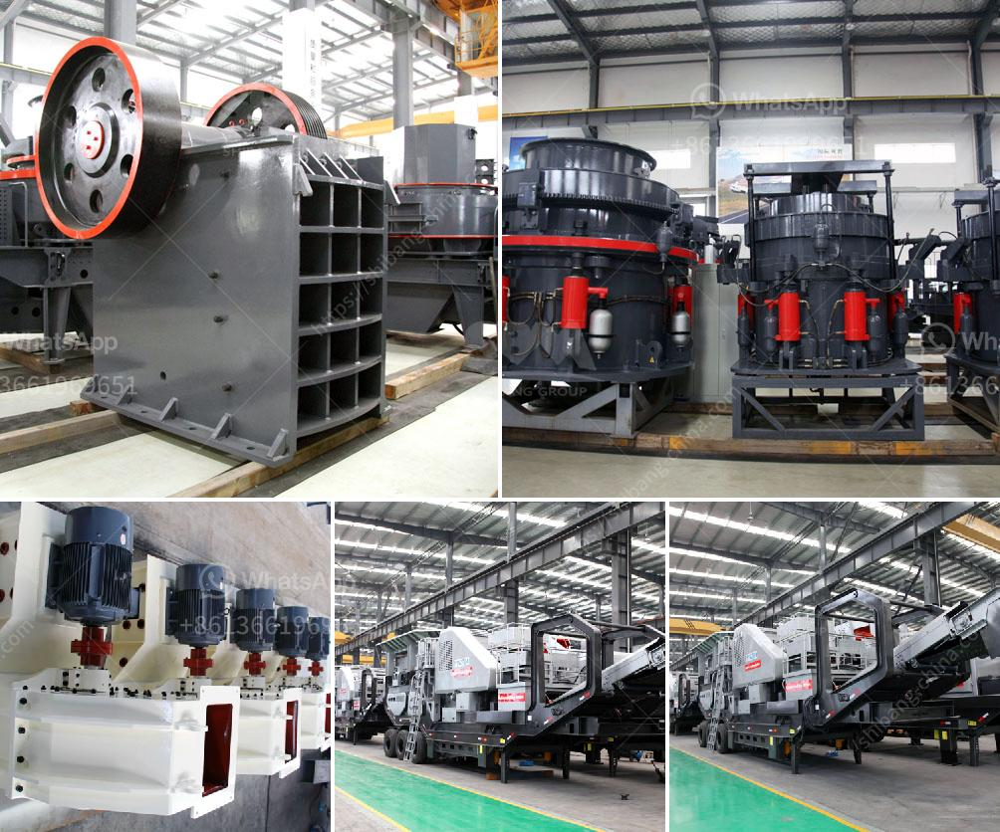

<h3>كيفية صنع مسحوق وضع الجدار</h3>
صنع مسحوق وضع الجدار هو عملية أساسية في مجال البناء والتشييد. يُستخدم هذا المسحوق لتحسين رونق ومتانة الجدران، بالإضافة إلى إعطائها ألوانًا جذابة ومثالية للديكورات المنزلية. في هذه المقالة، سنتطرق إلى كيفية صنع مسحوق وضع الجدار بشكل فعال وبأدوات بسيطة.

أولاً، تحتاج إلى عدة مكونات لصنع المسحوق، بما في ذلك الجير المطفأ والأسمنت الرمادي والرمل الناعم. يجب أن تتأكد من استخدام مكونات عالية الجودة للحصول على أفضل النتائج. يمكنك الحصول على هذه المكونات من متاجر مواد البناء المحلية.

عندما تحصل على المكونات، يجب أولاً خلطها بالنسبة المناسبة. يمكن أن تختلف هذه النسبة اعتمادًا على الاحتياجات والمتطلبات الخاصة بكنوعية الجدار واستخدامك له. بصفة عامة، النسبة المثلى تكون 1:1:6. هذا يعني أنك تحتاج إلى خلط 1 حجم من الجير المطفأ، 1 حجم من الأسمنت الرمادي و 6 أحجام من الرمل الناعم.

بعد خلط المكونات الجافة معًا، يمكنك إضافة الماء التدريجي إلى الخليط. يجب أن تكون الكمية المضافة من الماء في النسبة المناسبة لتحقيق تجانس الخليط ومرونته. يفضل استخدام آلة خلط لضمان حصولك على خليط متجانس ومتجانس.

بعد خلط المكونات وإضافة الماء، تأكد من خلطها بشكل جيد حتى تحصل على عجينة ناعمة ومتجانسة. يمكنك الاختبار ببساطة بواسطة الضغط على العجينة بإصبعك. إذا ظلت العجينة ثابتة وموحدة دون تشقق، فهذا يعني أن العجينة جيدة وجاهزة للإستخدام.

بعد تحضير المسحوق، يمكنك استخدامه على الجدران. فقط قم بتجميع قبضة من المسحوق بالماء واستخدامها لتغطية الجدران. استخدم تقنيات التوزيع المناسبة مثل النقش بالملطف والمسح بالمنشفة للحصول على تشطيب جيد ومتجانس.

أخيراً، بمجرد أن يجف المسحوق الذي وضعته، يمكنك تنعيم سطح الجدار بواسطة ورق الصنفرة الناعمة لإزالة أي تجاعيد أو عيوب في الجدار. بعد ذلك، يمكنك البدء في الديكور على الجدران وصباغتها حسب الرغبة.

في الختام، صنع مسحوق وضع الجدار يتطلب الالتزام بنسب محددة وخطوات تحضيرية معينة. عندما تصنعه بشكل صحيح، يمكنك الحصول على جدران جميلة ومتينة تضفي جمالًا على منزلك. قم بمراعاة النقاط المذكورة أعلاه واستعن بمواد ذات جودة عالية للحصول على أفضل النتائج.
<h3>Contact us</h3><ul><li><strong>Whatsapp:&nbsp;<a href="https://wa.me/8613661969651">+8613661969651</a></strong></li><li><a href="https://swt.shibang-china.com/?git&amp;zhl&amp;كيفية صنع مسحوق وضع الجدار"><strong>Online Service(chat now)</strong></a></li></ul><h3>Related</h3><ul><li><a href='تكلفة الحزام الناقل لكل متر.md'>تكلفة الحزام الناقل لكل متر</a></li><li><a href='مطحنة الكرات للحجر الجيري.md'>مطحنة الكرات للحجر الجيري</a></li><li><a href='آلة طحن الحجر الصخري في فوجيان.md'>آلة طحن الحجر الصخري في فوجيان</a></li><li><a href='صورة مطحنة رولر ريموند الموديل 30.md'>صورة مطحنة رولر ريموند الموديل 30</a></li><li><a href='شركة موردة لكسارة الحجر.md'>شركة موردة لكسارة الحجر</a></li></ul>