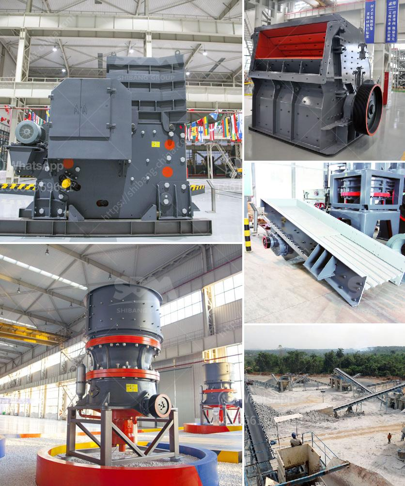

<h3>كيفية صنع مطحنة الكرة pdf</h3>
مطحنة الكرة هي جهاز يستخدم في عمليات طحن المواد الصلبة والمسحوقة في صناعات مختلفة، مثل صناعة السيراميك والأسمنت والصناعات الكيميائية. وفي هذه المقالة، سنتطرق إلى كيفية صنع مطحنة الكرة بشكل مبسط.

أولاً، يجب التأكد من توافر جميع المواد والأدوات اللازمة للبدء في العملية. ستحتاج إلى قضيب من الفولاذ، بطانة مطاطية، وحدة تحريك، ومحرك كهربائي، وروابط، وحاوية للمسحوق.

أول خطوة في عملية تصنيع مطحنة الكرة هي شد القضيب الصلب بين الروابط في الشكل المطلوب. يجب أن يكون القضيب قويًا بما يكفي لتحمل الضغط والقوة أثناء الطحن.

ثم، يجب تثبيت البطانة المطاطية داخل الحاوية بشكل دقيق. هذه البطانة تساعد على تقليل التآكل والصدمات أثناء عملية الطحن، وتحمي القضيب الصلب من التلف.

بعد تثبيت البطانة، يجب توصيل وحدة التحريك بالقضيب الصلب. تعمل هذه الوحدة على تحويل الحركة الدورانية من المحرك الكهربائي إلى حركة الاهتزاز الخطية للقضيب.

أخيرًا، يجب توصيل المحرك الكهربائي بوحدة التحريك وتثبيته في مكانه المخصص على الحاوية. يجب أن يكون المحرك كهربائيًا قويًا بما يكفي لتوفير الطاقة اللازمة لعملية الطحن.

بعد الانتهاء من مراحل التصنيع هذه، يمكنك استخدام مطحنة الكرة الخاصة بك لطحن المواد الصلبة والمسحوقة. يجب الأخذ في الاعتبار بعض الاحتياطات العامة، مثل ارتداء الملابس الواقية واستخدام القفازات والنظارات الواقية، حتى لا يحدث أي إصابات.

وبهذا، تكون قد تعرفت على كيفية صنع مطحنة الكرة بشكل مبسط. يجب على المهتمين بصناعة مطحنة الكرة أن يأخذوا في الاعتبار القوانين والتصميمات الهندسية اللازمة للحصول على جهاز آمن وفعال وفقًا للاستخدام المخطط له. على الرغم من أن هذا المقال يغطي الخطوات الأساسية لصنع مطحنة الكرة، فإنه لا يكفي بالنسبة للمحترفين، ويجب أن يطلبوا المساعدة من الخبراء في هذا المجال.
<h3>Contact us</h3><ul><li><strong>Whatsapp:&nbsp;<a href="https://wa.me/8613661969651">+8613661969651</a></strong></li><li><a href="https://swt.shibang-china.com/?git&amp;zhl&amp;كيفية صنع مطحنة الكرة pdf"><strong>Online Service(chat now)</strong></a></li></ul><h3>Related</h3><ul><li><a href='مصنع كسارة متنقلة مثبتة على الطرق.md'>مصنع كسارة متنقلة مثبتة على الطرق</a></li><li><a href='قائمة معدات وآلات التعدين عن الذهب.md'>قائمة معدات وآلات التعدين عن الذهب</a></li><li><a href='مطاحن الأسطوانات في الدول.md'>مطاحن الأسطوانات في الدول</a></li><li><a href='مصانع تجفيف رمل الفراك للبيع.md'>مصانع تجفيف رمل الفراك للبيع</a></li><li><a href='آلات معالجة الأحجار الكريمة لإثيوبيا.md'>آلات معالجة الأحجار الكريمة لإثيوبيا</a></li></ul>