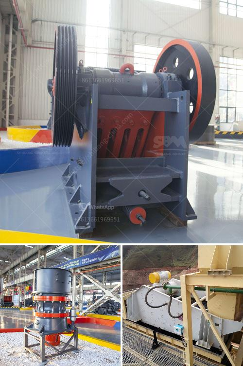

<h3>كيفية عمل كسارة الأسنان</h3>
تعد كسارة الأسنان جهازًا طبيًا يستخدم لعلاج الأمراض والحالات المرتبطة بالفكين والأسنان. تعمل الكسارة عن طريق وضع قوة ضغط خفيفة ومستمرة على الأسنان المصابة أو التالفة بهدف إعادة توجيه نمو الفكين وتصحيح أي خلل في توازن الفكين والأسنان. يتم استخدام الكسارات الأسنان تحت إشراف طبيب الأسنان أو أخصائي تقويم الأسنان.

تتألف الكسارة الأسنان عادة من ثلاثة أجزاء رئيسية: الأقواس الثابتة، والأقواس المتحركة، والمساند. الأقواس الثابتة عبارة عن أسلاك صلبة تثبت على سطح الأسنان وتعمل على توجيه الفكين للوضع الصحيح. الأقواس المتحركة عبارة عن مفصل يستخدم لضبط الكسارة بحيث يمكن تعديل قوة الضغط المطبقة على الأسنان. أما المساند فهي صفائح مطاطية تلتصق بالأسنان وتخفف الضغط المطبق عليها وتوفر الراحة للمريض.

تستخدم الكسارة الأسنان لعلاج العديد من المشاكل مثل الأسنان الملتوية أو الأسنان العرضية، أو فروز الفكين، أو الفكوك العميقة، أو فروز الفك العلوي مقابل الفك السفلي. تعمل الكسارة على توفير اتصال مستمر بين الفكين لإعادة توجيه النمو بطريقة صحيحة.

يتم تجديد تعديلات الكسارة الأسنان بانتظام لضمان استمرار تأثيرها على الأسنان والفكين. ويعتمد نجاح علاج الكسارة على تفاعل الجسم مع العلاج ولاحظ فرقًا في الوقت وتجنب التشنجات والتوترات. يمكن أن يستغرق العلاج باستخدام الكسارة الأسنان أشهرًا أو حتى سنوات حسب حجم المشكلة وسوء خطورة الحالة، وقد يتم الجمع بينه مع إجراءات أخرى مثل سحب الأسنان أو تقويم الأسنان.

من الجدير بالذكر أن الكسارة الأسنان قاصرة على الأشخاص الذين لم ينتهوا من فترة النمو الطبيعية. وتحتاج الكسارة الأسنان إلى صيانة دورية ومراقبة من طبيب الأسنان للتأكد من سلامة الجهاز ونجاح العلاج.

باختصار، يعد استخدام الكسارة الأسنان وسيلة فعالة وآمنة لتصحيح الفكين الخلوية وتحسين مظهر الأسنان والوجه. يجب أن يتم استخدامها تحت إشراف طبيب الأسنان المؤهل وتتطلب صيانة ورعاية منتظمة لضمان نجاح العلاج.
<h3>Contact us</h3><ul><li><strong>Whatsapp:&nbsp;<a href="https://wa.me/8613661969651">+8613661969651</a></strong></li><li><a href="https://swt.shibang-china.com/?git&amp;zhl&amp;كيفية عمل كسارة الأسنان"><strong>Online Service(chat now)</strong></a></li></ul><h3>Related</h3><ul><li><a href='مصنع كسارة الصخور بسعة 150 طن.md'>مصنع كسارة الصخور بسعة 150 طن</a></li><li><a href='كسارة الصخور.md'>كسارة الصخور</a></li><li><a href='خطة التحكم في تصنيع مطحنة الكرة.md'>خطة التحكم في تصنيع مطحنة الكرة</a></li><li><a href='مصنع معالجة الكالسيوم.md'>مصنع معالجة الكالسيوم</a></li><li><a href='آلة تعدين الكسارة.md'>آلة تعدين الكسارة</a></li></ul>