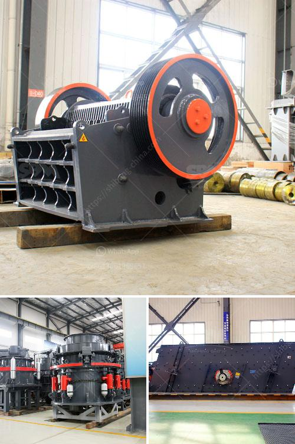

<h3>كيفية عمل مصنع سحق الحجر</h3>
مصانع سحق الحجر هي مثال على المنشآت الصناعية التي تُستخدم لتحويل الصخور الكبيرة إلى قطع أصغر قابلة للاستخدام في عدة صناعات. يعتبر سحق الحجر عملية أساسية في صناعة البناء والمناجم والمواد الكيميائية وصناعة الأسمنت والطاقة الكهربائية وغيرها. في هذه المقالة، سنتناول بشكل عام كيفية عمل مصنع سحق الحجر ومراحله الرئيسية.

أولاً وقبل كل شيء، يتم جمع الصخور الكبيرة من المناجم أو المقالع بواسطة المعدات الثقيلة مثل الشاحنات الكبيرة أو الرافعات. يتم استخدام معدات التكسير الأولي لتقسيم الصخور إلى قطع أصغر قبل أن يتم نقلها إلى المصنع.

في البداية، يتم تفريغ الصخور في تهوية خاصة لإزالة الساحبة الهوائية والشوائب الأخرى. ثم يتم نقل الصخور إلى سير من ناقل للوصول إلى المرحلة التالية.

تأتي المرحلة التالية في عملية سحق الحجر وهي مرحلة التكسير الأولي. تستخدم كسارات الفك أو المطارق الهيدروليكية لتكسير الصخور إلى أحجام أصغر. يتم ضبط حجم الفتحة في الكسارة بحيث يتم سحق الصخور إلى الحجم المطلوب.

بعد ذلك، تنتقل الصخور إلى مرحلة التكسير الثانوي والتكسير التصادمي. يستخدم الكسارات المخروطية أو الكسارات التصادمية لتكسير الصخور بشكل أكبر وتقسيمها إلى قطع أصغر. يتم تحميل الصخور في الكسارة وتنتقل بسرعة عالية وتصطدم بلوحة ثابتة أو مطرقة تتحرك بسرعة. تحدث عملية الاصطدام هذه لتكسير الصخور بقوة وتقسيمها إلى قطع أصغر.

أخيرًا، تأتي مرحلة فصل الحجم وتجهيز المنتج النهائي. في هذه المرحلة، تتم تنقية الحصى الناتجة من عملية السحق وتفصل عن المنتج غير المرغوب فيه مثل الرمال أو الأتربة. يتم تصنيف المنتج النهائي حسب الحجم المطلوب باستخدام شاشات تهتز أو طبقات فاصلة. يتم تعبئة المنتج النهائي في حاويات أو أكياس جاهزة للشحن والبيع.

هذه هي المراحل الرئيسية لعمل مصنع سحق الحجر. يجب أن يكون لديها الآلات والمعدات المناسبة لإتمام كل مرحلة بنجاح. عملية سحق الحجر تتطلب عناية واهتمامًا بتفاصيل العملية لضمان الحصول على منتج نهائي ذو جودة عالية وفقًا للمواصفات المطلوبة.
<h3>Contact us</h3><ul><li><strong>Whatsapp:&nbsp;<a href="https://wa.me/8613661969651">+8613661969651</a></strong></li><li><a href="https://swt.shibang-china.com/?git&amp;zhl&amp;كيفية عمل مصنع سحق الحجر"><strong>Online Service(chat now)</strong></a></li></ul><h3>Related</h3><ul><li><a href='أريد شراء كسارة البوزولان.md'>أريد شراء كسارة البوزولان</a></li><li><a href='سعر كسارة الصخور.md'>سعر كسارة الصخور</a></li><li><a href='كسارة الصخور المحمولة.md'>كسارة الصخور المحمولة</a></li><li><a href='كسارات الجرانيت والطاحونات.md'>كسارات الجرانيت والطاحونات</a></li><li><a href='كسارة للبيع في نيبال.md'>كسارة للبيع في نيبال</a></li></ul>