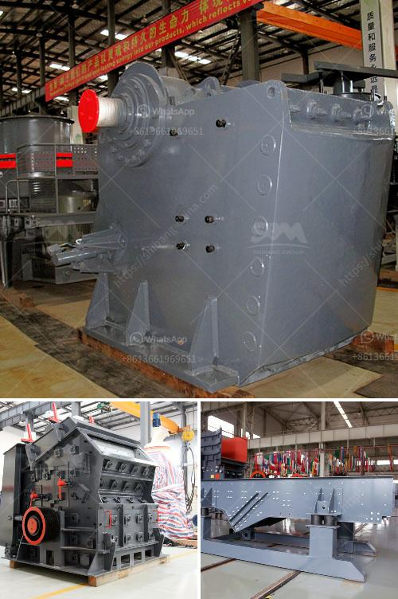

<h3>كيفية غسل الرمل للبناء</h3>
غسل الرمل للبناء هو عملية هامة تهدف إلى تحسين جودة الرمل المستخدم في البناء وضمان عدم وجود شوائب أو طين يؤثر سلبًا على جودة المواد الانشائية. يستخدم الرمل في العديد من التطبيقات في البناء مثل تكسير وتجهيز الحصى، وصب الخرسانة، وتشييد الطرق، وبناء الأساسات. يمكن أن تؤدي وجود شوائب غير مرغوب فيها في الرمل إلى ضعف قوة الهيكل واستدامته.

1. جمع الرمال: يتم جمع الرمل من المصادر المحلية مثل البحر، أنهار، مناجم الرمل أو بئر مائية. يفضل جمع الرمال من المصادر النظيفة والعذبة بدلاً من مناطق ملوثة أو مالحة لضمان جودة الرمل.

2. فحص الرمل: يتم فحص الرمال لاكتشاف وإزالة الشوائب المرئية مثل الأحجار الكبيرة أو الأغصان. يمكن استخدام سلال خاصة أو أدوات فرز لتصفية الشوائب وتجنب انتقالها إلى عملية الغسيل.

3. غسل الرمل: تتم عملية غسل الرمل عن طريق وضع الرمل في حاوية كبيرة أو بركة ماء. يجب أن يتم غسل الرمل بحرص لضمان عدم فقدان الرمل الناعم والحفاظ على جودته. يمكن استخدام طرق الغسيل الميكانيكية أو الكيميائية. في الطرق الميكانيكية، يتم تحريك الرمل بشكل مستمر بواسطة آلات تهتز أو عواصف مائية للتخلص من الطين والشوائب الأخرى. أما في الطرق الكيميائية، يتم استخدام المواد الكيميائية لتخليص الرمل من الشوائب بعد حلها في الماء.

4. تجفيف الرمل: بعد الانتهاء من عملية الغسيل، يجب تجفيف الرمل بشكل جيد قبل استخدامه في عمليات البناء. يمكن أن تتم عملية التجفيف عن طريق تعريض الرمل لأشعة الشمس المباشرة على سطح مستو أو عن طريق استخدام أفران خاصة.

باستخدام الطرق والإجراءات المذكورة أعلاه، يتم تحسين جودة الرمل المستخدم في البناء وتجنب وجود الشوائب والطين التي يمكن أن تؤثر سلبًا على قوة واستدامة المواد الأنشائية. يجب أن تتم هذه العملية بعناية وبالتزامن مع المعايير الفنية المعتمدة لضمان تحقيق أعلى مستويات الجودة في البناء.
<h3>Contact us</h3><ul><li><strong>Whatsapp:&nbsp;<a href="https://wa.me/8613661969651">+8613661969651</a></strong></li><li><a href="https://swt.shibang-china.com/?git&amp;zhl&amp;كيفية غسل الرمل للبناء"><strong>Online Service(chat now)</strong></a></li></ul><h3>Related</h3><ul><li><a href='مطحنة حجر نيجيريا.md'>مطحنة حجر نيجيريا</a></li><li><a href='تجهيز خام الحديد بي دي إف.md'>تجهيز خام الحديد بي دي إف</a></li><li><a href='سعر كسارة الفك 24x12.md'>سعر كسارة الفك 24x12</a></li><li><a href='أسعار كسارات الحجر الصغيرة.md'>أسعار كسارات الحجر الصغيرة</a></li><li><a href='موردين كسارات الفك والمخروط في موكوباني.md'>موردين كسارات الفك والمخروط في موكوباني</a></li></ul>