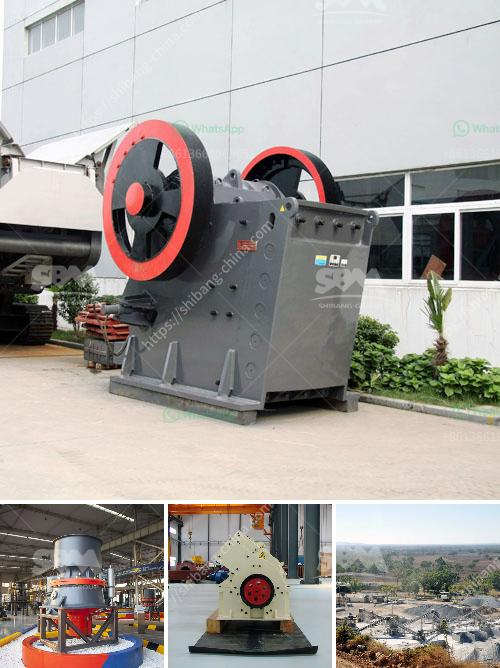

<h3>كيفية معالجة المعدن الكوارتز</h3>
يُعد المعدن الكوارتز واحدًا من أكثر المواد المستخدمة على نطاق واسع في العديد من الصناعات. فهو معدن طبيعي يتكون أساسًا من السيليكا ، وهو عبارة عن مادة متينة ومقاومة للحرارة والتآكل. يعتبر الكوارتز مثاليًا لمجموعة واسعة من التطبيقات بسبب خصائصه المميزة.

تعد معالجة المعدن الكوارتز هامة جدًا لتحسين وتعزيز خصائصه وتكونه الكيميائي. هناك العديد من الطرق المستخدمة لمعالجة المعدن الكوارتز وتتضمن بعضها التصنيع التقليدي والبعض الآخر التكنولوجيات المتقدمة. سنلقي نظرة على بعض أبرز أساليب معالجة المعدن الكوارتز:

1. التعريض لدرجات الحرارة المرتفعة: يتم تعريض الكوارتز لدرجة حرارة عالية ، وهذا يساعد في تحسين صلابته ومقاومته للحرارة. بالإضافة إلى ذلك، يتم تحويل الكوارتز المعالج حراريًا إلى مواد متعددة الاستخدامات مثل الزجاج والسيراميك.

2. علاج الأحماض: يمكن استخدام الأحماض المركزة مثل حمض الهيدروكلوريك لتحسين جودة المعدن الكوارتز وتنقيته. يتم غمر قطعة الكوارتز في هذه الأحماض لفترة من الزمن، وبعد ذلك يتم غسلها جيدًا للتخلص من الحمض الزائد.

3. التلميع: يتم تلميع سطح الكوارتز لتحقيق لمعان وتألق أفضل. يتم استخدام طرق التلميع المعتادة أو استخدام تقنيات التلميع الميكانيكي الأكثر تطورًا لتحقيق النتيجة المطلوبة.

4. التعدين وتكسير الصخور: تعد عملية التعدين وتكسير الصخور من أهم الخطوات في معالجة المعدن الكوارتز. تتطلب هذه العمليات قدرًا كبيرًا من المعدات والمهارات لاستخراج المعدن وتحويله إلى قطع صالحة للعمل.

5. استخدام التقانة المتقدمة: يمكن استخدام التكنولوجيا المتقدمة مثل تقنية التصنيع الرقمي لتحسين وتسهيل عمليات معالجة المعدن الكوارتز. هذه التقنيات تتطلب استخدام ماكينات قوية ودقيقة لتنفيذ عمليات معقدة مثل الحفر والتقطيع بالليزر على الكوارتز.

عند تطبيق الطرق المذكورة أعلاه لمعالجة المعدن الكوارتز بشكل صحيح ، يكون النتيجة حجر كوارتز عالي الجودة يمكن استخدامه في العديد من الصناعات المختلفة. سواء كان ذلك في صناعة الزجاج أو الالكترونيات أو حتى في صناعة الألماس الاصطناعي، يعد المعدن الكوارتز خيارًا مثاليًا بسبب خصائصه المتفوقة.

في الختام ، يعد المعدن الكوارتز مادة هامة في عالم الصناعة ، ويتطلب معالجته بعناية لاستخلاص أقصى قدر من الفوائد. التعرف على أفضل طرق المعالجة وتنفيذها بدقة يمكن أن يحقق نتائج ممتازة ويضمن استفادة كاملة من مميزات هذا المعدن الثمين.
<h3>Contact us</h3><ul><li><strong>Whatsapp:&nbsp;<a href="https://wa.me/8613661969651">+8613661969651</a></strong></li><li><a href="https://swt.shibang-china.com/?git&amp;zhl&amp;كيفية معالجة المعدن الكوارتز"><strong>Online Service(chat now)</strong></a></li></ul><h3>Related</h3><ul><li><a href='مصنع النحاس للبيع.md'>مصنع النحاس للبيع</a></li><li><a href='طاحونة السخام.md'>طاحونة السخام</a></li><li><a href='مطاحن طحن أتا.md'>مطاحن طحن أتا</a></li><li><a href='تكلفة طاحونة الكوارتز.md'>تكلفة طاحونة الكوارتز</a></li><li><a href='مطحنة طحن عمودية.md'>مطحنة طحن عمودية</a></li></ul>