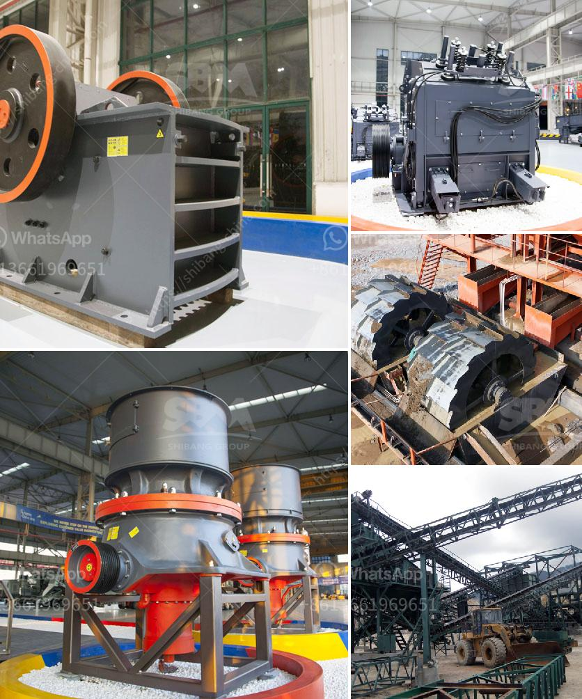

<h3>كيماويات تعويم تحسين الفحم في الهند</h3>
تعد الهند واحدة من الدول الرائدة في إنتاج الفحم على مستوى العالم، حيث تعد الطاقة الكهربائية المستمدة من الفحم أحد أهم مصادر الطاقة في البلاد. ولكن رغم توفر هذه الخامة بكميات كبيرة، إلا أن الفحم المستخدم غالبًا يحتوي على نسب عالية من المواد اللاصقة والمعادن الملونة والشوائب، مما يؤثر سلبًا على جودته ويجعله غير مناسب للاستخدام الفوري.

لحل هذه المشكلة، تم تطوير تقنيات تعويم الفحم باستخدام الكيماويات. يتم استخدام الكيماويات لفصل وإزالة الشوائب والمواد اللاصقة من الفحم، مما يعزز جودته ومنتجيته في عملية الحرق. تستخدم مجموعة متنوعة من الكيماويات في عمليات التعويم، بما في ذلك المواد المفلكسية ومعدن الصوديوم على شكل كيماويات مضافة، والتي تدخل في تركيزات منخفضة جداً بغرض تحسين الفحم.

توفر تقنية تعويم الفحم باستخدام الكيماويات العديد من الفوائد. فعندما يتم إزالة الشوائب والمواد اللاصقة، يصبح الفحم أكثر نقاءً، مما يقلل من انبعاثات الجسيمات العالقة والشوائب السامة أثناء الاحتراق. كذلك، تساهم هذه الكيماويات في رفع كفاءة الحرق وتحسين عملية حرق الفحم، مما يزيد من إنتاج الطاقة ويقلل من استهلاك الفحم.

بالإضافة إلى ذلك، يتيح استخدام التقنيات الكيماوية في تعويم الفحم تنظيفه من المواد اللاصقة والشوائب الضارة، مما يسهم في زيادة حجم الفحم المعروض للسوق بنفس الكمية من الخام المستخدم. وهذا يعني تحقيق استفادة أفضل من الفحم المتاح وتوفير المزيد من الطاقة للاستهلاك الداخلي والتصدير.

ومع ذلك، يجب أن نذكر أن استخدام الكيماويات في عمليات التعويم يتطلب تفتيش ومراقبة دقيقة للتأكد من تواجد مستويات منخفضة جدًا من هذه المواد الكيماوية المستخدمة في الفحم المعالج، حتى لا يكون لها أي تأثير سلبي على البيئة أو الصحة العامة.

في النهاية، يصبح واضحًا أن استخدام الكيماويات في تعويم الفحم يعد تقنية مهمة جدًا لتحسين جودة الفحم في الهند. تكاد تكون عمليات التعويم بالكيماويات ضرورية للحفاظ على قدرة الهند على إنتاج الكميات الضرورية من الفحم وضمان توفير الطاقة اللازمة للبلاد في المستقبل.
<h3>Contact us</h3><ul><li><strong>Whatsapp:&nbsp;<a href="https://wa.me/8613661969651">+8613661969651</a></strong></li><li><a href="https://swt.shibang-china.com/?git&amp;zhl&amp;كيماويات تعويم تحسين الفحم في الهند"><strong>Online Service(chat now)</strong></a></li></ul><h3>Related</h3><ul><li><a href='تقليل حجم مطحنة المطرقة.md'>تقليل حجم مطحنة المطرقة</a></li><li><a href='تجار كسارة الفك المحمولة في كينيا.md'>تجار كسارة الفك المحمولة في كينيا</a></li><li><a href='آلة تكسير الصخور.md'>آلة تكسير الصخور</a></li><li><a href='معلمات كسارة 250 طن في الساعة.md'>معلمات كسارة 250 طن في الساعة</a></li><li><a href='تكلفة مصنع لوحات الجبس في الهند.md'>تكلفة مصنع لوحات الجبس في الهند</a></li></ul>