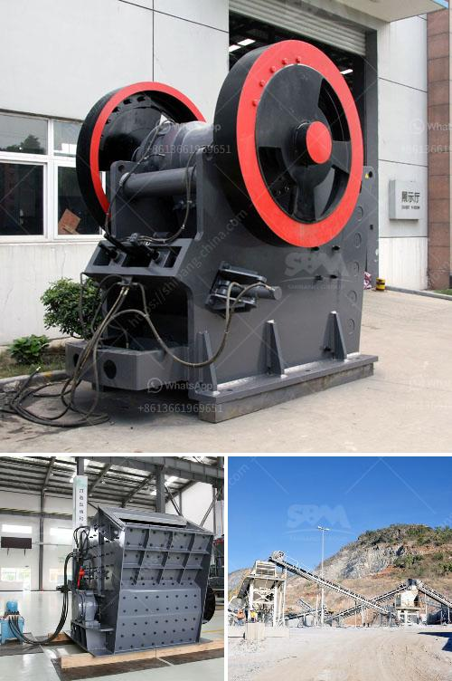

<h3>لكن كسارات الخرسانة نيجيريا</h3>
لكسارات الخرسانة في نيجيريا: الحاجة ، التحديات ، والتطور

تُعتبر صناعة البناء والتشييد من القطاعات الرئيسية في الاقتصاد النيجيري، ومن أهم مكونات البناء هي الخرسانة. ومع تزايد النمو السكاني في نيجيريا وارتفاع الطلب على الإسكان والمنشآت التجارية والصناعية، فإن الحاجة إلى خرسانة عالية الجودة وبأسعار معقولة أصبحت ضرورية.

تلعب كسارات الخرسانة دورًا حاسمًا في تلبية هذه الاحتياجات، حيث تعتبر مصدراً رئيسيًا للركام الخرساني. تقوم هذه الكسارات بتكسير الصخور والحجارة وتحويلها إلى رمل وحصى وحجارة مكسرة صغيرة، مما يسهم في إنتاج خرسانة ذات قوة وتحمل مثلى.

لكن هناك تحديات عديدة تواجه صناعة كسارات الخرسانة في نيجيريا. أحد هذه التحديات هو ارتفاع تكلفة المعدات والآلات اللازمة لتشغيل الكسارات. بالإضافة إلى ذلك، تحتاج الصناعة إلى خبرة فنية متخصصة لتشغيل الكسارات والحفاظ عليها، وهذا يعني التكاليف الإضافية للعملية.

وتشكل المشاكل البيئية أيضًا تحديًا لصناعة الكسارات في نيجيريا. فعمليات التكسير قد تترك أثرًا سلبيًا على البيئة المحيطة، بما في ذلك التربة والمياه الجوفية. وتحتاج صناعة الكسارات إلى اتباع معايير بيئية صارمة وتبني تكنولوجيا حديثة للحد من التأثيرات السلبية على البيئة.

مع ذلك، فإن صناعة كسارات الخرسانة في نيجيريا تشهد تطورًا ملحوظًا. فقد قامت بعض الشركات بتجديد المعدات واستخدام التكنولوجيا الحديثة لتحسين جودة وكفاءة الإنتاج. كما تم اتخاذ إجراءات بيئية للحد من التأثيرات السلبية للعمليات.

بالإضافة إلى ذلك، تواجه صناعة الكسارات في نيجيريا فرص توسع مستقبلية، حيث يُتوقع أن يستمر الطلب على الخرسانة بشكل متزايد نظرًا للنمو السكاني المستمر وتوسع المجالات الصناعية والتجارية. كما أن حكومة نيجيريا قد أدرجت قطاع البناء والتشييد ضمن أولوياتها التنموية، مما يشجع على استثمارات جديدة في صناعة الكسارات.

في الختام، تُعد كسارات الخرسانة في نيجيريا أحد القطاعات الحيوية في صناعة البناء والتشييد. وعلى الرغم من التحديات التي تواجهها، فإن التطور التكنولوجي والاهتمام البيئي يساعدان في تعزيز جودة وكفاءة الإنتاج. ومع بقاء الطلب على الخرسانة مرتفعًا، فإن صناعة الكسارات في نيجيريا تحتفظ بفرص تطوير استثمارية قوية في المستقبل.
<h3>Contact us</h3><ul><li><strong>Whatsapp:&nbsp;<a href="https://wa.me/8613661969651">+8613661969651</a></strong></li><li><a href="https://swt.shibang-china.com/?git&amp;zhl&amp;لكن كسارات الخرسانة نيجيريا"><strong>Online Service(chat now)</strong></a></li></ul><h3>Related</h3><ul><li><a href='مطحنة الطحن.md'>مطحنة الطحن</a></li><li><a href='مطحنة هامر لطحن البولي إيثيلين منخفض الكثافة.md'>مطحنة هامر لطحن البولي إيثيلين منخفض الكثافة</a></li><li><a href='جول بيلي كسارة حجر مستعملة.md'>جول بيلي كسارة حجر مستعملة</a></li><li><a href='كسارات الفك في جنوب أفريقيا.md'>كسارات الفك في جنوب أفريقيا</a></li><li><a href='مصنع مطحنة الكرة في باكستان.md'>مصنع مطحنة الكرة في باكستان</a></li></ul>