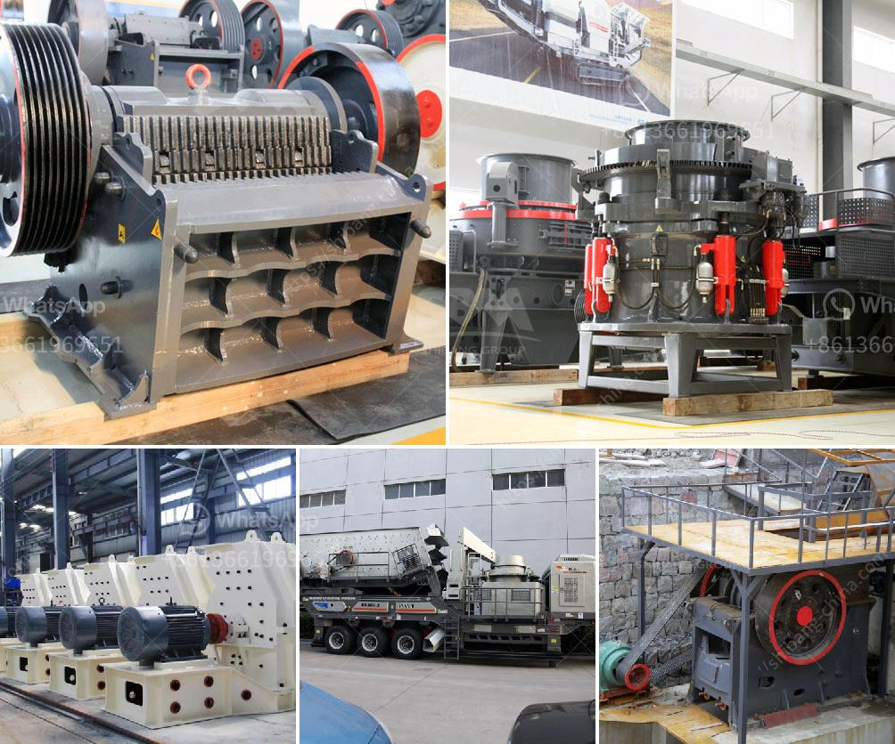

<h3>للحصول على تصريح كسارة في الفلبين</h3>
تعتبر صناعة التعدين والكسارات من القطاعات الحيوية في الاقتصاد الفلبيني، حيث تساهم في تلبية الطلب المتزايد على المواد الخام والبناء. ومن أجل تشغيل كسارة في الفلبين، تحتاج إلى الحصول على التصريح اللازم من السلطات المحلية والوطنية. فيما يلي مقالة تشرح الإجراءات الضرورية للحصول على تصريح كسارة في الفلبين.

أولاً وقبل كل شيء، يجب أن تكون الكسارة مرخصة ومسجلة رسمياً في البلدية المحلية ودائرة البيئة والموارد الطبيعية (DENR - Department of Environment and Natural Resources). يتطلب التسجيل تقديم طلب رسمي مع التفاصيل الكاملة عن الكسارة، مثل الموقع والطاقة الإنتاجية والأهداف المحددة.

بعد تقديم الطلب، يتعين عليك دفع الرسوم المطلوبة وتقديم جميع المستندات اللازمة لتقدير تأثير البيئة (EIA - Environmental Impact Assessment). يتم تقديم هذه المستندات إلى DENR ويتم تقييمها من قبل الجهات المختصة للتأكد من عدم وجود تأثير سلبي على البيئة والمجتمع المحلي.

عند الحصول على تقدير تأثير البيئة، ستحتاج إلى الحصول على تصريح الاستخدام التجاري من البلدية المحلية. هذا التصريح يتطلب إجراءات محددة مثل دفع الرسوم المطلوبة وتقديم خريطة توضح موقع الكسارة والتأكد من عدم انتهاك أي شروط محددة لاستخدام الأراضي والحفاظ على الصحة والسلامة العامة.

بعد الحصول على تصريح الاستخدام التجاري، يجب على الكسارة تقديم طلب أخر للحصول على تصريح تشغيل من DENR. يقوم DENR بالفحص والتحقق من الامتثال لجميع المتطلبات البيئية والصحية والسلامة المتعلقة بتشغيل الكسارة. وفي حالة الامتثال لجميع الشروط، ستتم الموافقة على التصريح وتحصيل الرسوم المطلوبة.

يجب الإشارة إلى أنه وفقًا للقانون الفلبيني، يُسمح فقط بتشغيل الكسارات في المناطق المخصصة لهذا الغرض بعيدًا عن المناطق السكنية الكثيفة. لذلك، قبل البدء في أي إجراءات، يجب تحديد الموقع المناسب للكسارة وفحص إمكانية الإخلاء الصحي والتأثير على المناطق المجاورة.

بروتوكول الحصول على تصريح كسارة في الفلبين قد يبدو معقدًا ومكلفًا، ولكنه ضروري لضمان تشغيل قانوني ومستدام. يجب على المسؤولين والمستثمرين في هذا القطاع تلبية جميع المتطلبات القانونية والبيئية والاقتصادية المتعلقة بتشغيل كسارة ناجحة في الفلبين.
<h3>Contact us</h3><ul><li><strong>Whatsapp:&nbsp;<a href="https://wa.me/8613661969651">+8613661969651</a></strong></li><li><a href="https://swt.shibang-china.com/?git&amp;zhl&amp;للحصول على تصريح كسارة في الفلبين"><strong>Online Service(chat now)</strong></a></li></ul><h3>Related</h3><ul><li><a href='تكلفة آلة معالجة الفلدسبار.md'>تكلفة آلة معالجة الفلدسبار</a></li><li><a href='مطحنة طحن دقيقة للبيع.md'>مطحنة طحن دقيقة للبيع</a></li><li><a href='مصانع محمولة للبيع في جنوب أفريقيا.md'>مصانع محمولة للبيع في جنوب أفريقيا</a></li><li><a href='شركة تصنيع آلات كسارة الفك.md'>شركة تصنيع آلات كسارة الفك</a></li><li><a href='سعر آلة الطحن في ماليزيا.md'>سعر آلة الطحن في ماليزيا</a></li></ul>